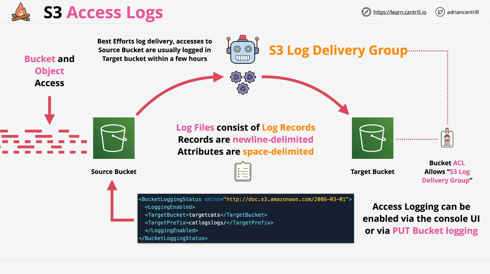

# AWS S3 Access Logs

## Overview

S3 Access Logs provide visibility into requests made to an S3 bucket. This feature allows logging of access requests for security, auditing, and analytical purposes.

## Architecture

### Components

- **Source Bucket:** The bucket for which you want to enable logging and track access requests.
- **Target Bucket:** The destination where access logs will be stored.
- **S3 Log Delivery Group:** A system service that manages and delivers logs to the target bucket.

### Enabling Access Logging

1. **Configuration Methods:**
   - AWS Management Console
   - CLI (`put-bucket-logging` operation)
   - API
2. **Log Delivery Process:**
   - The S3 Log Delivery Group reads the logging configuration from the source bucket.
   - Logs are written to the target bucket with **best-effort delivery**, meaning changes in configuration may take hours to reflect.

### Permissions

- The **target bucket** must grant **write access** to the `S3 Log Delivery Group` via an **Access Control List (ACL)**.

## Log Format

### Structure

- **Log Files:** Logs are delivered as files containing multiple records.
- **Records:** Each record represents a request made to the source bucket.
- **Attributes:**
  - Date & Time
  - Requester Identity
  - Operation Type
  - Status Codes
  - Error Codes
  - Additional Metadata

### Delimiters

- **Records:** Separated by new lines.
- **Attributes:** Space-delimited within each record.
- Similar in structure to **Apache log files**.

## Use Cases

- **Security Monitoring:** Track unauthorized or suspicious access.
- **Access Auditing:** Ensure compliance with security policies.
- **Usage Analytics:** Understand customer access patterns.
- **Billing Analysis:** Identify cost contributors related to data retrieval.

## Considerations

- **Log Management:**
  - AWS does not automatically manage log file retention.
  - Users must configure lifecycle policies for **deletion or storage class transitions**.
- **Scalability:**
  - A single **target bucket** can store logs from multiple **source buckets**.
  - Prefixes can be used to separate logs by bucket.

## Conclusion

S3 Access Logs are a valuable tool for security, auditing, and cost analysis. Proper configuration, permissions management, and lifecycle policies ensure effective use of this feature.
