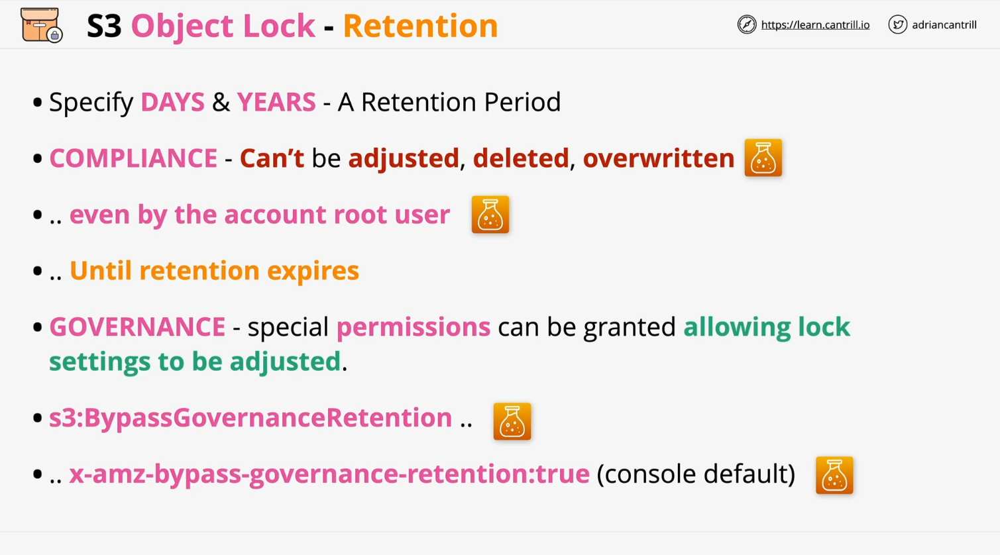
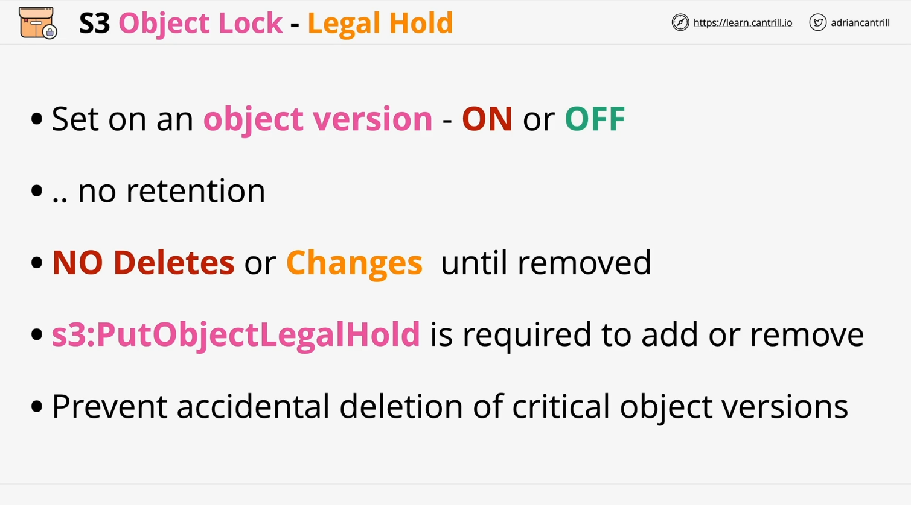
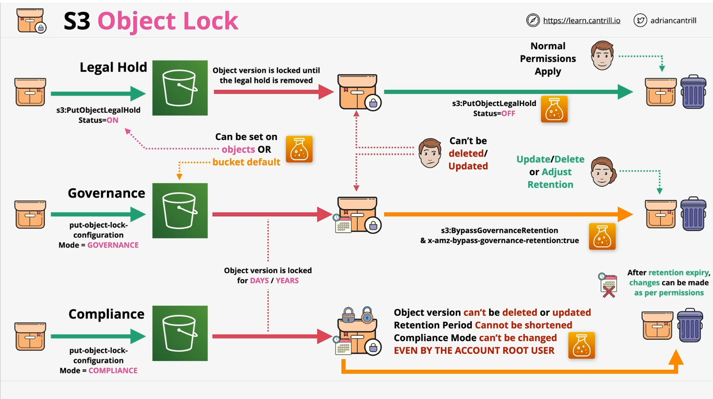

# AWS S3 Object Lock - Learn Cantrill.io AWS SA C03

## Introduction

AWS S3 Object Lock is an essential feature for security, compliance, and governance within Amazon S3. Understanding Object Lock is crucial for SysOps certification and for anyone architecting or developing AWS-based applications. This document details Object Lock, its retention methods, and how it applies to real-world use cases.

## What is S3 Object Lock?

S3 Object Lock is a set of features that enable Write Once, Read Many (WORM) storage. It ensures that object versions cannot be deleted or modified for a defined retention period.

### Key Points:

- Enabled on new S3 buckets at creation.
- Cannot be disabled once enabled.
- Requires versioning to be enabled.
- Object versions, not entire buckets, are locked.
- Two primary retention methods: **Retention Periods** and **Legal Holds**.

## Retention Methods

Object Lock manages object retention in two ways:

### 1. Retention Period

Retention periods define a specific duration (days/years) for which an object version remains immutable.

#### Retention Period Modes

There are two distinct modes for setting retention periods:

#### **Compliance Mode**

- The strictest form of retention.
- Objects **cannot** be deleted, modified, or have their retention period reduced.
- No AWS identity, including the root user, can override it.
- Used in regulated industries like finance and healthcare for strict compliance.

#### **Governance Mode**

- Less restrictive than Compliance Mode.
- Objects **cannot** be modified or deleted unless a special permission is granted.
- Users with `s3:BypassGovernanceRetention` permission and the appropriate header (`x-amz-bypass-governance-retention: true`) can override retention settings.
- Used for process control, accidental deletion prevention, and testing before compliance mode implementation.

### 2. Legal Hold

Legal Hold is a **binary** setting (on/off) that prevents deletion or modification of an object version. Unlike retention periods, it has no expiration date.

#### Key Characteristics:

- Can be applied or removed at any time.
- Requires `s3:PutObjectLegalHold` permission to change.
- Used in legal cases to flag critical object versions for investigations or audits.

## How Object Lock Works

### Legal Hold Process

1. Upload an object.
2. Apply a **Legal Hold** (`on` status).
3. The object version cannot be modified or deleted.
4. Removing the legal hold restores normal permissions.

### Governance Mode Retention Process

1. Upload an object with **Governance Mode** enabled.
2. Set a retention period.
3. Object version **cannot** be deleted or modified unless the `s3:BypassGovernanceRetention` permission is granted and the `x-amz-bypass-governance-retention: true` header is used.

### Compliance Mode Retention Process

1. Upload an object with **Compliance Mode** enabled.
2. Set a retention period.
3. Object version **cannot** be deleted or modified by any identity (including root user) until retention period expires.
4. Once expired, normal permissions apply.

## Combining Retention Methods

- **Legal Hold + Compliance Mode**: Provides the strictest form of protection.
- **Legal Hold + Governance Mode**: Allows certain users to override governance settings while maintaining legal restrictions.
- **Governance Mode for Testing, Compliance Mode for Enforcement**: Organizations may test governance mode before permanently locking data with compliance mode.

## Conclusion

Understanding S3 Object Lock is critical for securing and managing object data in AWS. Whether for compliance, governance, or accidental deletion prevention, selecting the correct mode is essential.

- **Compliance Mode** is irreversible and should be used with caution.
- **Governance Mode** provides flexibility with administrative controls.
- **Legal Hold** offers on/off protection without a defined retention period.

Ensure you fully understand these concepts for AWS certifications and real-world applications. If necessary, review the lesson multiple times to grasp the nuances of each mode.
