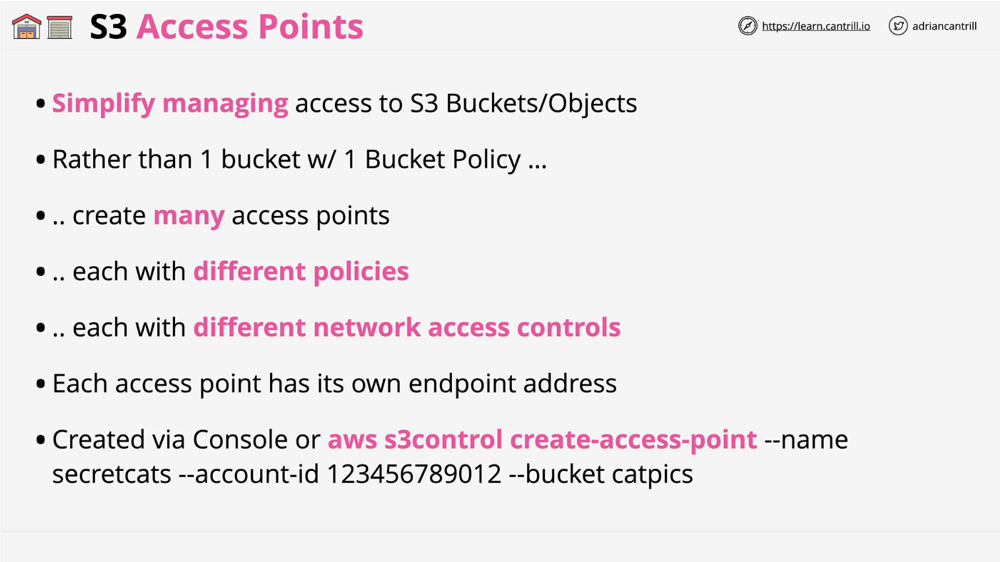
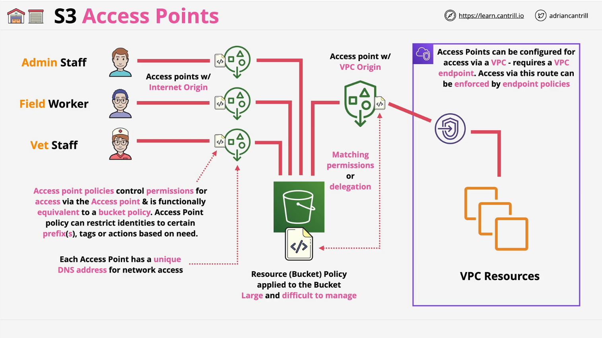

# AWS S3 Access Points

## Introduction

S3 Access Points is a feature of Amazon S3 that enhances the manageability of S3 buckets, especially in environments where multiple teams, users, or applications need access to different parts of the same bucket. It simplifies access control by allowing multiple access points with individual policies instead of managing a single, complex bucket policy.

## Why Use S3 Access Points?



- **Simplifies access management**: Instead of maintaining a single bucket policy, you can create multiple access points, each with its own permissions.
- **Enhances security**: Access points can restrict access to specific sources such as Virtual Private Cloud (VPC) endpoints.
- **Scalability**: Ideal for large organizations with diverse access needs across multiple teams and workloads.

## Key Features

- **Multiple Access Points per Bucket**: Each access point has a unique endpoint and policy.
- **Separate Access Policies**: Access point policies function similarly to bucket policies but allow finer-grained control.
- **Restrict Access by Source**: Access points can be limited to allow access only from specific VPCs or from the internet.
- **Dedicated Endpoints**: Each access point provides a unique DNS name, making it easier to route access requests.

## Creating an S3 Access Point

You can create an S3 Access Point using:

- AWS Console
- AWS CLI: `aws s3control create-access-point`
- AWS SDKs and API

## Example Scenario



### **Scenario: Animal Health Data Storage**

An organization, **Animals for Life**, stores sensitive health data in an S3 bucket. Different teams require different levels of access:

- **Admin Staff**: Manages employee data.
- **Field Workers**: Collects and processes animal research data.
- **Vet Staff**: Handles animal medical records.
- **Data Analysis Team (VPC)**: Runs analytics within a controlled environment.

### **Using Access Points to Manage Access**

Instead of using a single complex bucket policy, the organization creates **four access points**, one for each team. Each access point has:

1. **Unique DNS Endpoint**: Each team accesses S3 through its dedicated endpoint.
2. **Custom Access Policy**: Limits access to relevant objects and prefixes.
3. **VPC Restriction (for Data Analysis Team)**: The VPC access point is restricted to internal network traffic only.

## Access Point Policies vs. Bucket Policies

- **Access Point Policies**: Control access when an access point is used to reach the bucket.
- **Bucket Policies**: Still required to permit access via access points.
- **Delegated Permissions Model**: A common approach is to set the bucket policy to allow all actions via access points and define finer control in the access point policies.

## Best Practices

- **Use Access Points for Large Buckets**: If a bucket is accessed by multiple teams or workloads, use access points instead of managing a complex bucket policy.
- **Restrict Access with VPC Tied Access Points**: For security, ensure that access points used by internal applications are restricted to VPC access.
- **Leverage Delegation for Simplicity**: Define broad permissions at the bucket level and granular permissions at the access point level.

# Additional Resources

For more details on access points and permission delegation, refer to [AWS Documentation](https://docs.aws.amazon.com/AmazonS3/latest/userguide/access-points.html).

## Key Concepts

1. **Access Points** are named network endpoints attached to S3 buckets that simplify data access management.
2. Each Access Point has its own:
   - IAM policies
   - Network controls (VPC or Internet)
   - Block Public Access settings

## Important Components

### 1. IAM Policies

- Both the access point and bucket must permit the request.
- Can delegate access control from the bucket to access points.
- Support condition keys like:
  - `s3:DataAccessPointArn`
  - `s3:DataAccessPointAccount`
  - `s3:AccessPointNetworkOrigin`

### 2. Network Access Control

- Can restrict access to a specific VPC or allow Internet access.
- Network origin must be specified at creation and **cannot be changed**.
- VPC endpoints need appropriate policies to work with access points.

### 3. Access Point Names

- Must be unique within the account and region.
- 3-50 characters long.
- Must start with a number or lowercase letter.
- Cannot contain underscores, uppercase letters, or periods.
- Cannot end in `-s3alias`.

## Key Commands

### 1. Creating Access Points

```bash
aws s3control create-access-point --name example-ap --account-id 111122223333 --bucket bucket-name
```

### 2. Creating VPC-Restricted Access Point

```bash
aws s3control create-access-point --name example-vpc-ap --account-id 123456789012 --bucket bucket-name --vpc-configuration VpcId=vpc-1a2b3c
```

### 3. Using Access Points

#### Get an Object

```bash
aws s3api get-object --bucket arn:aws:s3:region:account-id:accesspoint/access-point-name --key object-key output-file
```

#### Upload an Object

```bash
aws s3api put-object --bucket access-point-alias --key object-key --body file-name
```

#### List Objects

```bash
aws s3api list-objects-v2 --bucket access-point-alias
```

#### Delete an Object

```bash
aws s3api delete-object --bucket arn:aws:s3:region:account-id:accesspoint/access-point-name --key object-key
```

## Important Features

### 1. Access Point Aliases

- Automatically generated bucket-style aliases.
- Can be used instead of ARNs for data operations.
- Format: `access-point-name-metadata-s3alias`.
- Cannot be modified or disabled.

### 2. Monitoring & Logging

- Supports CloudWatch metrics.
- Logs available through:
  - Server access logging.
  - AWS CloudTrail.
- Can track requests made through access points.

### 3. Security Features

- **Block Public Access settings** (cannot be changed after creation).
- **VPC-only access option** for internal use.
- **Cross-account access support** via IAM policies.
- **Integration with IAM policies** for fine-grained control.

## Limitations

- Maximum **10,000 access points** per region (can request an increase).
- **Network origin cannot be changed** after creation.
- **Block Public Access settings are immutable** post-creation.
- **Access point aliases cannot be used** in IAM policies or as logging destinations.

## Best Practices

1. Use access points to **delegate bucket access control**.
2. Enable **appropriate monitoring and logging**.
3. Carefully plan **Block Public Access and network settings** before creation.
4. Use **VPC endpoints with appropriate policies** for VPC-restricted access points.
5. Consider using **access point aliases** for simplified data access.

## Conclusion

S3 Access Points provide a flexible and scalable way to manage access to large-scale datasets across teams. By leveraging IAM policies, network controls, and monitoring tools, organizations can ensure secure and efficient data access.

## Conclusion

S3 Access Points provide a more flexible and scalable way to manage access to S3 buckets. They allow organizations to create multiple, more manageable access policies for different teams, reducing the complexity and risk associated with a single large bucket policy. By implementing access points, businesses can enhance security, improve governance, and simplify access management for large datasets.
