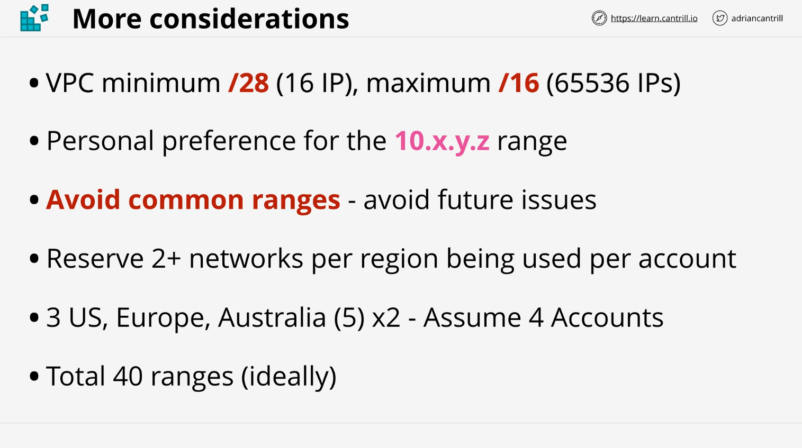

# AWS VPC Design

## Lesson Links

- [AWS Single VPC Design](https://aws.amazon.com/answers/networking/aws-single-vpc-design/)
- [Google Cloud VPC Documentation](https://cloud.google.com/vpc/docs/vpc)
- [AWS SA Associate SAAC02 - VPC Basics](https://github.com/acantril/aws-sa-associate-saac02/tree/master/07-VPC-Basics/01_vpc_sizing_and_structure)

## Introduction

This lesson focuses on designing a well-structured and scalable network inside AWS using a **Virtual Private Cloud (VPC)**. Instead of covering the technical aspects of VPC, it emphasizes the importance of creating a proper **IP plan** and structuring networks effectively.

## Key Concepts

### Importance of a Well-Designed VPC

- Designing a **scalable** and **efficient** VPC structure is crucial.
- Choosing the **right IP range** is essential since changing it later is complex and can lead to performance issues.
- A well-planned VPC structure prevents overlapping or duplicate IP ranges, which can create communication challenges.

### IP Planning Considerations

- **VPC Size**: Determines how many services and resources can fit.
- **Avoiding Overlaps**: Consider existing networks (on-premises, other cloud environments, partner networks).
- **Future-Proofing**: Think ahead about potential expansion needs.

### Structuring a VPC

- Every network includes multiple **tiers**, such as:
  - Web Tier
  - Application Tier
  - Database Tier
- AWS **Availability Zones (AZs)** add another layer of complexity.

## Case Study: Animals for Life Organization

### Known Information

- The organization has **three major offices**:
  - London
  - New York
  - Seattle
- Existing **on-premises and cloud networks**:
  - `192.168.10.0/24` (Brisbane on-prem)
  - `10.0.0.0/16` (AWS pilot network)
  - `172.31.0.0/16` (Azure pilot network)
  - Other offices use:
    - `192.168.15.0/24` (London)
    - `192.168.20.0/24` (New York)
    - `192.168.25.0/24` (Seattle)
  - **Google Cloud Default Network**: `10.128.0.0/9` (which overlaps with `10.128.0.0 - 10.255.255.255`)
- These ranges **cannot** be used for the new AWS VPC design to avoid conflicts.

## Choosing an IP Range for the AWS VPC

### AWS VPC Limitations

- **Minimum Size**: `/28` (16 IP addresses)
- **Maximum Size**: `/16` (65,536 IP addresses)

### Preferred IP Range

- **Use the 10.X.Y.Z range** (Private IP addressing)
- Avoid common defaults:
  - `10.0.0.0/16` (widely used default)
  - `10.1.0.0/16` (often chosen to avoid `10.0.0.0`)
  - Anything up to `10.10.0.0/16` should be avoided
- **Suggested starting point:** `10.16.0.0/16` (clean base-2 number)

### Calculating the Required IP Ranges

- Estimate the **number of AWS regions** required:
  - **3 US regions**
  - **1 Europe region**
  - **1 Australia region**
  - **Total: 5 regions**
- Allocate **2 VPC ranges per region** → `5 × 2 = 10 ranges`
- Consider **4 AWS accounts** → `10 × 4 = 40 IP ranges`
- Exclude Google Cloud overlap (`10.128.0.0/9`)
- **Usable range:** `10.16.0.0/16` to `10.127.0.0/16`

## Conclusion

A **well-planned VPC** ensures seamless network scalability, security, and interoperability with other environments. The second part of the lesson will continue refining the design process.
