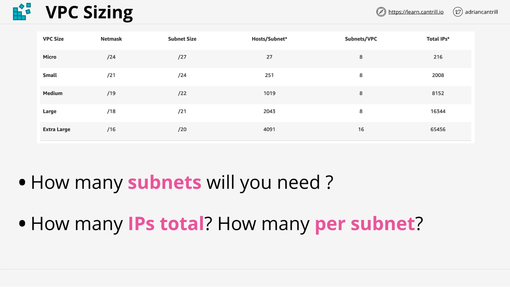
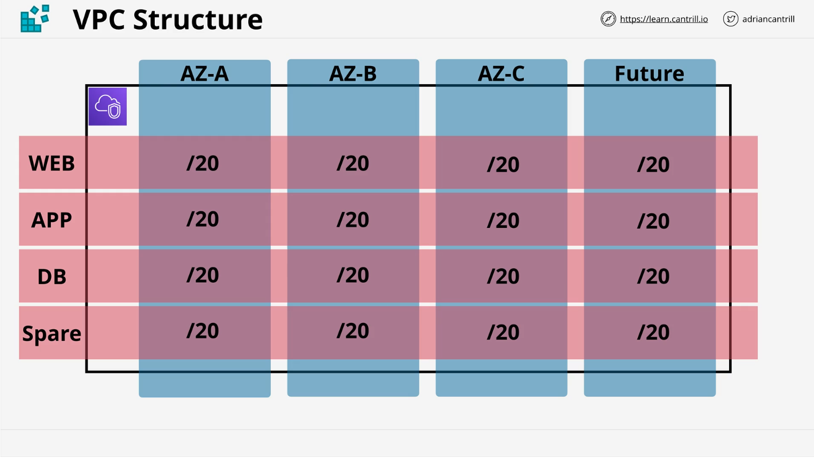
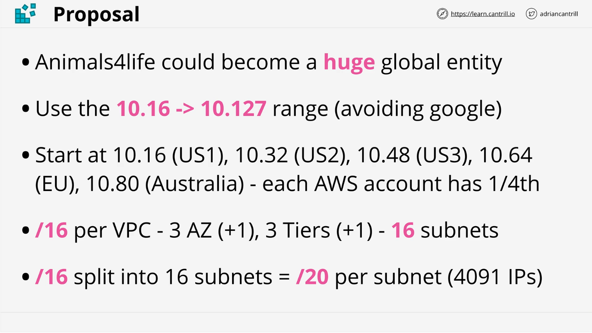

# AWS SA-C03: VPC Sizing and Structure

## Lesson Links

- [AWS Single VPC Design](https://aws.amazon.com/answers/networking/aws-single-vpc-design/)
- [Google Cloud VPC Documentation](https://cloud.google.com/vpc/docs/vpc)
- [AWS SA Associate VPC Basics GitHub](https://github.com/acantril/aws-sa-associate-saac02/tree/master/07-VPC-Basics/01_vpc_sizing_and_structure)

## Overview

This lesson continues the discussion on VPC (Virtual Private Cloud) sizing and structure. It covers considerations for subnet allocation, availability zones, and IP address planning for scalable AWS architectures.

## VPC Sizing in AWS

| VPC Size    | Netmask | Subnet Size | Hosts/Subnet | Subnets/VPC | Total IPs |
| ----------- | ------- | ----------- | ------------ | ----------- | --------- |
| Micro       | /24     | /27         | 27           | 8           | 216       |
| Small       | /21     | /24         | 251          | 8           | 2008      |
| Medium      | /19     | /22         | 1019         | 8           | 8152      |
| Large       | /18     | /21         | 2043         | 8           | 16344     |
| Extra Large | /16     | /20         | 4091         | 16          | 65456     |

### **Explanation of VPC Size Categories and Their Details**

In AWS, a **Virtual Private Cloud (VPC)** allows users to create an isolated network environment within AWS. The table you provided outlines different VPC size configurations, including **netmask, subnet size, hosts per subnet, subnets per VPC, and total available IPs**.

### **Breakdown of the Table Components**

| **Column**       | **Explanation**                                                                                                           |
| ---------------- | ------------------------------------------------------------------------------------------------------------------------- |
| **VPC Size**     | Categorizes different VPC sizes (Micro, Small, Medium, Large, Extra Large).                                               |
| **Netmask**      | CIDR (Classless Inter-Domain Routing) notation defining the VPC’s address space (e.g., `/16` means 65,536 total IPs).     |
| **Subnet Size**  | CIDR notation defining the size of each subnet within the VPC (e.g., `/27` means fewer IPs per subnet, `/20` means more). |
| **Hosts/Subnet** | The number of usable IP addresses per subnet (AWS reserves 5 IPs per subnet).                                             |
| **Subnets/VPC**  | Number of subnets that can be created within the VPC.                                                                     |
| **Total IPs**    | The total number of usable IP addresses across all subnets in the VPC.                                                    |

### **Detailed Breakdown by VPC Size**

#### **1. Micro VPC**

- **Netmask:** `/24` (256 total IPs)
- **Subnet Size:** `/27` (32 IPs per subnet, 27 usable)
- **Hosts/Subnet:** 27
- **Subnets per VPC:** 8
- **Total Usable IPs:** **216**
- **Use Case:** Best for small applications with limited networking needs.

#### **2. Small VPC**

- **Netmask:** `/21` (2,048 total IPs)
- **Subnet Size:** `/24` (256 IPs per subnet, 251 usable)
- **Hosts/Subnet:** 251
- **Subnets per VPC:** 8
- **Total Usable IPs:** **2,008**
- **Use Case:** Suitable for small to medium-sized workloads.

#### **3. Medium VPC**

- **Netmask:** `/19` (8,192 total IPs)
- **Subnet Size:** `/22` (1,024 IPs per subnet, 1,019 usable)
- **Hosts/Subnet:** 1,019
- **Subnets per VPC:** 8
- **Total Usable IPs:** **8,152**
- **Use Case:** Medium-sized applications with significant scaling requirements.

#### **4. Large VPC**

- **Netmask:** `/18` (16,384 total IPs)
- **Subnet Size:** `/21` (2,048 IPs per subnet, 2,043 usable)
- **Hosts/Subnet:** 2,043
- **Subnets per VPC:** 8
- **Total Usable IPs:** **16,344**
- **Use Case:** Ideal for large-scale applications needing extensive subnet segmentation.

#### **5. Extra Large VPC**

- **Netmask:** `/16` (65,536 total IPs)
- **Subnet Size:** `/20` (4,096 IPs per subnet, 4,091 usable)
- **Hosts/Subnet:** 4,091
- **Subnets per VPC:** 16
- **Total Usable IPs:** **65,456**
- **Use Case:** Best for enterprise environments or organizations running multiple large applications.

### **Key Takeaways**

1. **Larger VPCs have more IPs but also require better subnet planning** to avoid waste.
2. **Subnet size affects the number of available IPs per subnet**—smaller subnets mean fewer hosts, while larger subnets allow more.
3. **AWS reserves 5 IPs per subnet** for internal use.
4. **Choosing the right VPC size depends on your application needs**—for example, if you anticipate rapid growth, start with a Medium or Large VPC.

AWS provides different VPC sizes, ranging from micro to extra-large:

- **Micro**: `/24` VPC with 8 subnets (`/27` each, 27 IPs per subnet, total 216 IPs)
- **Extra Large**: `/16` VPC with 16 subnets (`/20` each, 4,091 IPs per subnet, total 65,536 IPs)

### Key Questions When Designing a VPC:

1. **How many subnets will you need?**
2. **How many IP addresses per subnet and in total?**

## Subnets and Availability Zones

- Services in AWS use **subnets** within a VPC, not the VPC itself.
- Each **subnet is located in a single availability zone (AZ)**.
- The number of AZs a VPC spans affects **high availability and resilience**.
- Some AWS regions have limited AZs (e.g., three or more).

### Recommended Availability Zone Setup

- Default recommendation: **3 AZs + 1 spare (A, B, C, and a spare)**.
- This means the VPC must have **at least 4 subnets**.

### Infrastructure Tiers

- Typical architecture includes the following tiers:
  - **Web Tier**
  - **Application Tier**
  - **Database Tier**
  - **Spare (future expansion)**
- Each tier requires its own subnet in each AZ.

### Example Subnet Allocation

- **1 AZ, 4 tiers**: 4 subnets
- **4 AZs, 4 tiers**: 16 subnets

### Example VPC Size Breakdown

| VPC Prefix | Number of Subnets | Subnet Prefix |
| ---------- | ----------------- | ------------- |
| `/16`      | 16                | `/20`         |
| `/17`      | 16                | `/21`         |
| `/18`      | 16                | `/22`         |

## IP Address Planning for a Global Organization

### Assumptions

- **Organization**: "Animals for Life"
- **Expected Growth**: High
- **Regions**:
  - **3 in the US**
  - **1 in Europe**
  - **1 in Australia**
- **IP Address Range**: Avoiding common and Google Cloud reserved ranges.
- **Preferred Range**: `10.16.0.0/12`

### Regional IP Address Allocation

| Region      | IP Range                            |
| ----------- | ----------------------------------- |
| US Region 1 | `10.16.0.0/16` - `10.31.255.255/16` |
| US Region 2 | `10.32.0.0/16` - `10.47.255.255/16` |
| US Region 3 | `10.48.0.0/16` - `10.63.255.255/16` |
| Europe      | `10.64.0.0/16` - `10.79.255.255/16` |
| Australia   | `10.80.0.0/16` - `10.95.255.255/16` |

### AWS Account and VPC Structure

- **3 AWS Accounts**: `General`, `Prod`, `Dev`
- **1 Reserved Account**
- **Each account gets 4 VPCs per region**
- **Each VPC gets a `/16` range**

## Implementation Strategy

- A **documented IP plan** (available in the GitHub repo) outlines the allocation strategy.
- The plan ensures **non-overlapping VPCs** across accounts and regions.
- Future-proofing by reserving extra capacity.

## Summary and Next Steps

- **Key Takeaways**:
  - Plan for **growth** and **high availability**.
  - Choose a **VPC size** based on **subnet requirements**.
  - Allocate **IP addresses efficiently** to prevent conflicts.
  - Follow a **structured approach** for subnetting within a VPC.
- **Next Topics**:
  - Technical aspects of AWS private networking.
  - Detailed configurations for VPCs and subnets.

This lesson serves as the **foundation for network topology** planning throughout the AWS SA-C03 course. The referenced IP planning document will be used in future lessons.
