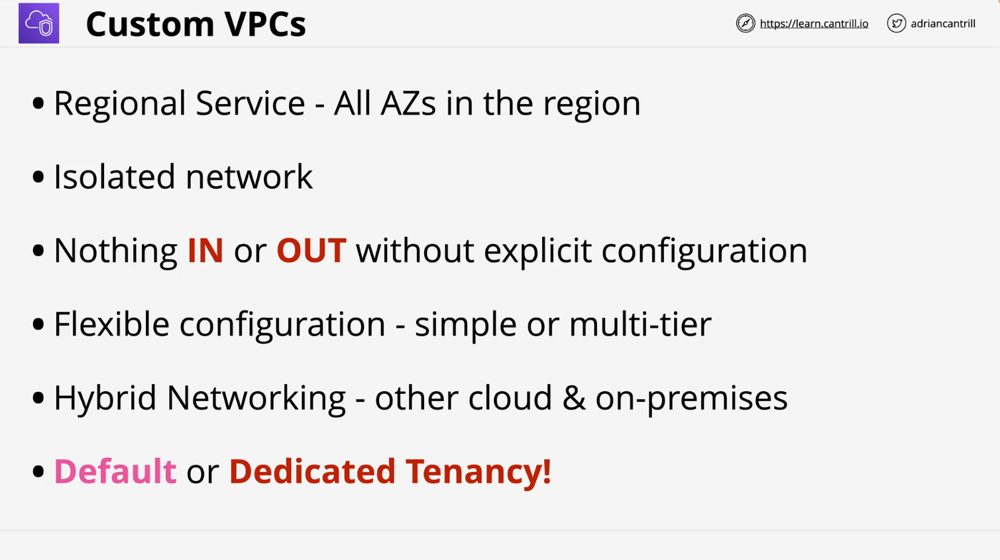

# Learn Cantrill.io AWS SA C03 - VPC Overview

## Lesson Links

- **VPC Limits**: [AWS Documentation](https://docs.aws.amazon.com/vpc/latest/userguide/amazon-vpc-limits.html)
- **Architecture Diagram**: /00_LEARNINGAIDS/VPCStucture-1.png>)

## Introduction

This lesson focuses on building a **multi-tier, custom VPC** step by step. AWS VPCs allow for incremental complexity, making it easy to start simple and gradually add components.

## Overview of the Custom VPC Implementation

- The **VPC shell** is the first step.
- The final implementation includes **multiple subnets, internet gateways, NAT gateways, and a bastion host**.
- A **multi-tier VPC** will be created, consisting of four tiers across **three availability zones** (A, B, and C), with a total of **12 subnets** (16 possible subnets, but 4 are reserved for future availability zones).
- **IP Addressing**: The VPC will use **10.16.0.0/16**.
- **Internet Access**:
  - An **Internet Gateway** will allow public access.
  - **NAT Gateways** will enable private instances to have outbound access.
  - A **Bastion Host** will be deployed for administrative access (though not a best practice).

## VPC Architecture and Design Principles

### VPC Isolation

- VPCs are **regionally isolated**.
- **Multiple VPCs** can exist within a single AWS account, providing **segregation and security**.
- No traffic can enter or leave a VPC without **explicit configuration**.
- Acts as a **network boundary** and provides an **isolated blast radius** for security.

### Default vs. Custom VPCs

- **Default VPC**: AWS pre-configured with a **static structure**.
- **Custom VPC**: Highly flexible, allowing for complex multi-tier networks.
- Supports **hybrid networking** for connecting to on-premises and other cloud environments.

### Instance Tenancy

- **Default Tenancy**: Allows resources to be on shared or dedicated hardware as needed.
- **Dedicated Tenancy**: Ensures all instances run on dedicated hardware, but at a **higher cost**.
- Recommendation: Use **default tenancy** unless a dedicated setup is required.

## IP Addressing

### IPv4 Support

- **Primary CIDR Block**: Assigned during VPC creation.
- **Range Options**:
  - Smallest: **/28** (16 IPs, but not all are usable).
  - Largest: **/16** (65,536 IPs).
- **Secondary CIDR Blocks** can be added (default limit: **5**, but can be increased via support request).

### IPv6 Support

- IPv6 CIDR **/56** block can be assigned.
- IPv6 addresses are **publicly routable by default**.
- Two options for IPv6 assignment:
  1. AWS-allocated IPv6 block.
  2. User-owned IPv6 addresses.
- **No distinction between public and private IPv6 addresses**, but explicit permission is required for internet access.

## DNS in VPCs

- **Provided by AWS Route 53**.
- VPC DNS address = `VPC Base IP + 2` (e.g., `10.0.0.2`).
- Two key settings:
  1. **Enable DNS Hostnames**: Assigns public DNS names to instances with public IPs.
  2. **Enable DNS Support**: Allows instances to use AWS-provided DNS resolution.
- Troubleshooting tip: If **DNS issues arise**, check these settings first.

## Next Steps

- The **next lesson** will cover the practical demo of creating the VPC.
- This includes setting up **CIDR blocks, subnets, internet access, and security components**.
- Gradual implementation to build a **fully functional multi-tier network** inside AWS.

Stay tuned for the **hands-on demo** where we implement the **Animals4Life VPC** inside an AWS account!
