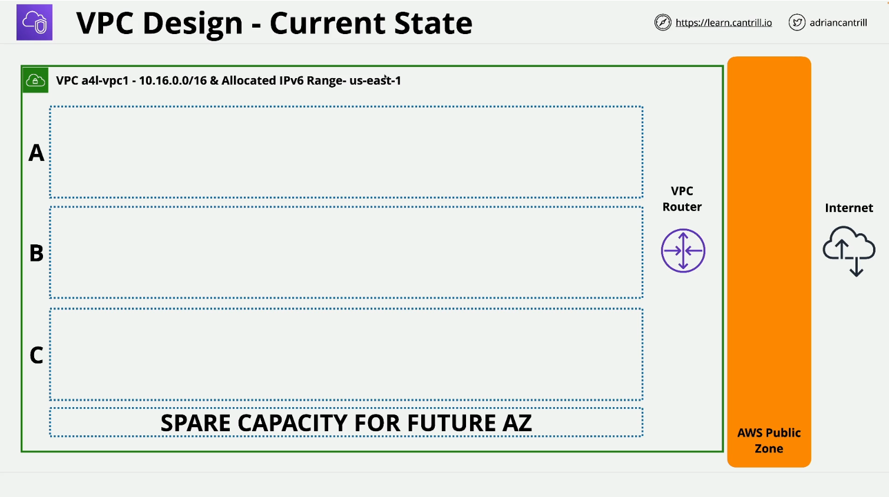

# LearnCantrill.io AWS SA C03 - Custom VPCs

## Overview

This lesson covers the architecture and key features of Custom VPCs, including topics relevant to the AWS Solutions Architect Associate (SA-C03) exam. In the second half, a **DEMO** walks through the implementation of a VPC shell for the **Animals4Life (A4L)** organization.

## Lesson Links

- **VPC Limits:** [AWS VPC Limits](https://docs.aws.amazon.com/vpc/latest/userguide/amazon-vpc-limits.html)
- **VPC Architecture Diagram:** /00_LEARNINGAIDS/VPCStucture-1.png>)

## Custom VPC Implementation (DEMO)

### **Step 1: AWS Console Setup**

- Log in to the **AWS Management Console**.
- Use the **IAM Admin User**.
- Set the AWS region to **Northern Virginia (us-east-1)**.

### **Step 2: Creating the VPC**

1. Navigate to the **VPC Console**.
2. Click on **Create VPC**.
3. Choose between:
   - **VPC Only** (Recommended for this demo).
   - **VPC and More** (Includes additional components via a wizard).
4. Select **VPC Only** to create the VPC step by step.

### **Step 3: VPC Configuration**

- **VPC Name:** `a4l-vpc1`
- **IPv4 CIDR Block:** `10.16.0.0/16`
- **Tenancy:** `Default`
- **Enable IPv6:** Select **Amazon Provided IPv6 CIDR Block**
- Leave other settings as default.
- Click **Create VPC**.

### **Step 4: Post-Creation Configurations**

- Every VPC is assigned a **unique VPC ID**.
- By default, a custom VPC does **not** include any subnets (to be created later).

#### **Enable DNS Settings**

1. Select the newly created VPC.
2. Go to **Actions > Edit VPC Settings**.
3. Ensure both options are enabled:
   - ✅ **Enable DNS Resolution** (Default: Enabled)
   - ✅ **Enable DNS Hostnames** (Default: Disabled – Enable it manually)
4. Click **Save**.

### **Step 5: Confirming the Configuration**

- **IPv4 CIDR:** `10.16.0.0/16`
- **IPv6 CIDR:** Auto-allocated by AWS (different for each VPC).
- **Region:** `us-east-1 (Northern Virginia)`
- **DNS Hostnames Enabled:** Yes

## Next Steps

- In the following lessons, additional components will be configured:
  - **Creating and structuring subnets**.
  - **Setting up an Internet Gateway**.
  - **Configuring route tables and routing**.
  - **Enabling production-ready networking capabilities**.

## Conclusion

This lesson focused on setting up a basic **Custom VPC** with the necessary configurations to support further networking enhancements. The next lessons will progressively build on this by implementing subnets, internet gateways, and routing configurations.

**Stay tuned for the next lesson!** 🎉
