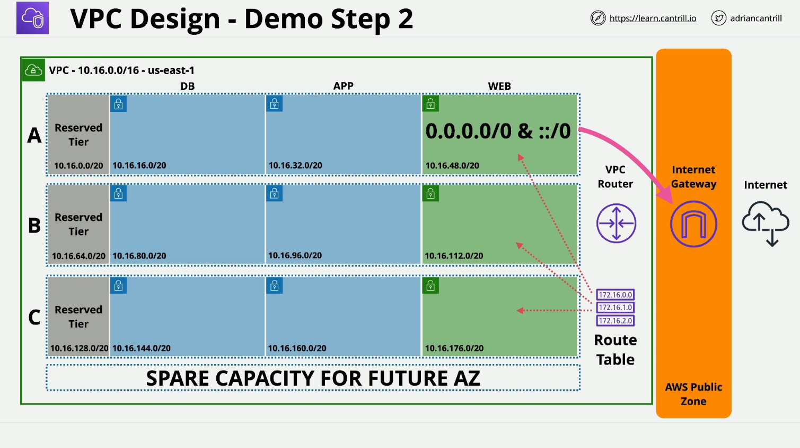

# VPC Public Subnet Configuration Demo



## **VPC Public Subnet Configuration - Part 2**

This lesson continues from **Part 1**, where we configured public subnets in a **Virtual Private Cloud (VPC)**. In this part, we will test the configuration by launching an **EC2 instance** in a public subnet, connect to it, and finally, clean up the infrastructure.

## **1. Launching an EC2 Instance (Bastion Host)**

### **Steps:**

1. **Navigate to EC2 Console**: Go to **AWS Management Console > EC2**.
2. Click **Launch Instance**.
3. **Set Instance Name**: `A4L-Bastion`.
4. **Choose Amazon Linux**:
   - Select **Amazon Linux** from the list.
   - Ensure it's the **latest version** and **free-tier eligible**.
5. **Select Architecture**:
   - Choose **64-bit x86**.
6. **Select Instance Type**:
   - Ensure it's **free-tier eligible** (`t2.micro` or `t3.micro`, depending on region).
7. **Configure Key Pair**:
   - Select an existing key pair (must have been created earlier).
8. **Configure Network Settings**:
   - **VPC**: Select `A4L-VPC1` (Animals for Life VPC).
   - **Subnet**: Select `SN-Web-A` (Public Subnet A).
   - **Enable Auto-Assign Public IP**: Ensure **both IPv4 and IPv6** are enabled.
9. **Set Up Security Group**:
   - Create a new security group: `A4L-Bastion-SG`.
   - **Allow SSH Access**:
     - **Protocol**: SSH (Port 22).
     - **Source**: `0.0.0.0/0` (IPv4) and `::/0` (IPv6).
10. **Launch Instance**: Click **Launch Instance** and go to **Instances** to view the running instance.

### **Result:**

- The `A4L-Bastion` instance will start initializing.
- Wait for **"2/2 status checks"** to pass before proceeding.

## **2. Connecting to the Bastion Host**

### **Check Instance Details:**

- Select the `A4L-Bastion` instance.
- Locate the **Public IPv4 Address** and **Private IPv4 Address**.
- Scroll down to view **instance metadata**.

### **Connection Methods:**

1. **Using EC2 Instance Connect (Web Console)**
   - Click **Connect**.
   - Choose **EC2 Instance Connect**.
   - Verify **Username**: `ec2-user`.
   - Click **Connect** to open a web-based SSH terminal.
2. **Using Local SSH Client**
   - Select **SSH Client** in the connection options.
   - Copy the provided SSH command:
     ```sh
     ssh -i "your-key.pem" ec2-user@<Public-IP>
     ```
   - Open a **terminal (macOS/Linux)** or **Command Prompt (Windows)**.
   - Navigate to the directory where the **key pair** is stored.
   - If needed, modify file permissions:
     ```sh
     chmod 400 your-key.pem
     ```
   - Paste and execute the **SSH command**.
   - Accept the **fingerprint verification** (`yes`).

### **Result:**

- Successfully connected to the `A4L-Bastion` instance.
- If connecting from **Windows**, permission adjustments may not be required.

## **3. Understanding Connection Options**

- **EC2 Instance Connect**: Web-based SSH access (only works with public IP).
- **SSH Client**: Requires a private key and terminal.
- **Session Manager** (not covered in this lesson): Allows SSH access **without a public IP**.

## **4. Cleaning Up Infrastructure**

If you are taking a break, it's best to delete resources to avoid unnecessary charges.

### **Steps to Terminate EC2 Instance:**

1. **Go to EC2 Console > Instances**.
2. Select `A4L-Bastion`.
3. Click **Terminate Instance** > Confirm.
4. Wait until the instance reaches the **Terminated** state.

### **Deleting the VPC and Resources**

1. **Go to VPC Console**.
2. Click **Your VPCs**.
3. Select `Animals for Life VPC` (`A4L-VPC1`).
4. Click **Actions > Delete VPC**.
5. Confirm deletion by typing `delete`.

### **What Gets Deleted?**

- **Internet Gateway**
- **Route Tables**
- **Subnets (Web A, Web B, Web C, etc.)**
- **Security Groups**
- **Any associated resources**

### **Result:**

- AWS environment is reset to its **original state** before this lesson.

## **5. Summary of Accomplishments**

- ✅ **Launched a Bastion Host (EC2) in a Public Subnet**
- ✅ **Successfully Connected via SSH (EC2 Instance Connect & Local Client)**
- ✅ **Understood Different EC2 Connection Methods**
- ✅ **Terminated the EC2 Instance & Cleaned Up VPC Resources**

## **6. What's Next?**

- Next, we'll explore **automating VPC setup** using **AWS CloudFormation**.
- Learn about **Network Address Translation (NAT)** for private instances.
- Implement **Network Access Control Lists (NACLs)** for added security.

You're doing an amazing job so far! Keep going! 🚀
