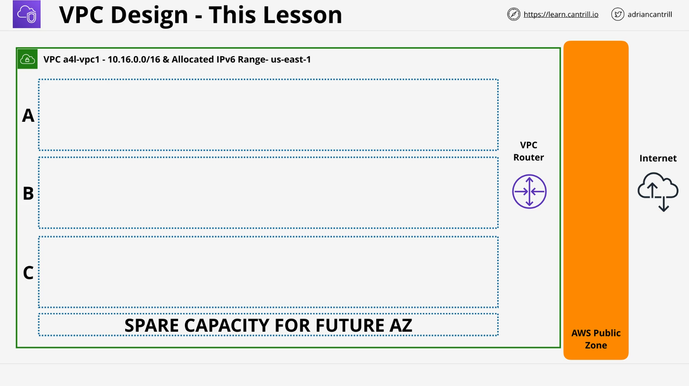
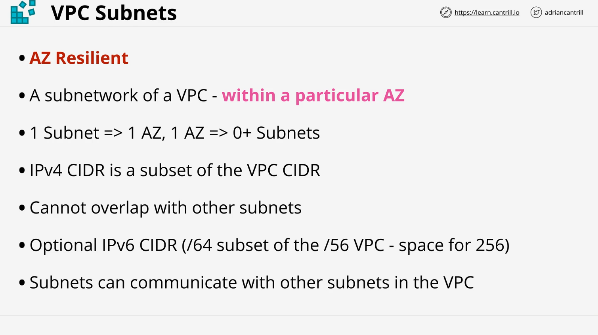
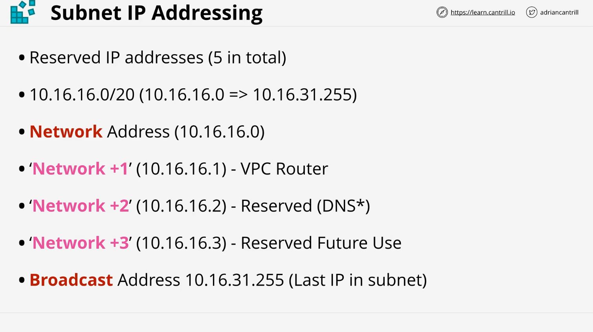
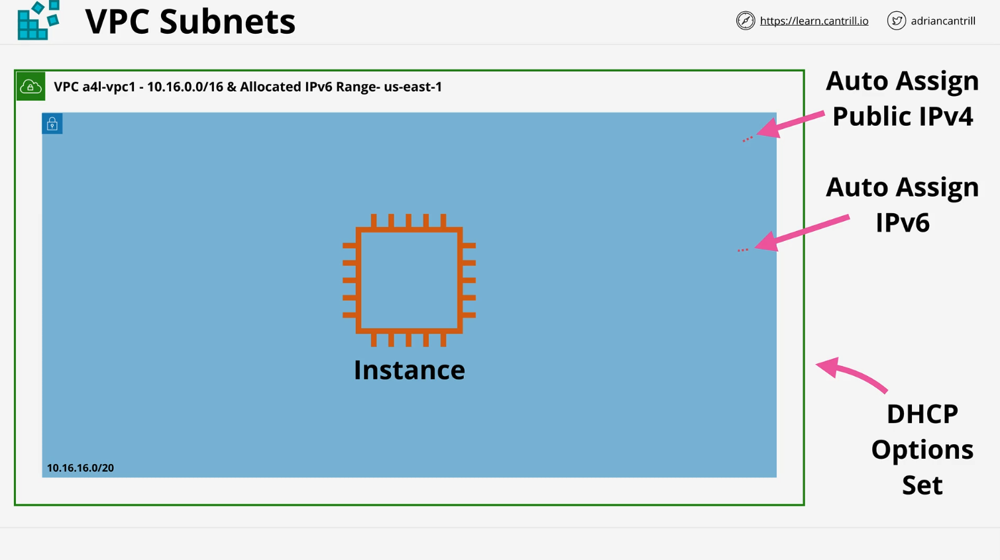
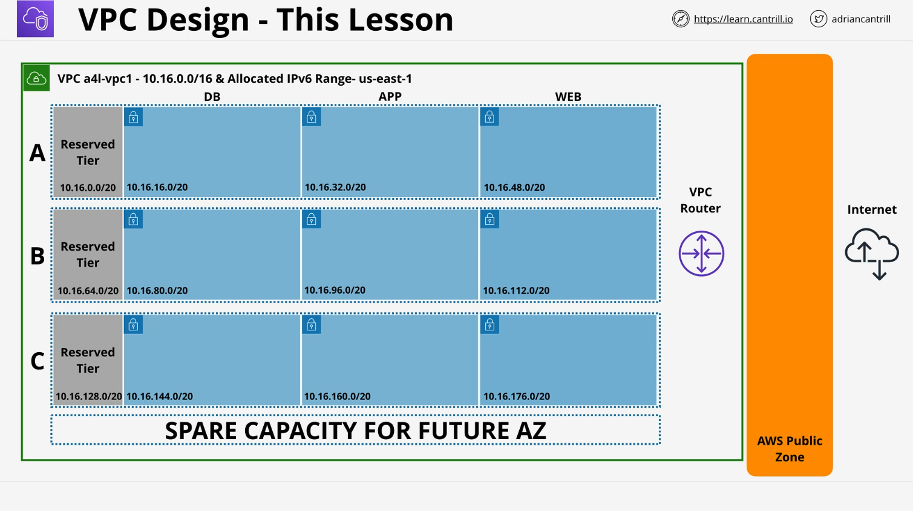

# VPC Subnets

## Overview

This lesson expands on **VPC networking** by covering **VPC subnets**—an essential component for structuring and improving the **functionality and resilience** of a Virtual Private Cloud (VPC). Subnets are **critical for production deployments** and important for the AWS Solutions Architect Associate (SA-C03) exam.

The lesson includes:

- The **role of subnets** in AWS networking.
- **Subnet and availability zone relationships**.
- **IP addressing considerations** (IPv4 and IPv6).
- **Subnet reservation rules** and **DHCP option sets**.
- A **detailed demo** for manually creating a structured VPC.

## **VPC Subnet Architecture**

At the start of this lesson, we have a **basic VPC framework (skeleton VPC)**. The goal is to create a structured **multi-tier VPC** by adding **subnets**.

### **Public vs. Private Subnets**

- **AWS uses color coding in architecture diagrams**:
  - **Green** → Public subnets.
  - **Blue** → Private subnets.
- **Subnets start as private** and require configuration to become public.

### **What is a Subnet?**

A **subnet** is:

- A **subnetwork** inside a **specific Availability Zone (AZ)**.
- **Fixed** to that AZ; it cannot span multiple zones.
- A key part of designing **highly available architectures**.

### **Subnets and Availability Zones**

- A **subnet belongs to one and only one Availability Zone**.
- An **Availability Zone can have multiple subnets**.
- **Subnets cannot overlap** in a VPC.

## **Subnet IP Addressing and Allocation**

### **IPv4 CIDR Allocation**

- **Subnets use IPv4 CIDR blocks** within the allocated **VPC CIDR range**.
- **Non-overlapping** subnets are required.
- Example:
  - **VPC CIDR**: `10.16.0.0/16`
  - **Subnet CIDR**: `10.16.16.0/20`

### **IPv6 CIDR Allocation**

- Subnets can **optionally** use **IPv6** if enabled at the VPC level.
- VPC IPv6 block → `/56`, Subnet IPv6 block → `/64`.
- A **VPC can support 256 `/64` subnets**.

### **Default Subnet Communication**

- **Subnets inside a VPC** can **communicate freely** with each other by default.
- **Isolation is at the VPC level**.

## **Reserved IP Addresses in a Subnet**

Each subnet reserves **five IP addresses** that **cannot be used**:

1. **Network Address** (first IP in range).
2. **Network +1** (used by AWS VPC Router).
3. **Network +2** (reserved for AWS DNS).
4. **Network +3** (reserved for future AWS use).
5. **Broadcast Address** (last IP in range).

Example for `10.16.16.0/20`:

- **Unusable addresses**:
  - `10.16.16.0` (network address)
  - `10.16.16.1` (VPC router)
  - `10.16.16.2` (AWS DNS)
  - `10.16.16.3` (AWS reserved)
  - `10.16.31.255` (broadcast)

### **Impact on Usable IPs**

- A **/24 subnet** has **256 total IPs**, but only **251 usable**.
- **Smaller subnets** lose a larger percentage of their addresses.

## **DHCP Option Sets**

- **VPCs use a DHCP Option Set** to control:
  - **DNS servers**.
  - **NTP servers**.
  - **NetBIOS settings**.
- **Only one DHCP Option Set per VPC**.
- **Cannot edit an existing set**—must create a new one.

## **Subnet-Level Configuration**

Two important settings are **defined at the subnet level**:

1. **Auto-assign Public IPv4 Addresses**

   - Controls whether resources get a **public IP** automatically.
   - Important for **public subnets**.
   - Covered in the **routing & internet gateway lesson**.

2. **Assign IPv6 Addresses**
   - Controls whether instances receive an **IPv6 address**.
   - Requires both **VPC and subnet** to have an IPv6 range.

## **Demo: Creating Subnets**

In the **demo lesson**, we will **manually create 12 subnets** inside our **multi-tier VPC**.

### **Demo Goals**

- **Manually create all subnets**.
- Ensure **correct CIDR allocations**.
- Assign **subnets to the correct Availability Zones**.
- Enable **IPv6 where applicable**.

⚠️ **Attention to detail is critical!**  
Mistakes in **CIDR blocks** or **availability zone assignments** can cause issues later.

## **Next Steps**

- Complete the **manual subnet creation demo**.
- Future lessons will cover:
  - **Routing & Internet Gateways**.
  - **Public vs. Private Subnets**.
  - **NAT Gateways & Bastion Hosts**.

## **Conclusion**

This lesson covered:

- **The fundamentals of subnets in AWS**.
- **Subnet-AZ relationships**.
- **IPv4 & IPv6 allocation strategies**.
- **Reserved IP addresses**.
- **DHCP options and subnet-level settings**.

In the **next demo lesson**, we will **implement this architecture step by step**.
