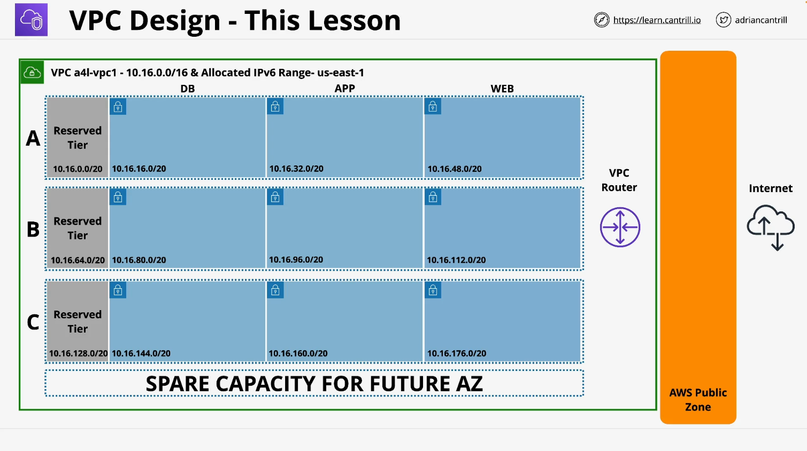

# AWS Subnet Creation Guide (Learn Cantrill.io - AWS SA C03)

## Overview

This guide details the manual creation of subnets within a custom AWS VPC for the _Animals for Life_ project. The process involves setting up multiple subnets across three availability zones (AZA, AZB, and AZC) with IPv4 and IPv6 configurations.

## Subnet Configuration

Each availability zone contains four types of subnets:

- **Reserved Subnet**
- **Database Subnet (DB Subnet)**
- **Application Subnet (App Subnet)**
- **Web Subnet**

### Subnet Details

| Name          | CIDR Block     | Availability Zone | Custom IPv6 Value |
| ------------- | -------------- | ----------------- | ----------------- |
| sn-reserved-A | 10.16.0.0/20   | AZA               | IPv6 00           |
| sn-db-A       | 10.16.16.0/20  | AZA               | IPv6 01           |
| sn-app-A      | 10.16.32.0/20  | AZA               | IPv6 02           |
| sn-web-A      | 10.16.48.0/20  | AZA               | IPv6 03           |
| sn-reserved-B | 10.16.64.0/20  | AZB               | IPv6 04           |
| sn-db-B       | 10.16.80.0/20  | AZB               | IPv6 05           |
| sn-app-B      | 10.16.96.0/20  | AZB               | IPv6 06           |
| sn-web-B      | 10.16.112.0/20 | AZB               | IPv6 07           |
| sn-reserved-C | 10.16.128.0/20 | AZC               | IPv6 08           |
| sn-db-C       | 10.16.144.0/20 | AZC               | IPv6 09           |
| sn-app-C      | 10.16.160.0/20 | AZC               | IPv6 0A           |
| sn-web-C      | 10.16.176.0/20 | AZC               | IPv6 0B           |

## Steps to Create Subnets

### 1. Navigate to the AWS VPC Console

- Open the AWS Management Console.
- Search for "VPC" and select "VPC Console".
- Click on **Subnets**.

### 2. Creating Subnets for Each Availability Zone

- Click **Create Subnet**.
- Select the _Animals for Life_ VPC.
- Follow the below steps for each subnet:
  1. Copy the subnet name from the table.
  2. Set the appropriate **Availability Zone** (AZA, AZB, or AZC).
  3. Choose **IPv4 Manual Input** and enter the corresponding **CIDR Block**.
  4. Choose **IPv6 Manual Input**.
  5. Select the **VPC IPv6 range** from the dropdown.
  6. Click **Down Arrow Twice** to adjust to `/64` subnet size.
  7. Enter the corresponding **Custom IPv6 Value**.
  8. Click **Add New Subnet** and repeat for all subnets in that AZ.
- Click **Create Subnet**.

### 3. Repeat for Other Availability Zones

- Follow the same steps for AZB and AZC.
- Skip AZD (reserved for future expansion).

### 4. Enable Auto-Assign IPv6

- Select each subnet and click **Actions > Edit Subnet Settings**.
- Check **Enable Auto-Assign IPv6 Addresses**.
- Click **Save**.
- Repeat for all subnets.

## Key Takeaways

- **12 subnets** were manually created across **3 Availability Zones**.
- Each subnet has a unique **CIDR Block** and **IPv6 Value**.
- **IPv6 auto-assignment** was enabled for all subnets.
- This manual process is essential for understanding VPC configurations but should be automated in production environments.

## Next Steps

- Continue refining the VPC architecture.
- Explore automation using **AWS CloudFormation** or **Terraform** for large-scale deployments.
- Move to the next lesson in the _Learn Cantrill.io AWS SA C03_ course.
