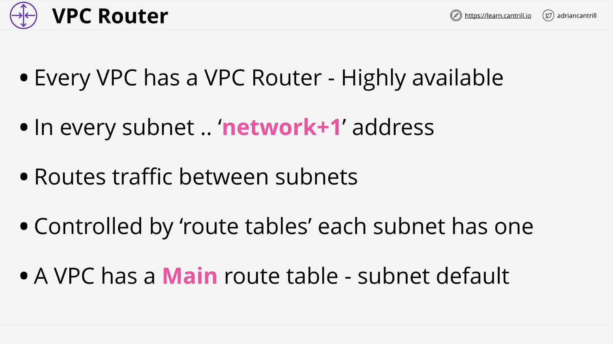
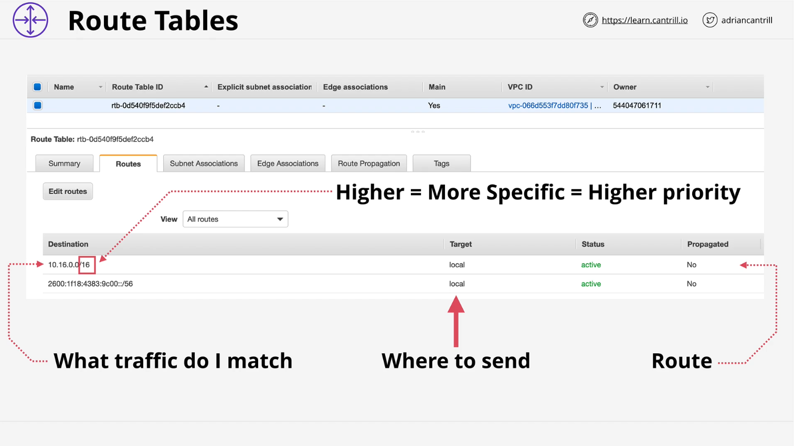
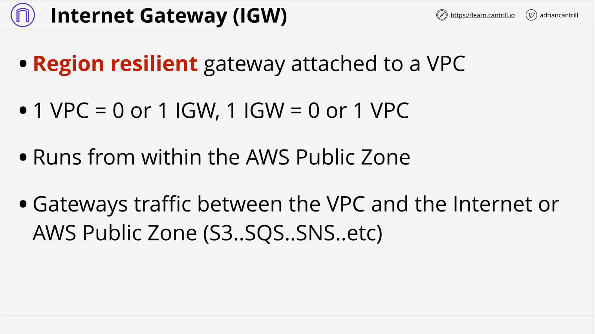
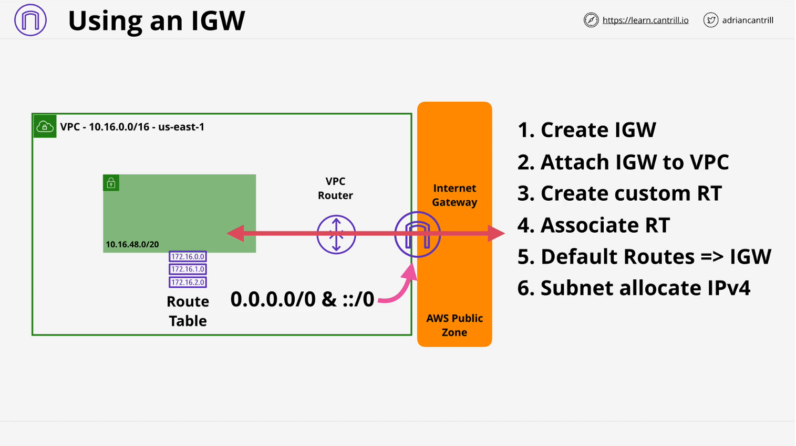
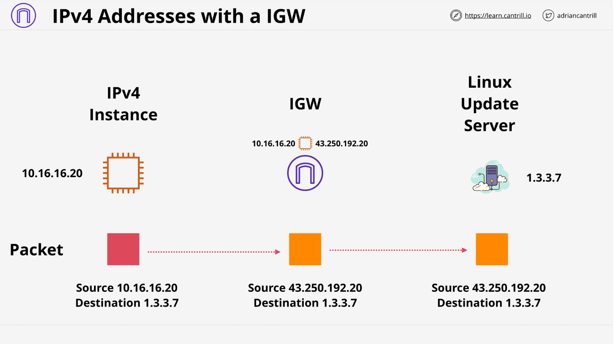
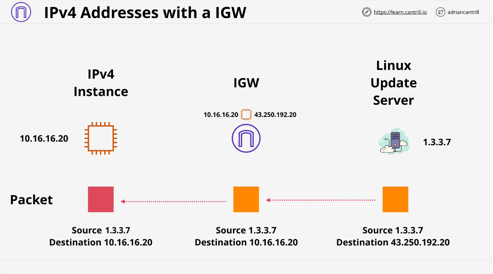
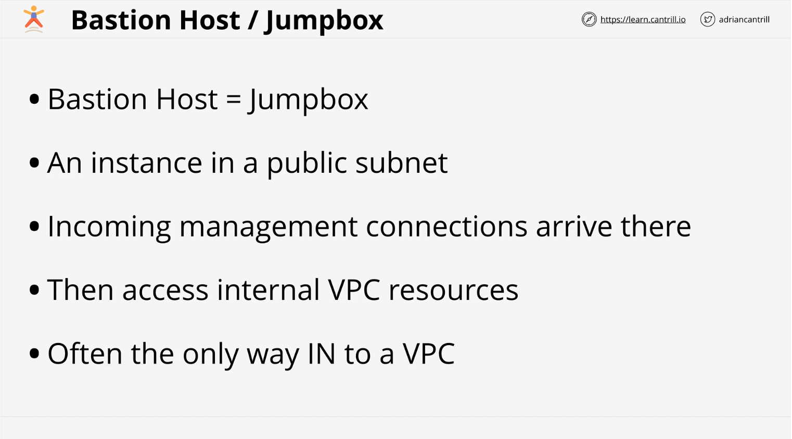

# VPC Routing and Internet Gateway

## Introduction

This lesson covers how routing works within an AWS Virtual Private Cloud (VPC) and introduces the Internet Gateway (IGW). The goal is to understand how data flows within a VPC and how it interacts with the AWS public zone and the internet. This lesson includes theoretical concepts and is followed by a hands-on demo where you configure an Internet Gateway in a VPC.

## VPC Routing Overview

A **VPC router** is a highly available device present in every VPC, whether default or custom. Its main function is to move traffic between different locations. The router operates in all Availability Zones (AZs) used by the VPC and is always available.

### Key Characteristics of a VPC Router:

- It has a **network interface** in every subnet within the VPC.
- The interface uses the **network +1 address** of the subnet.
- By default, it routes **traffic between subnets** within the VPC.

When an EC2 instance in one subnet communicates with another subnet, the VPC router facilitates the transfer.

## Route Tables in VPC

### Route Table Concepts

A **Route Table** influences how traffic leaving a subnet is handled.

- Every VPC has a **main route table**.
- If a subnet does not have an explicitly associated custom route table, it uses the **main route table**.
- A **subnet can only have one route table** associated with it at a time.
- A **route table can be associated with multiple subnets**.

### Route Table Example

A route table is a list of **routes** that direct traffic based on its destination IP.

- When a packet leaves a subnet, the **VPC router checks the destination IP** and compares it against the **destination field** in the route table.
- If multiple routes match, the one with the **highest prefix value** (most specific match) is selected.
- The target field in the route specifies the next hop for the traffic, which could be:
  - **Local** (for intra-VPC traffic)
  - **An AWS Gateway** (e.g., Internet Gateway, NAT Gateway, etc.)

### Default Routes

- The **default route** (0.0.0.0/0 for IPv4) matches all IP addresses and is often used to route internet-bound traffic.
- Local routes are always present and cannot be modified.

## Internet Gateway (IGW)

### Purpose and Functionality

An **Internet Gateway** is a highly available gateway that enables internet access for resources within a VPC.

- **Resilient at a regional level** – One IGW covers all Availability Zones in a VPC’s region.
- **One-to-one relationship** with a VPC:
  - A VPC can have **zero or one** Internet Gateway.
  - An IGW can be **detached and attached** to a different VPC but can only be associated with one at a time.
- The IGW enables traffic flow **between the VPC and the AWS public zone/internet**.
- Public IPv4 and IPv6-enabled instances rely on the IGW for external access.

### Steps to Enable Internet Access via IGW

1. **Create and attach an Internet Gateway** to the VPC.
2. **Create a custom route table** and associate it with the public subnet.
3. **Add a default route (0.0.0.0/0) to the route table**, pointing to the IGW.
4. **Configure the subnet to allocate public IPv4/IPv6 addresses**.
5. Once completed, instances in the **public subnet** can access the internet, and vice versa, provided there are no additional security restrictions.

## Public IP Addressing and NAT Functionality

### Public IPv4 Addresses

- AWS assigns public IPv4 addresses dynamically.
- **EC2 instances do not directly receive public IPv4 addresses** inside the OS.
- Instead, the **Internet Gateway maintains a mapping** between private and public IPs.
- The public IP is used when traffic leaves the VPC, and the IGW performs **NAT (Network Address Translation)**.

### Traffic Flow Example (IPv4)

1. **Outgoing Traffic:**
   

   - An EC2 instance with private IP **10.16.16.20** initiates a request to an external service.
   - The **Internet Gateway replaces the private IP** with the assigned public IP (e.g., 43.250.192.20).
   - The packet is then sent over the public internet.

2. **Incoming Traffic:**
   
   - The external server replies to **43.250.192.20**.
   - The **IGW translates the destination IP back to 10.16.16.20**.
   - The packet is forwarded to the EC2 instance inside the VPC.

### IPv6 Addressing Differences

- **IPv6 addresses are globally routable**.
- The EC2 instance **does** have the IPv6 address configured inside the OS.
- The **Internet Gateway does not perform NAT** for IPv6 traffic.

## Bastion Host / Jumpbox

Bastion Hosts and Jumpboxes are essential security components in cloud network architecture. They act as controlled entry points for managing private resources within a **Virtual Private Cloud (VPC)**.

### 1. Overview

- Bastion Hosts and Jumpboxes serve the same purpose and are often used interchangeably.
- They are instances deployed in a **public subnet** within a VPC.
- Their primary function is to allow secure administrative access to internal resources.

### 2. Architectural Role

- **Inbound Management Gateway**:

  - All incoming management connections arrive at the Bastion Host first.
  - After authentication, users can access internal **private-only VPC** resources.

- **Primary Use Cases**:
  - Acting as a secure management point.
  - Providing access to private-only VPCs.
  - Ensuring a highly secure network environment.

### 3. Security Measures

- **Access Control**:

  - Configure to accept connections **only from specific IP addresses**.
  - Restrict access using **SSH authentication**.
  - Integrate with **on-premises identity servers** for enhanced security.

- **Secure Entry Point**:
  - Bastion Hosts are generally the **only access point** for highly secure VPCs.

### 4. Modern Alternatives

- While alternative methods exist for managing private EC2 instances, Bastion Hosts continue to be relevant.
- They are a key concept in cloud architecture and **feature prominently in certification exams**.

## Key Takeaways for the AWS Exam

1. **VPC Routing**

   - A **VPC router is always available** and routes traffic between subnets by default.
   - **Route tables control how traffic exits subnets** and direct it toward targets.
   - Each **subnet must have an associated route table**.
   - **Local routes always exist and take priority over custom routes**.

2. **Internet Gateway (IGW)**
   - **One IGW per VPC (or none at all)**.
   - **Regionally resilient** – works across all AZs in a VPC.
   - Required for **public internet access** to AWS resources inside a VPC.
3. **Public IP Behavior**
   - **Public IPv4 addresses are never assigned inside the OS** – they are managed by AWS.
   - The **Internet Gateway handles NAT for IPv4**.
   - **IPv6 addresses are directly configured in the OS** and are publicly routable.

## Next Steps

The following **demo lesson** will cover the hands-on process of configuring an Internet Gateway and setting up public subnets in a VPC. This will reinforce the theoretical concepts covered in this lesson.
