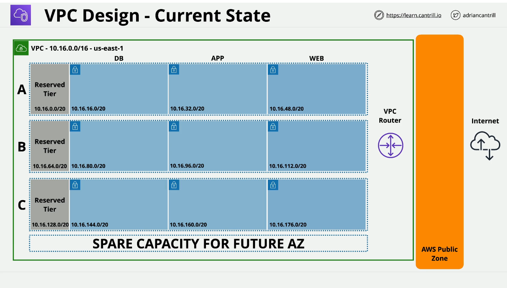
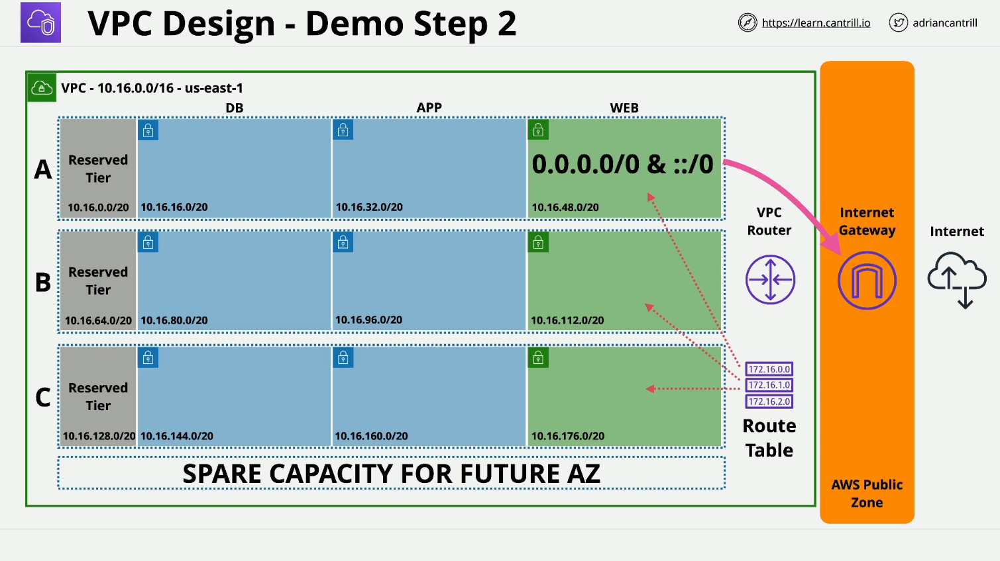

# LearnCantrill.io AWS SA-C03 - VPC Configuration Demo (Part 1)

## Overview

This lesson demonstrates key networking concepts in AWS by configuring a **custom Virtual Private Cloud (VPC)**. The demo builds on prior lessons and focuses on enabling public internet access for specific subnets.

## Architecture Setup

- The **VPC** is named `Animals for Life VPC` and is deployed in `us-east-1`.
- Uses the **CIDR range** `10.16.0.0/16`.
- Contains **12 subnets** across **3 Availability Zones (AZs)**:
  - **3 Web subnets** (web A, web B, web C)
  - **3 Application subnets**
  - **3 Database subnets**
  - **3 Reserved subnets**
- Initially, all subnets are private, meaning **no direct internet access**.

## Goal

The objective of this demo is to configure the **web subnets (web A, web B, web C)** as **public subnets** by:

- Creating and attaching an **Internet Gateway (IGW)**.
- Configuring a **public route table**.
- Assigning **public IPv4 addresses** to instances launched in web subnets.

## Steps to Enable Public Internet Access

### 1. Create and Attach an Internet Gateway

- Navigate to **VPC Console** → **Internet Gateways**.
- Click **Create Internet Gateway** and name it `A4L-VPC1-IGW`.
- Attach the **Internet Gateway** to the `Animals for Life VPC`.

### 2. Create and Configure a Route Table

- Navigate to **Route Tables**.
- Click **Create Route Table**, name it `A4L-VPC1-RT-Web`, and associate it with the VPC.
- Edit **Subnet Associations** and attach **web A, web B, and web C** to this new route table.
- Edit **Routes**:
  - Add a **default IPv4 route** (`0.0.0.0/0`) pointing to the **Internet Gateway**.
  - Add a **default IPv6 route** (`::/0`) pointing to the **Internet Gateway**.

### 3. Enable Auto-Assignment of Public IPv4 Addresses

- Navigate to **Subnets**.
- For each web subnet (`web A`, `web B`, `web C`):
  - Click **Edit Subnet Settings**.
  - Enable **Auto-assign public IPv4 address**.
  - Save changes.

## Summary of Configurations

| Component                | Configuration Details              |
| ------------------------ | ---------------------------------- |
| **Internet Gateway**     | Created and attached to `A4L-VPC1` |
| **Route Table**          | `A4L-VPC1-RT-Web`                  |
| **Subnets Associated**   | `web A`, `web B`, `web C`          |
| **Default Routes**       | `0.0.0.0/0 → IGW`, `::/0 → IGW`    |
| **Public IP Assignment** | Enabled for all `web` subnets      |

## Next Steps

- This concludes **Part 1** of the lesson.
- **Part 2** will build on this setup and continue further configurations.
- Take a short break before proceeding to **Part 2**.
