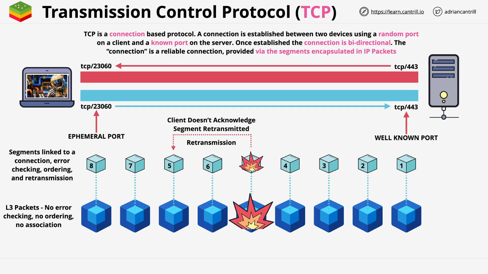
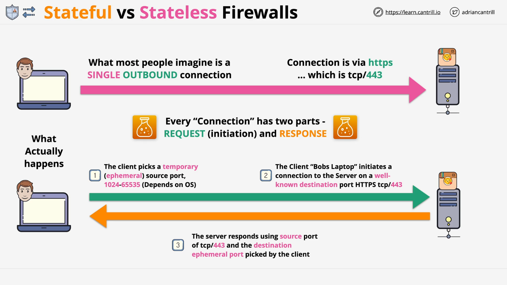
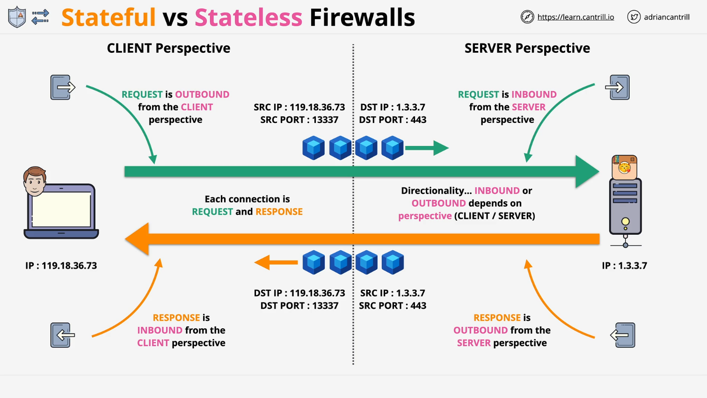
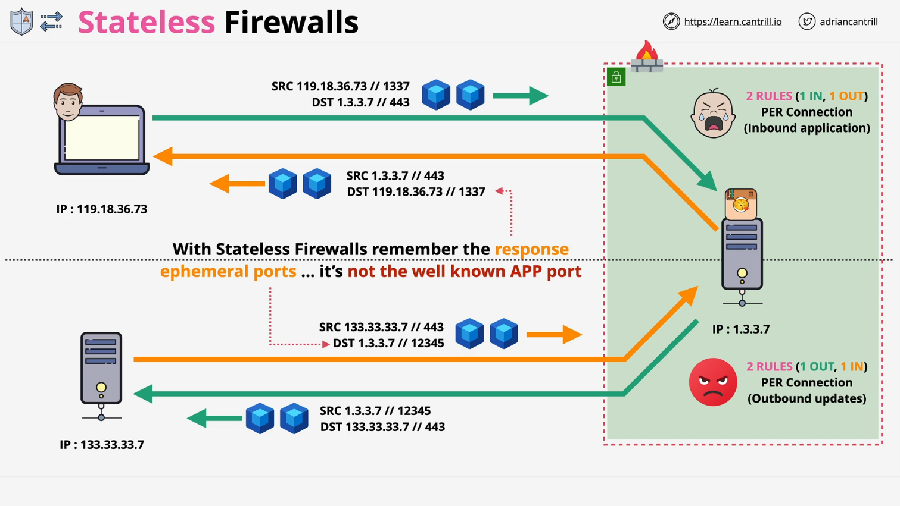
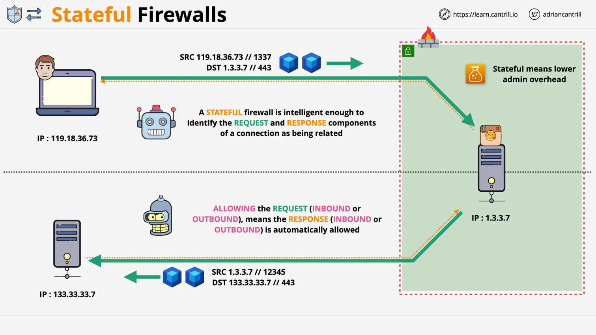

# Understanding Stateful and Stateless Firewalls

## Introduction

This document provides a detailed explanation of the differences between stateful and stateless firewalls. It also includes a refresher on TCP/IP networking fundamentals to better understand how firewalls interact with network traffic.

## TCP/IP Networking Refresher

### How TCP and IP Work Together

- TCP (Transmission Control Protocol) operates on top of IP (Internet Protocol) at Layer 4.
- IP packets carry data with a source and destination IP across networks.
- TCP adds error correction and port-based communication (e.g., HTTP on TCP port 80, HTTPS on TCP port 443).

### Understanding TCP Connections

- When a client (e.g., Bob's laptop) connects to a server (e.g., Categoram application), TCP establishes a connection.
- Each connection consists of two parts:
  1. **Request**: Client requests data from the server.
  2. **Response**: Server sends data back to the client.

### Ports and Connection Setup

- The client selects an **ephemeral port** (1024-65535, OS-dependent) for communication.
- It connects to the server on a **well-known port** (e.g., TCP 443 for HTTPS).
- The response from the server uses the same ephemeral port to communicate back to the client.
- Unique connection identifiers:
  - Source IP & Port
  - Destination IP & Port

## Directionality of Connections

### Outbound vs. Inbound Traffic

- **Client Perspective**: Request = outbound, Response = inbound.
- **Server Perspective**: Request = inbound, Response = outbound.
- Firewall rules must consider both perspectives.

## Stateless Firewalls

### How Stateless Firewalls Work

- **Do not track connection states**; treat request and response as independent traffic flows.
- Each request and response requires separate firewall rules:
  - One rule for inbound request.
  - One rule for outbound response.

### Challenges of Stateless Firewalls

- Increased management overhead (two rules per connection).
- Requires explicit allow rules for both directions.
- Responses use ephemeral ports, requiring wide port range allowances, reducing security.

### Example Scenario

1. **Bob's Laptop to Categoram Server**
   - Inbound request to Categoram on TCP 443.
   - Outbound response from Categoram on ephemeral port.
2. **Categoram Server to Software Update Server**
   - Outbound request to software update server.
   - Inbound response from software update server to Categoram.

> **Key Takeaway**: Stateless firewalls require an inverse rule for every request to allow responses.

## Stateful Firewalls

### How Stateful Firewalls Work

- **Track and recognize connection states**, automatically allowing corresponding responses.
- Instead of two rules per connection, only the request needs to be explicitly allowed.
- The firewall dynamically identifies and allows the correct response traffic.

### Advantages of Stateful Firewalls

- **Reduces rule management overhead** (only request rules needed).
- **Improves security** by only allowing expected responses.
- **No need to allow full ephemeral port range**, as the firewall tracks which port is used.

### Example Scenario

1. **Bob's Laptop to Categoram Server**
   - Firewall sees the outbound request to TCP 443 and **remembers it**.
   - Automatically allows the inbound response from the server to Bob’s laptop.
2. **Categoram Server to Software Update Server**
   - Firewall tracks the request and automatically allows the inbound response.

> **Key Takeaway**: Stateful firewalls reduce complexity by handling response traffic automatically.

## Summary

| Feature                  | Stateless Firewall         | Stateful Firewall             |
| ------------------------ | -------------------------- | ----------------------------- |
| Tracks Connection State  | No                         | Yes                           |
| Number of Rules Required | Two per connection         | One per connection            |
| Ephemeral Port Handling  | Must allow full range      | Automatically handled         |
| Security                 | Lower (broader allowances) | Higher (restricted responses) |
| Admin Overhead           | High                       | Low                           |

> Next, we will explore how AWS implements both stateful and stateless firewall mechanisms in its cloud services.
