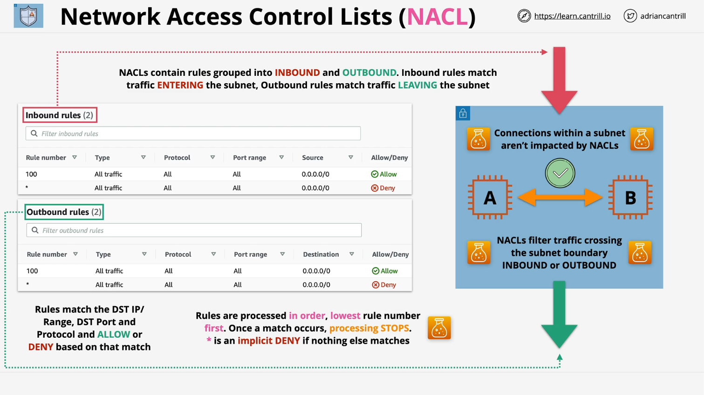
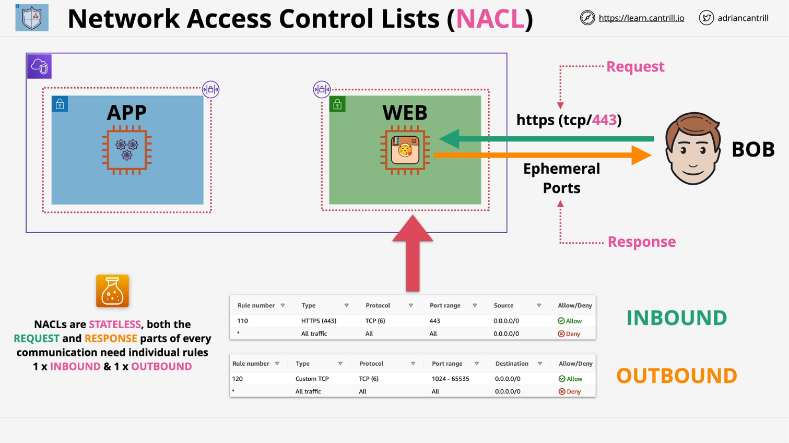
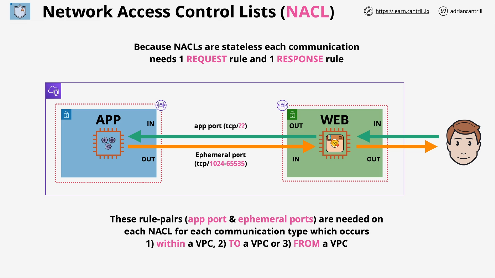
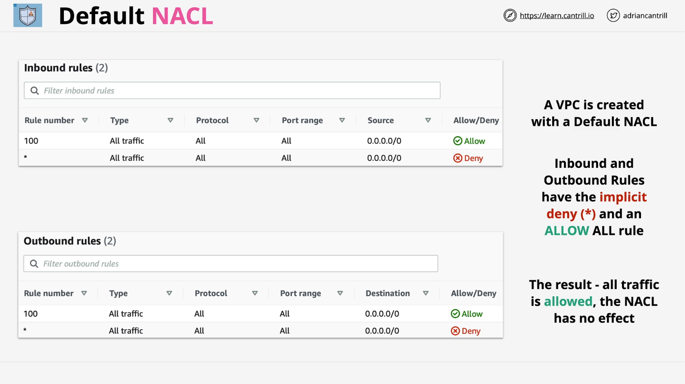
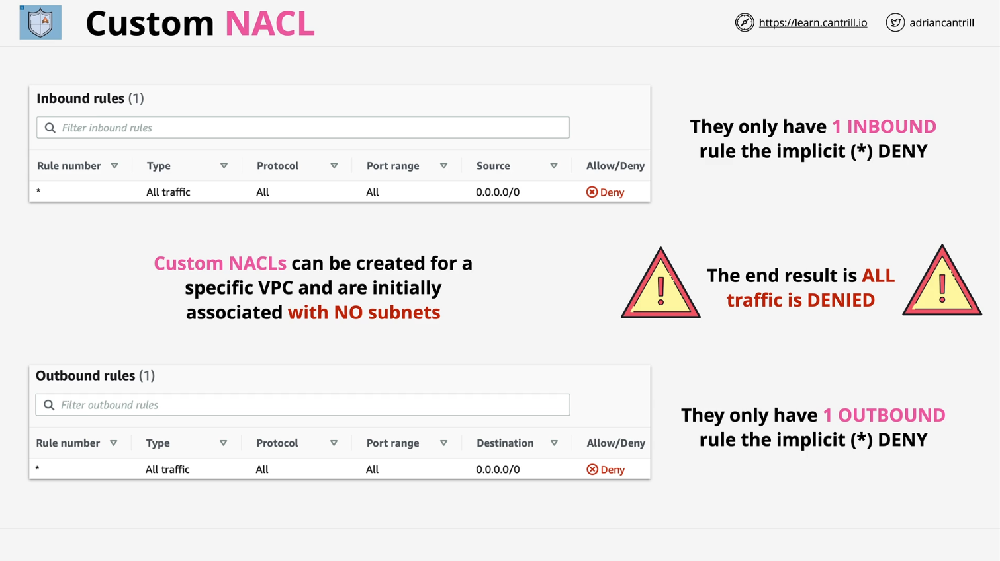

# Network Access Control Lists (NACLs) Explained

This lesson from LearnCantrill.io’s AWS Solutions Architect (SA) C03 course focuses on **Network Access Control Lists (NACLs)** within AWS Virtual Private Clouds (VPCs). It covers how NACLs function, their stateless nature, rule processing, and their role in securing network traffic across subnets.

## Introduction to Network Access Control Lists (NACLs)

- NACLs act as traditional firewalls for AWS VPCs.
- They are associated with **subnets**, not individual instances.
- NACLs filter traffic **entering and leaving** a subnet but do not affect traffic **within** the same subnet.

## Core Concepts of NACLs

**Key Characteristics:**

- **Subnet Association:** Every subnet has one associated NACL.
- **Two Rule Sets:** Each NACL has **inbound** and **outbound** rules.
- **Direction-Based:** Rules apply based on the **traffic direction**, not whether it's a request or response.
- **Stateless:** Both **request** and **response** traffic need separate rules.

**Rule Matching:**

- Rules are processed **in order** by rule number (lowest to highest).
- Once a rule matches traffic, it's either **allowed** or **denied**, and processing stops.
- A **catch-all deny** rule (denoted by `*`) implicitly denies all unmatched traffic.

## How NACLs Work in AWS VPCs

### **Example Architecture: Single Subnet Communication**

- Consider an AWS VPC with a subnet hosting two EC2 instances: **Instance A** and **Instance B**.
- NACLs filter traffic **into and out of the subnet**, not between instances within the same subnet.

### **Example: User Accessing a Web Server**

- **Scenario:** Bob accesses a web server using HTTPS (TCP port 443).
- **Inbound Rule:** Allow traffic from `0.0.0.0/0` (anywhere) to TCP port `443`.
- **Outbound Rule:** Allow traffic to `0.0.0.0/0` using the **ephemeral port range** (`1024–65535`).

### **Ephemeral Ports:**

- These ports are **randomly chosen** by the client’s operating system for response traffic.
- AWS commonly uses the port range **1024–65535**.

## Multi-Tier Architecture and Complexity of NACL Rules

**Scenario:** A multi-tier application with a web server and an application server across two subnets.

**Traffic Flow:**

1. **User to Web Server:**

   - Inbound rule on the web subnet NACL for HTTPS (port 443).
   - Outbound rule for the ephemeral port range.

2. **Web Server to App Server:**

   - Outbound rule on the web subnet NACL for the app port.
   - Inbound rule on the app subnet NACL for the same port.

3. **App Server Response:**
   - Outbound rule from the app subnet using ephemeral ports.
   - Inbound rule on the web subnet for the same ephemeral port range.

**Key Takeaways:**

- Each connection requires **two rules per NACL** (inbound and outbound).
- As communication crosses subnet boundaries, **multiple NACL rules** are needed.

## Default vs. Custom NACLs

| Feature                | Default NACL                           | Custom NACL                           |
| ---------------------- | -------------------------------------- | ------------------------------------- |
| **Creation**           | Automatically created with VPC         | Created manually for specific VPCs    |
| **Associated Subnets** | All subnets by default                 | No subnets associated initially       |
| **Default Rules**      | Allow all inbound and outbound traffic | Deny all inbound and outbound traffic |
| **Customization**      | Not recommended for detailed control   | Used for precise traffic management   |

⚠️ **Caution:** Associating a custom NACL with a subnet without proper rules will block all traffic.

## Key Properties and Considerations

- **Stateless:** NACLs treat requests and responses separately.
- **Subnet-Level:** They operate **only at subnet boundaries**.
- **Explicit Deny:** Unlike security groups, NACLs support **explicit deny** rules.
- **IP-Based:** Rules are based on **IP addresses, CIDR ranges, ports, and protocols**.
- **No Logical Awareness:** NACLs can't reference AWS resources directly (e.g., instance IDs).
- **One NACL per Subnet:** A subnet can only have one NACL, but one NACL can be associated with multiple subnets.

## NACLs vs. Security Groups

| Feature                  | NACLs                                | Security Groups                            |
| ------------------------ | ------------------------------------ | ------------------------------------------ |
| **State**                | Stateless                            | Stateful                                   |
| **Rule Direction**       | Inbound and outbound rules required  | Inbound and outbound tracked automatically |
| **Allow/Deny**           | Supports both allow and deny         | Only supports allow                        |
| **Resource Association** | Associated with subnets              | Associated with instances                  |
| **Use Case**             | IP-based filtering and explicit deny | Instance-level access control              |

💡 **Best Practice:**

- Use **Security Groups** for instance-level access control.
- Use **NACLs** to add an extra layer of protection, especially for **IP-based blocking**.

## Conclusion

Network ACLs provide an additional layer of security in AWS VPCs by controlling traffic flow at the subnet level. Their **stateless nature**, **explicit deny capability**, and **direction-based rules** make them valuable for fine-grained traffic filtering. However, they can become complex when managing multi-tier architectures and cross-subnet communication.

**Key Takeaways:**

- Understand the **stateless behavior** and need for **separate request and response rules**.
- Manage rule order carefully to **avoid unintentional denies**.
- Combine NACLs with **security groups** for robust network protection.

For advanced security, AWS recommends **security groups** for instance-level filtering and **NACLs** for subnet-level traffic control, especially when explicit denial of malicious IPs is needed.
