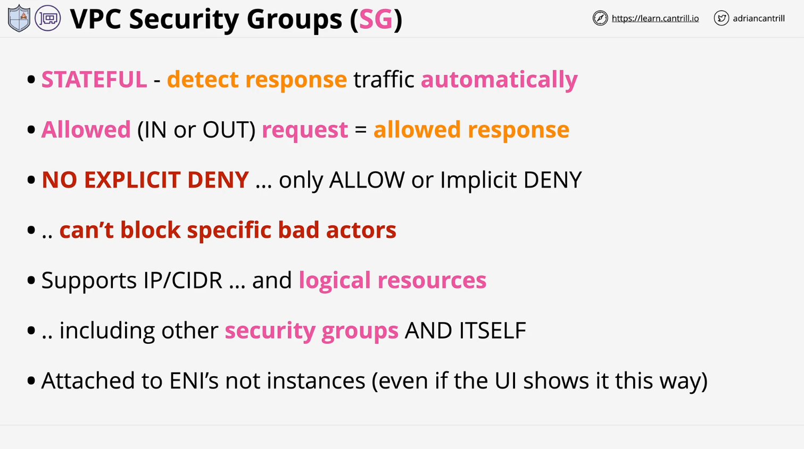

# Security Groups

## Overview

This lesson covers AWS Security Groups, a stateful security feature used to control inbound and outbound traffic for resources within a Virtual Private Cloud (VPC). Unlike Network Access Control Lists (NACLs), security groups cannot explicitly deny traffic but offer advanced functionality through logical resource referencing.

## Key Concepts

### What Are Security Groups?

- Security groups act as virtual firewalls, controlling traffic to and from AWS resources.
- They are stateful, meaning response traffic is automatically allowed if the initial request is permitted.
- Security groups are attached to Elastic Network Interfaces (ENIs), not directly to instances or subnets.

## Stateful Nature of Security Groups

- Traffic flows are tracked, ensuring return traffic is automatically allowed without additional rules.
- For example, if an inbound rule allows HTTPS (TCP port 443) traffic, the response is permitted without an outbound rule.

## Implicit Deny and Lack of Explicit Deny

- Security groups use an implicit deny model. If traffic is not explicitly allowed, it is denied by default.
- There is no option for an explicit deny rule, making it impossible to block specific IPs or ranges.
- To block bad actors, network ACLs are often used alongside security groups.

## Rule Structure and Evaluation

- Rules can be defined based on IP addresses, CIDR ranges, and AWS logical resources (e.g., other security groups).
- Separate inbound and outbound rule sets exist, but stateful behavior simplifies configuration.

## Security Group Attachments

- Security groups are attached to Elastic Network Interfaces (ENIs), not directly to instances.
- When you assign a security group to an instance, it attaches to the instance's primary ENI.

## Example Scenario: Single-Tier Application

Consider an EC2 instance in a public subnet with HTTPS access from the internet.

### Configuration:

- Inbound rule allows TCP port 443 from 0.0.0.0/0.
- Outbound rule is not required for response traffic.

### Limitation:

- If a malicious actor is detected, the security group cannot explicitly block their IP.

## Advanced Features

### Logical Resource Referencing

Security groups can reference other AWS resources, enabling dynamic traffic control.

Example:

- A web instance in a public subnet and an app instance in a private subnet.
- Web security group (a4l-web) allows TCP port 443 from all IPs.
- App security group (a4l-app) allows TCP port 1337 from the web security group.

**Effect:**

- Any instance with the a4l-web security group can access any instance with the a4l-app security group on port 1337.
- This eliminates the need for IP-based rules and simplifies scaling.

### Self-Referencing

Security groups can reference themselves, enabling intra-group communication.

Example:

- In a private subnet with auto-scaling instances, a security group allows TCP port 1337 from itself.
- This allows instances within the group to communicate without IP dependency.

**Benefits:**

- Simplifies management for auto-scaling groups and clustered applications.
- Ideal for domain controllers and high-availability architectures.

## Security Groups vs. Network ACLs

| Feature               | Security Groups                       | Network ACLs |
| --------------------- | ------------------------------------- | ------------ |
| Stateful              | Yes                                   | No           |
| Implicit Deny         | Yes                                   | Yes          |
| Explicit Deny         | No                                    | Yes          |
| Attachment Level      | Elastic Network Interface (ENI)       | Subnet       |
| Logical Resource Ref. | Yes (AWS resources, self-referencing) | No           |

## Best Practices

- Use security groups to allow traffic based on logical resource associations.
- Combine with network ACLs for explicit denial of unwanted traffic.
- Avoid relying on IP-based rules when security group references can simplify management.
- Implement self-referencing for intra-group communication in clustered or auto-scaling environments.

## Conclusion

AWS Security Groups provide stateful traffic control, simplifying resource communication through logical references. While they lack explicit deny capabilities, combining them with NACLs ensures robust security. Understanding these distinctions is crucial for both AWS certification and real-world implementations.
