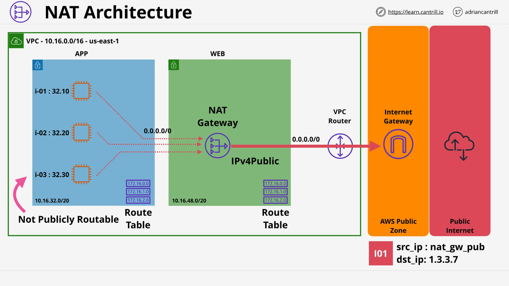

# NAT Gateway

## Overview

This lesson focuses on **Network Address Translation (NAT)** in AWS, a method for giving private resources outgoing-only access to the internet. AWS offers a managed service called the **NAT Gateway** within a VPC to achieve this functionality. This document covers the concepts, architecture, and key details of the NAT Gateway.

## What is NAT?

**Network Address Translation (NAT)** is a process that modifies IP packets by changing their **source** or **destination** IP addresses. There are two primary types of NAT:

1. **Static NAT:**

   - One-to-one mapping between private and public IP addresses.
   - Handled by the **Internet Gateway (IGW)** in AWS.
   - When an instance with a public IPv4 address sends data, the IGW changes the source IP from private to public and vice versa for the return traffic.

2. **IP Masquerade (Dynamic NAT):**
   - Many-to-one mapping, where multiple private IP addresses share a single public IP address.
   - This is the functionality provided by the **NAT Gateway**.
   - Enables outgoing connections from private instances but prevents unsolicited incoming connections.

## Why Use NAT?

NAT is essential for private subnets that need outgoing internet access without being exposed to the public internet. Common use cases include:

- **Software updates** for private instances.
- **Accessing AWS public services** like S3, DynamoDB, and more.
- **Maintaining private network integrity** while allowing selective internet access.

## NAT Gateway Architecture

Here's how the **NAT Gateway** works within an AWS VPC:

1. **Private Subnet:**

   - Contains instances with private IP addresses (e.g., `10.16.32.0/20`).
   - Instances cannot access the internet directly.

2. **Public Subnet:**

   - Hosts the **NAT Gateway**.
   - Assigned an **Elastic IP** (EIP), a static public IPv4 address.
   - Route table points the default route (`0.0.0.0/0`) to the **Internet Gateway (IGW)**.

3. **Routing Flow:**
   - Private instances send packets to the **NAT Gateway**.
   - The **NAT Gateway** replaces the source IP (private) with its **Elastic IP** (public).
   - Packets are routed through the **Internet Gateway** to the internet.
   - Response packets are routed back through the **NAT Gateway**, which translates the destination IP back to the private instance.

**Example Packet Flow:**

1. Instance `i01` (IP: `10.16.32.10`) sends a request to an update server (`1.3.3.7`).
2. The route table sends the packet to the **NAT Gateway**.
3. The **NAT Gateway** records the session in its **Translation Table**.
4. It replaces the source IP (`10.16.32.10`) with its **Elastic IP** (public).
5. The **Internet Gateway** sends the packet to the internet.
6. The server (`1.3.3.7`) responds, and the packet returns via the **NAT Gateway**, which translates the destination IP back to `10.16.32.10`.

## Key Facts About NAT Gateway

### 1. Deployment

- Must be deployed in a **public subnet**.
- Requires an **Elastic IP (EIP)** for a static public IPv4 address.
- Each private subnet needing internet access must route traffic through a **NAT Gateway**.

### 2. Availability and Resilience

- **AZ Resilient:** A NAT Gateway is resilient only within its **Availability Zone (AZ)**.
- For **regional resilience**, deploy one NAT Gateway per AZ and configure corresponding route tables.

### 3. Performance and Scaling

- **Scalable:** Supports up to **45 Gbps** of bandwidth.
- To increase throughput, deploy multiple **NAT Gateways** and route traffic from different subnets accordingly.

### 4. Cost

- **Hourly charge:** Around **$0.045 per hour** (varies by region).
- **Data processing fee:** Around **$0.045 per GB** of data processed.
- Both **base hourly** and **data usage** charges apply.

## Summary of Key Concepts

| Feature              | Description                                                    |
| -------------------- | -------------------------------------------------------------- |
| **Type of NAT**      | Static NAT (1:1) via IGW, Dynamic NAT (many:1) via NAT Gateway |
| **Primary Function** | Outgoing internet access for private subnets                   |
| **Elastic IP (EIP)** | Required for NAT Gateway to have a static public IP            |
| **Resilience**       | AZ-resilient; deploy per AZ for regional resilience            |
| **Performance**      | Up to 45 Gbps per NAT Gateway                                  |
| **Cost Components**  | Hourly charge + data processing fee                            |

## Conclusion

NAT Gateways are essential for **outbound internet access** from private instances in an AWS VPC. They provide **IP masquerading**, ensuring private subnets remain secure while allowing internet-bound communication. For **high availability**, deploy NAT Gateways per **Availability Zone**, and always consider **cost and bandwidth requirements** when designing your VPC architecture.

This concludes **Part 1** of the lesson. In **Part 2**, the course continues with further implementation details and demonstrations.
