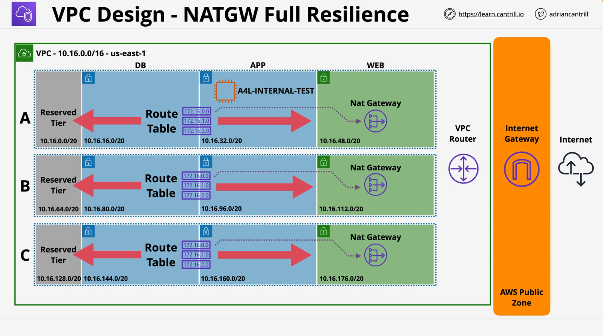

# Animals4Life VPC Template with NAT Gateway Implementation

## CloudFormation Template Analysis

### Overview

The CloudFormation template creates a comprehensive VPC infrastructure for the Animals4Life organization with subnets across three availability zones, supporting both IPv4 and IPv6 addressing. The infrastructure follows the best practice of separating resources into distinct tiers (web, application, database, and reserved) across multiple availability zones for high availability.

### Parameters

- **LatestAmiId**: A parameter that references the latest Amazon Linux 2 AMI from the SSM Parameter Store, used for EC2 instance deployment.

### Resources

#### VPC and Internet Gateway

- Creates a VPC with CIDR block `10.16.0.0/16`
- Enables DNS support and hostnames
- Adds IPv6 CIDR block allocation
- Creates an Internet Gateway and attaches it to the VPC
- Sets up a route table for web subnets with routes to the Internet Gateway for both IPv4 and IPv6 traffic

#### Subnet Structure

The template creates a tiered subnet structure across three availability zones (A, B, C):

1. **Reserved Subnets** (private):

   - Reserved-A: `10.16.0.0/20` with IPv6 CIDR `/64`
   - Reserved-B: `10.16.64.0/20` with IPv6 CIDR `/64`
   - Reserved-C: `10.16.128.0/20` with IPv6 CIDR `/64`

2. **Database Subnets** (private):

   - DB-A: `10.16.16.0/20` with IPv6 CIDR `/64`
   - DB-B: `10.16.80.0/20` with IPv6 CIDR `/64`
   - DB-C: `10.16.144.0/20` with IPv6 CIDR `/64`

3. **Application Subnets** (private):

   - APP-A: `10.16.32.0/20` with IPv6 CIDR `/64`
   - APP-B: `10.16.96.0/20` with IPv6 CIDR `/64`
   - APP-C: `10.16.160.0/20` with IPv6 CIDR `/64`

4. **Web Subnets** (public):
   - WEB-A: `10.16.48.0/20` with IPv6 CIDR `/64`
   - WEB-B: `10.16.112.0/20` with IPv6 CIDR `/64`
   - WEB-C: `10.16.176.0/20` with IPv6 CIDR `/64`

#### IPv6 Configuration

- Includes a custom Lambda function to modify subnet attributes for IPv6 address assignment
- Creates an IAM role for the Lambda function with required permissions

#### EC2 Instance and Security

- Deploys a private EC2 instance (`A4L-INTERNAL-TEST`) in the APP-A subnet
- Creates a security group allowing SSH access (IPv4 and IPv6)
- Enables self-referencing rule for instances in the same security group

#### Systems Manager Integration

- Sets up an IAM role and instance profile for Systems Manager integration
- Creates VPC endpoints for SSM, EC2 Messages, and SSM Messages services
- This allows management of the private instance without direct internet access

## NAT Gateway Implementation Demo



### Demo Overview

The demo shows how to implement NAT gateways in each availability zone to provide internet access for private EC2 instances without exposing them directly to the internet. The architecture follows AWS best practices for high availability by placing a NAT gateway in each availability zone.

### Implementation Steps:

1. **Initial Setup**

   - Deploy the base VPC architecture using CloudFormation one-click deployment
   - Verify the EC2 instance is running with status checks passed
   - Connect to the private EC2 instance using Session Manager
   - Confirm the instance lacks internet connectivity by trying to ping `1.1.1.1`

2. **Create NAT Gateways**

   - Create three NAT gateways, one for each availability zone:
     - NAT-GW-A in the Web-A subnet
     - NAT-GW-B in the Web-B subnet
     - NAT-GW-C in the Web-C subnet
   - Allocate Elastic IP addresses for each NAT gateway
   - Wait for NAT gateways to become available

3. **Configure Route Tables**

   - Create three private route tables:
     - RT-private-A for AZ-A private subnets
     - RT-private-B for AZ-B private subnets
     - RT-private-C for AZ-C private subnets
   - Add default routes (0.0.0.0/0) pointing to the corresponding NAT gateway in each route table
   - Associate each private route table with the private subnets in its availability zone:
     - RT-private-A with Reserved-A, App-A, and DB-A
     - RT-private-B with Reserved-B, App-B, and DB-B
     - RT-private-C with Reserved-C, App-C, and DB-C

4. **Test Connectivity**

   - Verify private instance now has internet connectivity through the NAT gateway by pinging `1.1.1.1`

5. **Cleanup Process**
   - Remove subnet associations from the private route tables
   - Delete the private route tables
   - Delete NAT gateways
   - Release Elastic IP addresses
   - Delete the CloudFormation stack

### Key Architectural Benefits

1. **High Availability**: By placing a NAT gateway in each availability zone, if one AZ fails, instances in other AZs maintain internet connectivity.

2. **Fault Isolation**: Each availability zone uses its own NAT gateway, preventing a single point of failure.

3. **Security**: Private instances gain outbound internet access without being directly exposed to inbound internet traffic.

4. **Session Manager Integration**: The setup includes VPC endpoints for Systems Manager, allowing management of private instances without direct internet access.

## AWS Services and Features Utilized

1. **VPC (Virtual Private Cloud)**: For network isolation
2. **Subnets**: For logical network segmentation
3. **Internet Gateway**: For public subnet internet connectivity
4. **NAT Gateway**: For private subnet outbound internet access
5. **Route Tables**: For controlling network traffic flow
6. **Elastic IP Addresses**: For static public IP allocation
7. **CloudFormation**: For infrastructure as code deployment
8. **EC2 Instances**: For compute resources
9. **Security Groups**: For network security
10. **IAM Roles and Policies**: For permissions management
11. **Lambda Functions**: For custom resource implementation
12. **VPC Endpoints**: For private AWS service access
13. **Systems Manager Session Manager**: For secure instance access without SSH

This architecture demonstrates AWS best practices for building secure, highly available infrastructure with proper network segmentation and controlled internet access.

# CloudFormation Template Explanation:

This [template](https://console.aws.amazon.com/cloudformation/home?region=us-east-1#/stacks/create/review?templateURL=https://learn-cantrill-labs.s3.amazonaws.com/awscoursedemos/0003-aws-associate-vpc-private-internet-access-using-nat-gateways/a4l_vpc_privateinternet_nat.yaml&stackName=A4L) creates a VPC (Virtual Private Cloud) architecture for an organization called Animals4Life, with multiple subnets and supporting resources.

```yaml
Description: Animals4Life base VPC Template w/ private instance
```

This is the template description, indicating it's for creating a VPC with private instances for an organization called Animals4Life.

```yaml
Parameters:
  LatestAmiId:
    Description: AMI for Bastion Host (default is latest AmaLinux2)
    Type: "AWS::SSM::Parameter::Value<AWS::EC2::Image::Id>"
    Default: "/aws/service/ami-amazon-linux-latest/amzn2-ami-hvm-x86_64-gp2"
```

Defines a parameter that references the latest Amazon Linux 2 AMI (Amazon Machine Image) through the AWS Systems Manager Parameter Store.

```yaml
Resources:
  VPC:
    Type: AWS::EC2::VPC
    Properties:
      CidrBlock: 10.16.0.0/16
      EnableDnsSupport: true
      EnableDnsHostnames: true
      Tags:
        - Key: Name
          Value: a4l-vpc1
```

Creates a VPC with CIDR block 10.16.0.0/16, enabling DNS support and hostnames, and tagging it as "a4l-vpc1".

```yaml
IPv6CidrBlock:
  Type: AWS::EC2::VPCCidrBlock
  Properties:
    VpcId: !Ref VPC
    AmazonProvidedIpv6CidrBlock: true
```

Adds an IPv6 CIDR block to the VPC, using Amazon's automatic allocation.

```yaml
InternetGateway:
  Type: "AWS::EC2::InternetGateway"
  Properties:
    Tags:
      - Key: Name
        Value: A4L-vpc1-igw
```

Creates an Internet Gateway resource tagged as "A4L-vpc1-igw".

```yaml
InternetGatewayAttachment:
  Type: "AWS::EC2::VPCGatewayAttachment"
  Properties:
    VpcId: !Ref VPC
    InternetGatewayId: !Ref InternetGateway
```

Attaches the Internet Gateway to the VPC.

```yaml
RouteTableWeb:
  Type: "AWS::EC2::RouteTable"
  Properties:
    VpcId: !Ref VPC
    Tags:
      - Key: Name
        Value: A4L-vpc1-rt-web
```

Creates a route table for web subnets within the VPC.

```yaml
RouteTableWebDefaultIPv4:
  Type: "AWS::EC2::Route"
  DependsOn: InternetGatewayAttachment
  Properties:
    RouteTableId:
      Ref: RouteTableWeb
    DestinationCidrBlock: "0.0.0.0/0"
    GatewayId:
      Ref: InternetGateway
```

Adds a default route for IPv4 traffic (0.0.0.0/0) to the Internet Gateway in the web route table.

```yaml
RouteTableWebDefaultIPv6:
  Type: "AWS::EC2::Route"
  DependsOn: InternetGatewayAttachment
  Properties:
    RouteTableId:
      Ref: RouteTableWeb
    DestinationIpv6CidrBlock: "::/0"
    GatewayId:
      Ref: InternetGateway
```

Adds a default route for IPv6 traffic (::/0) to the Internet Gateway in the web route table.

```yaml
RouteTableAssociationWebA:
  Type: "AWS::EC2::SubnetRouteTableAssociation"
  Properties:
    SubnetId: !Ref SubnetWEBA
    RouteTableId:
      Ref: RouteTableWeb
```

Associates the web route table with the first web subnet (A).

```yaml
RouteTableAssociationWebB:
  Type: "AWS::EC2::SubnetRouteTableAssociation"
  Properties:
    SubnetId: !Ref SubnetWEBB
    RouteTableId:
      Ref: RouteTableWeb
```

Associates the web route table with the second web subnet (B).

```yaml
RouteTableAssociationWebC:
  Type: "AWS::EC2::SubnetRouteTableAssociation"
  Properties:
    SubnetId: !Ref SubnetWEBC
    RouteTableId:
      Ref: RouteTableWeb
```

Associates the web route table with the third web subnet (C).

The template then defines 12 subnets across 4 tiers (reserved, db, app, web) in 3 Availability Zones (A, B, C). For each subnet, it specifies:

```yaml
SubnetReservedA:
  Type: AWS::EC2::Subnet
  DependsOn: IPv6CidrBlock
  Properties:
    VpcId: !Ref VPC
    AvailabilityZone: !Select [0, !GetAZs ""]
    CidrBlock: 10.16.0.0/20
    AssignIpv6AddressOnCreation: true
    Ipv6CidrBlock:
      Fn::Sub:
        - "${VpcPart}${SubnetPart}"
        - SubnetPart: "00::/64"
          VpcPart: !Select [0, !Split ["00::/56", !Select [0, !GetAtt VPC.Ipv6CidrBlocks]]]
    Tags:
      - Key: Name
        Value: sn-reserved-A
```

Each subnet definition includes:

- VPC association
- Availability Zone placement
- IPv4 CIDR block allocation
- IPv6 configuration
- Naming tag

The web subnets have an additional property for auto-assigning public IPs:

```yaml
MapPublicIpOnLaunch: true
```

```yaml
IPv6WorkaroundSubnetWEBA:
  Type: Custom::SubnetModify
  Properties:
    ServiceToken: !GetAtt IPv6WorkaroundLambda.Arn
    SubnetId: !Ref SubnetWEBA
```

Creates custom resources that use a Lambda function to modify the web subnets to assign IPv6 addresses on instance creation.

```yaml
IPv6WorkaroundRole:
  Type: AWS::IAM::Role
  Properties:
    AssumeRolePolicyDocument:
      Version: "2012-10-17"
      Statement:
        - Effect: Allow
          Principal:
            Service:
              - lambda.amazonaws.com
          Action:
            - sts:AssumeRole
    Path: "/"
    Policies:
      - PolicyName: !Sub "ipv6-fix-logs-${AWS::StackName}"
        PolicyDocument:
          Version: "2012-10-17"
          Statement:
            - Effect: Allow
              Action:
                - logs:CreateLogGroup
                - logs:CreateLogStream
                - logs:PutLogEvents
              Resource: arn:aws:logs:*:*:*
      - PolicyName: !Sub "ipv6-fix-modify-${AWS::StackName}"
        PolicyDocument:
          Version: "2012-10-17"
          Statement:
            - Effect: Allow
              Action:
                - ec2:ModifySubnetAttribute
              Resource: "*"
```

Creates an IAM role for the IPv6 workaround Lambda function, allowing it to create logs and modify subnet attributes.

```yaml
IPv6WorkaroundLambda:
  Type: AWS::Lambda::Function
  Properties:
    Handler: "index.lambda_handler"
    Code:
      ZipFile:
        Fn::Sub: |
          import cfnresponse
          import boto3

          def lambda_handler(event, context):
              if event['RequestType'] is 'Delete':
                cfnresponse.send(event, context, cfnresponse.SUCCESS)
                return

              responseValue = event['ResourceProperties']['SubnetId']
              ec2 = boto3.client('ec2', region_name='${AWS::Region}')
              ec2.modify_subnet_attribute(AssignIpv6AddressOnCreation={
                                              'Value': True
                                            },
                                            SubnetId=responseValue)
              responseData = {}
              responseData['SubnetId'] = responseValue
              cfnresponse.send(event, context, cfnresponse.SUCCESS, responseData, "CustomResourcePhysicalID")
    Runtime: python3.9
    Role: !GetAtt IPv6WorkaroundRole.Arn
    Timeout: 30
```

Defines a Lambda function that sets the `AssignIpv6AddressOnCreation` attribute to true for web subnets.

```yaml
A4LINTERNALTEST:
  Type: AWS::EC2::Instance
  DependsOn:
    - ssminterfaceendpoint
    - ssmec2messagesinterfaceendpoint
    - ssmmessagesinterfaceendpoint
  Properties:
    InstanceType: "t2.micro"
    ImageId: !Ref LatestAmiId
    IamInstanceProfile: !Ref SessionManagerInstanceProfile
    SubnetId: !Ref SubnetAPPA
    SecurityGroupIds:
      - !Ref InstanceSecurityGroup
    Tags:
      - Key: Name
        Value: A4L-INTERNAL-TEST
```

Creates an EC2 instance in one of the app subnets with a t2.micro instance type.

```yaml
InstanceSecurityGroup:
  Type: "AWS::EC2::SecurityGroup"
  Properties:
    VpcId: !Ref VPC
    GroupDescription: Enable SSH access via port 22 IPv4 & v6
    SecurityGroupIngress:
      - Description: "Allow SSH IPv4 IN"
        IpProtocol: tcp
        FromPort: "22"
        ToPort: "22"
        CidrIp: "0.0.0.0/0"
      - Description: "Allow SSH IPv6 IN"
        IpProtocol: tcp
        FromPort: "22"
        ToPort: "22"
        CidrIpv6: ::/0
```

Creates a security group allowing SSH access from anywhere via IPv4 and IPv6.

```yaml
InstanceSecurityGroupSelfReferenceRule:
  Type: "AWS::EC2::SecurityGroupIngress"
  Properties:
    GroupId: !Ref InstanceSecurityGroup
    IpProtocol: "-1"
    SourceSecurityGroupId: !Ref InstanceSecurityGroup
```

Adds a self-reference rule allowing all traffic between instances using this security group.

```yaml
SessionManagerRole:
  Type: "AWS::IAM::Role"
  Properties:
    AssumeRolePolicyDocument:
      Version: 2012-10-17
      Statement:
        - Effect: Allow
          Principal:
            Service:
              - ec2.amazonaws.com
          Action:
            - "sts:AssumeRole"
    Path: /
    Policies:
      - PolicyName: root
        PolicyDocument:
          Version: 2012-10-17
          Statement:
            - Effect: Allow
              Action:
                - "ssm:DescribeAssociation"
                # ... many other SSM permissions ...
              Resource: "*"
            # ... additional permission statements ...
```

Creates an IAM role for Systems Manager Session Manager, allowing remote management of EC2 instances.

```yaml
SessionManagerInstanceProfile:
  Type: "AWS::IAM::InstanceProfile"
  Properties:
    Path: /
    Roles:
      - !Ref SessionManagerRole
```

Creates an instance profile to attach the Session Manager role to EC2 instances.

The template ends with three VPC endpoints for Amazon SSM services:

```yaml
ssminterfaceendpoint:
  Type: AWS::EC2::VPCEndpoint
  Properties:
    VpcEndpointType: "Interface"
    PrivateDnsEnabled: "True"
    SubnetIds:
      - !Ref SubnetAPPA
      - !Ref SubnetAPPB
      - !Ref SubnetAPPC
    SecurityGroupIds:
      - !Ref InstanceSecurityGroup
    ServiceName: !Sub com.amazonaws.${AWS::Region}.ssm
    VpcId: !Ref VPC
```

These endpoints allow instances in private subnets to communicate with AWS Systems Manager services without going through the internet.
