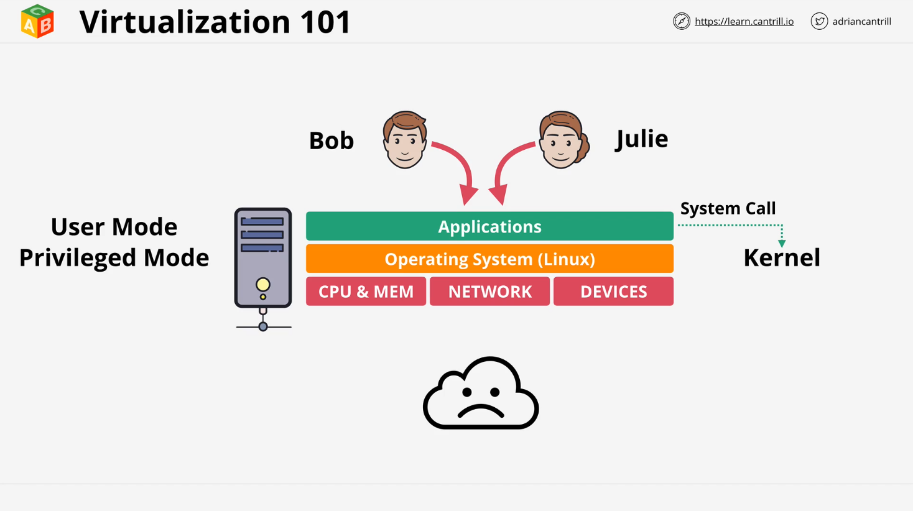
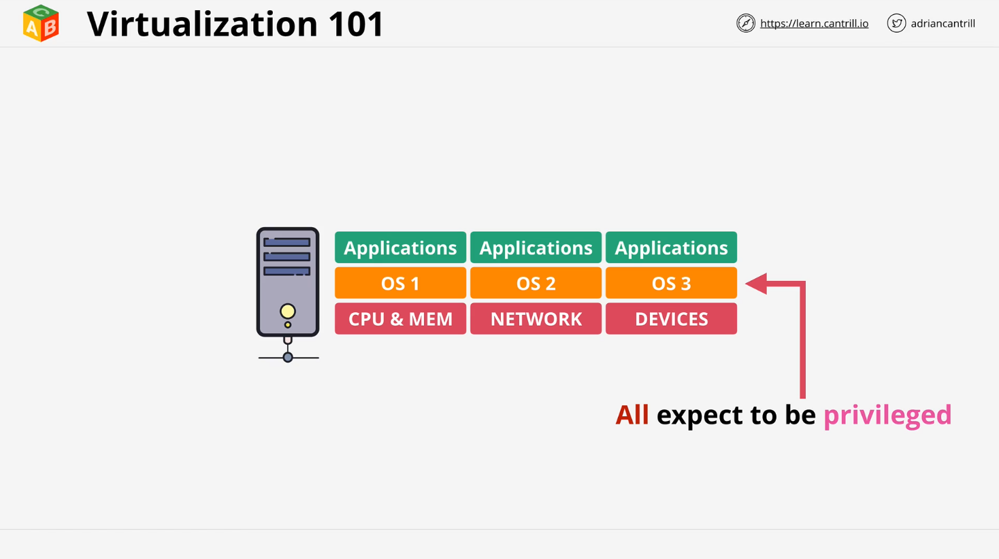
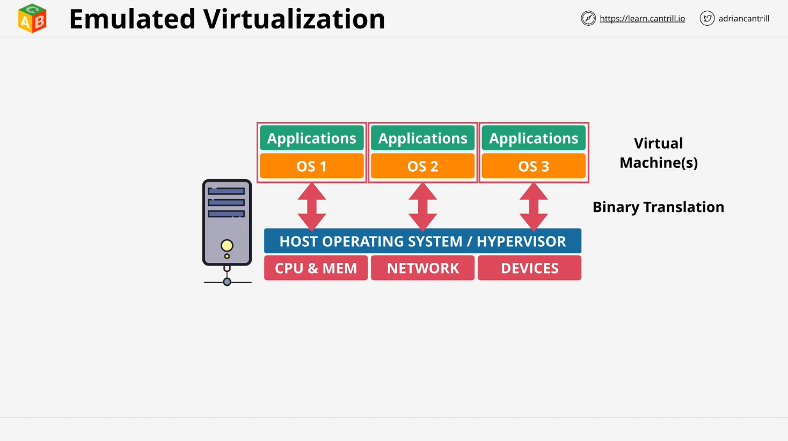
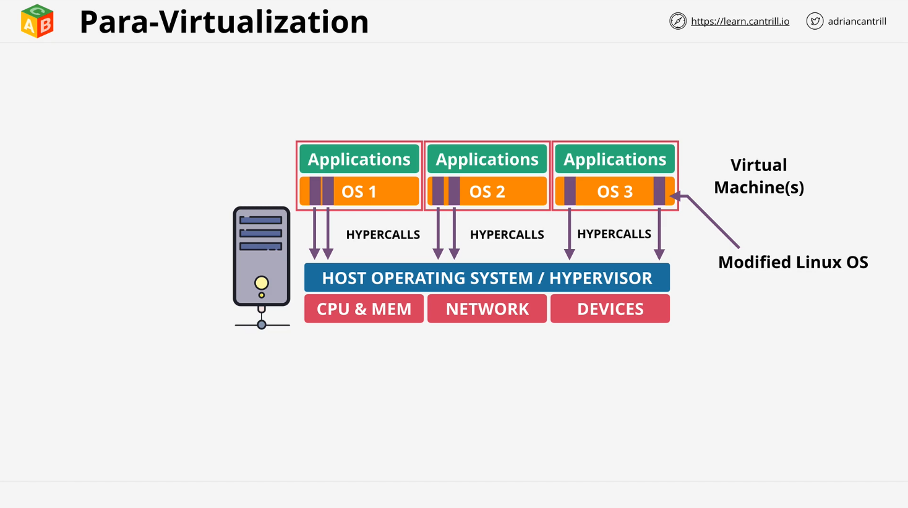
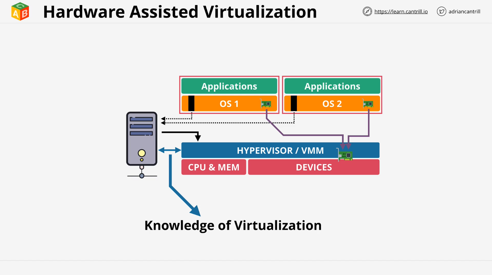
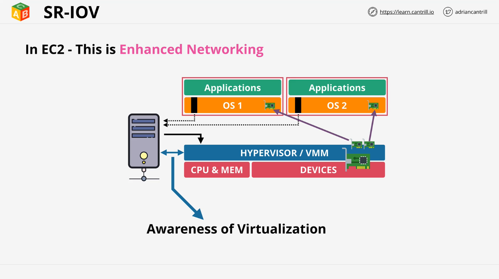

# EC2 Virtualization Overview

## Introduction

This lesson introduces the fundamentals of virtualization as it applies to AWS EC2. Virtualization enables multiple operating systems to run on a single piece of hardware, which is essential for cloud computing. Understanding virtualization helps explain EC2 features and performance optimizations.

## Traditional Computing Model (Without Virtualization)

Before virtualization, a server had:

- Physical resources: **CPU, Memory, Network cards, Storage**
- An **Operating System (OS)** running directly on hardware
- The OS kernel had **privileged access** to hardware
- Applications ran in **user mode** and had to interact with the OS for hardware access

### Issues in Traditional Model

- Only **one OS per server**, leading to resource underutilization
- Running multiple OS instances required **separate physical machines**
- **Inefficient** and costly

## What is Virtualization?

Virtualization allows **multiple operating systems (OS)** to run on the same physical hardware by using a **hypervisor**.

### How Virtualization Works

- The **hypervisor** runs in privileged mode and manages virtual machines (VMs)
- Each VM gets **virtualized hardware** (CPU, memory, disk, network)
- OS within the VM (**guest OS**) believes it has direct hardware access
- The **hypervisor ensures separation** between VMs

### Problem with Early Virtualization

CPUs were not designed for virtualization. This caused issues because:

- CPUs only allowed **one privileged process** (i.e., a single OS)
- Multiple OS instances **competing for hardware access** caused system crashes

## Types of Virtualization

### 1️. **Software-Based (Emulated) Virtualization**

- A **host OS** runs a **hypervisor** that creates virtual machines
- Guest OS runs **unmodified** but interacts with **emulated hardware**
- The hypervisor **intercepts privileged instructions** using **binary translation**
- **Major downside:** **Slow performance** due to software-based instruction translation

### 2️. **Paravirtualization (PV)**

- Guest OS is **modified** to communicate with the hypervisor using **hypercalls**
- No need for binary translation, resulting in **better performance**
- Only works if the **OS supports paravirtualization**

### 3️. **Hardware-Assisted Virtualization**

- Modern CPUs include **virtualization-aware instructions** (Intel VT-x, AMD-V)
- Guest OS attempts **privileged operations**, which are **trapped by the CPU**
- The hypervisor handles these operations efficiently
- **Result:** **Minimal performance loss** compared to bare-metal execution

## Performance Bottlenecks in Virtualization

Even with **hardware-assisted virtualization**, some performance issues remain:

- **Network and disk I/O** still require software-level translation
- Virtualized network cards and storage devices create overhead

### **Solution: SR-IOV (Single Root I/O Virtualization)**

- **SR-IOV allows physical devices (e.g., network cards) to be virtualization-aware**
- A single physical device presents itself as **multiple logical devices**
- Guest OS sees a **real dedicated device**, bypassing the hypervisor
- **Benefits:**
  - **Lower latency**
  - **Higher throughput**
  - **Less CPU overhead on the host**

### **SR-IOV in AWS EC2**

AWS EC2 uses **SR-IOV for enhanced networking**, providing:

- Faster network speeds
- More consistent low-latency performance
- Reduced CPU usage

## AWS EC2 & The Nitro Hypervisor

AWS developed its own hypervisor called **Nitro**, which improves:

- **Performance** by offloading virtualization tasks
- **Security** by isolating instances
- **Networking** with enhanced features like **SR-IOV**

Nitro enables AWS EC2 to provide **high-performance cloud infrastructure**.

## Conclusion

- **Virtualization enables cloud computing** by allowing multiple OS instances to run on the same hardware
- **AWS EC2 leverages advanced virtualization techniques**, including **hardware-assisted virtualization and SR-IOV**
- **Nitro Hypervisor** enhances EC2 performance and security

AWS constantly improves EC2 performance by integrating **modern virtualization techniques**, making cloud computing **efficient, scalable, and cost-effective**.
