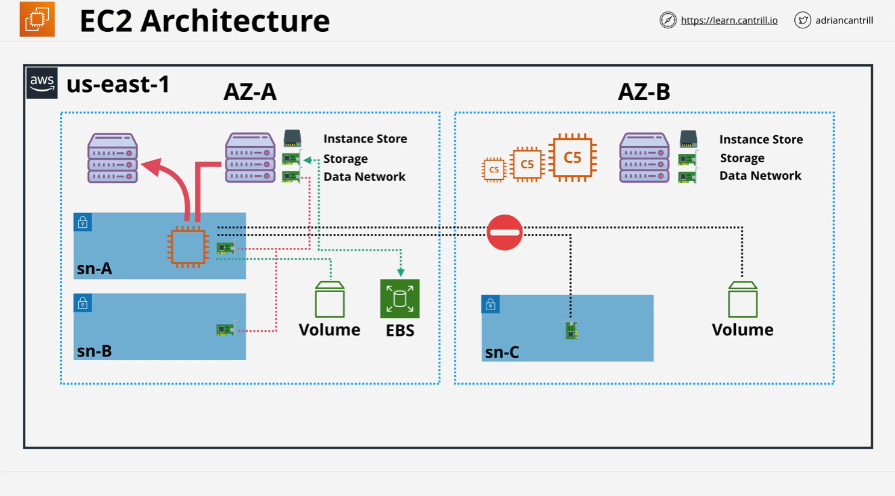

# EC2 Architecture Summary

## Introduction

This lesson focuses on the architecture of Amazon EC2 (Elastic Compute Cloud), a fundamental AWS service frequently covered in certification exams.

## EC2 High-Level Architecture

- **EC2 Instances**: Virtual machines consisting of an operating system, allocated compute resources (CPU, memory), storage (local or network-based), and access to networking and hardware components.
- **EC2 Hosts**: The physical servers managed by AWS that run EC2 instances.
  - **Shared Hosts**: Used by multiple AWS customers, with logical isolation between them.
  - **Dedicated Hosts**: Fully owned by a single customer, offering greater control over the environment.

## Availability Zone (AZ) Resilience

- EC2 is tied to specific **Availability Zones (AZs)**.
- If an AZ fails, all instances within that AZ may also fail.
- **Key Exam Tip**: Always consider availability zones when working with EC2.

## EC2 Networking & Storage

- **Networking**
  - Instances are provisioned within **VPC subnets**, which exist in a single AZ.
  - Each instance has a **Primary Elastic Network Interface (ENI)**.
  - Instances can have multiple ENIs in the same AZ but not across AZs.
- **Storage**
  - **Instance Store**: Temporary local storage on an EC2 host; data is lost if an instance is stopped or moved.
  - **Elastic Block Store (EBS)**: Persistent storage within a single AZ, independent of EC2 instance lifecycle.
  - **Cross-AZ limitation**: EBS volumes and ENIs cannot be shared across AZs.

## Instance Lifecycle & Relocation

- **Instances remain on the same host** unless:
  - The host fails or is taken down for maintenance.
  - The instance is **stopped and started** (not just restarted), in which case AWS relocates it within the same AZ.
- **EC2 instances cannot move across AZs natively**.
  - Migration involves creating a new instance in a different AZ from an AMI (Amazon Machine Image) or snapshot.

## EC2 Instance Types & Host Allocation

- Instances share host resources.
- Hosts generally run **instances of the same type and generation**.
- AWS assigns instances based on hardware compatibility.

## Use Cases for EC2

EC2 is best suited for:

1. **Traditional OS and Compute Needs**: Applications requiring a specific OS, runtime, and configuration.
2. **Long-Running Compute Workloads**: Unlike some AWS compute services with runtime limits, EC2 can run workloads indefinitely.
3. **Service-Based Applications**: Applications requiring persistent execution, such as web servers and backend services.
4. **Burstable or Steady-State Workloads**: Suitable for both low-load applications with occasional bursts and consistently running workloads.
5. **Monolithic Applications**: Systems requiring multiple components, middleware, or legacy software.
6. **Application Migrations & Disaster Recovery**: Useful for moving traditional applications to AWS or setting up backup environments.

## Key Takeaways

- EC2 is **highly tied to specific availability zones**.
- **Networking, storage, and compute resources are all confined within a single AZ**.
- **AZ isolation is a strength**, allowing architects to design highly available architectures by deploying across multiple AZs.
- **EC2 is a default compute choice in AWS** unless a specific requirement suggests otherwise (e.g., Lambda for serverless, ECS for containers).

## Conclusion

Understanding EC2’s architecture, AZ constraints, and ideal use cases is critical for both real-world deployments and AWS certification exams. By leveraging EC2’s strengths and designing for AZ resilience, solutions architects can build robust, scalable applications on AWS.
