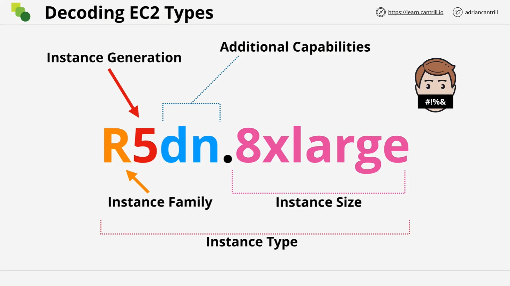

# EC2 Instance Types

## Overview

This lesson from LearnCantrill.io covers the different types of AWS EC2 instances and the considerations for selecting the right instance type for a given workload. It provides an in-depth explanation of EC2 instance categories, naming conventions, and best practices for making informed decisions.

## EC2 Instance Selection Considerations

When selecting an EC2 instance, a Solutions Architect should consider:

- **Resource Allocation**: The combination of virtual CPU, memory, and storage.
- **Performance vs. Cost**: Optimizing for the best price-performance ratio.
- **Network Bandwidth**: Ensuring sufficient network throughput for workloads.
- **Hardware Architecture**: Choosing between x86 or ARM architectures, Intel or AMD CPUs.
- **Additional Features**: Evaluating capabilities like GPUs and FPGAs for specialized workloads.

## Categories of EC2 Instances

AWS groups EC2 instances into five primary categories:

### 1. General Purpose

- **Use Case**: Default choice for steady-state workloads.
- **Characteristics**: Balanced CPU-to-memory ratio.
- **Example Instances**: T3, M5, A1.

### 2. Compute Optimized

- **Use Case**: High-performance computing, gaming, machine learning, media processing.
- **Characteristics**: More CPU power per dollar.
- **Example Instances**: C5, C6g.

### 3. Memory Optimized

- **Use Case**: Large in-memory databases, caching applications.
- **Characteristics**: High memory allocation relative to CPU.
- **Example Instances**: R5, X1e.

### 4. Accelerated Computing

- **Use Case**: Graphics rendering, parallel processing, FPGA workloads.
- **Characteristics**: Includes GPUs and FPGAs for specialized tasks.
- **Example Instances**: P4, F1.

### 5. Storage Optimized

- **Use Case**: Data warehousing, high I/O applications like Elasticsearch.
- **Characteristics**: High-speed, high-capacity local storage.
- **Example Instances**: I3, D2.

## Understanding EC2 Instance Naming

AWS EC2 instance names follow a structured format:

```
<Instance Family><Generation><Additional Features>.<Size>
```


For example: `r5dn.8xlarge`

### Breakdown of Components

| Component                      | Description                                                            |
| ------------------------------ | ---------------------------------------------------------------------- |
| **Instance Family** (`r`)      | Defines category (e.g., `t`, `m`, `c`, `r`, etc.)                      |
| **Generation** (`5`)           | AWS iterates versions (e.g., `c4` → `c5`)                              |
| **Additional Features** (`dn`) | Extra capabilities such as `d` (NVMe storage), `n` (network optimized) |
| **Size** (`8xlarge`)           | Determines vCPU and memory allocation                                  |

### Common Additional Features

- **`a`**: AMD CPUs
- **`d`**: NVMe storage
- **`n`**: Network optimized
- **`e`**: Extra capacity (RAM or storage)

## Key Takeaways

- **Instance selection impacts performance and cost.**
- **Use general-purpose instances by default unless specific needs exist.**
- **Decode instance names to understand their capabilities.**
- **Choose the latest generation for better price-performance.**
- **Use resources like [AWS Instance Types](https://aws.amazon.com/ec2/instance-types/) and [EC2 Instances Info](https://ec2instances.info/) for selection guidance.**

## Next Steps

This concludes part one of the lesson. Continue with part two to dive deeper into EC2 instance selection and best practices.
