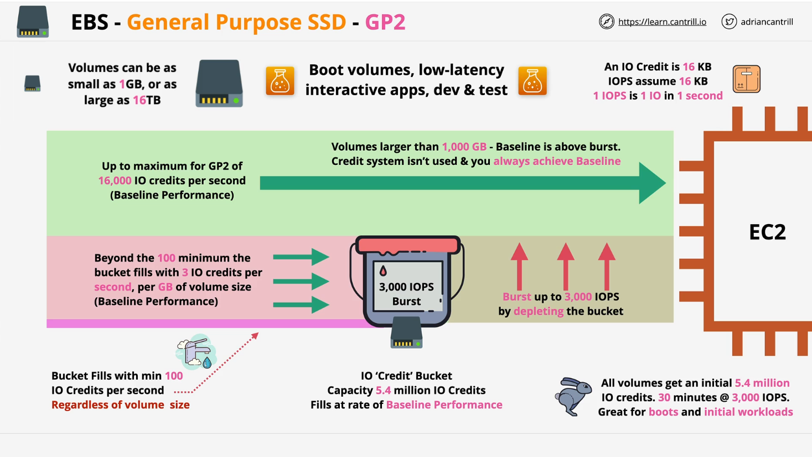
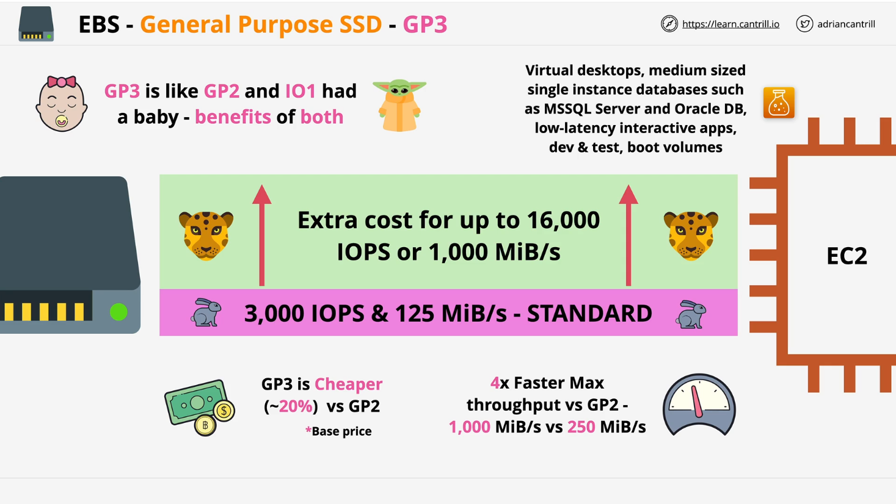

# AWS EBS Volume Types: GP2 vs. GP3

## Introduction

This lesson covers two general-purpose SSD volume types in AWS Elastic Block Store (EBS): **GP2** and **GP3**. GP2 has been the default SSD storage, but GP3 is a newer alternative expected to become the default in the future.

## GP2 (General Purpose SSD - Version 2)

### Overview

GP2 was a game-changing storage type when introduced, offering high performance at a reasonable cost. However, it has a unique **IO credit** system that can be difficult to understand initially.

### Volume Size and IO Credits

- **Size Range**: 1GB – 16TB
- **IO Credit System**:
  - Each GP2 volume is allocated **IO credits** (measured in 16KB chunks).
  - If transferring a 160KB file, it consumes **10 IO blocks** (10 × 16KB).
  - If done in one second, that equals **10 IOPS** (Input/Output Operations Per Second).
  - Low activity means low credit usage; high activity consumes more credits.

### Credit Bucket System

- Each volume starts with an **IO credit bucket** (max: **5.4 million credits**).
- Credits refill at the **baseline performance rate** of the volume.
- Minimum **100 IOPS** (refill rate of 100 credits/sec).
- **Formula**: **3 IOPS per GB** (e.g., a 100GB volume gets **300 IOPS**).
- **Burst Mode**:
  - Can reach **3,000 IOPS** (for up to 30 minutes with full credits).
  - If consuming **more** credits than the refill rate, the bucket depletes.
  - If consuming **less**, credits replenish over time.

### Performance Considerations

- **Volumes ≤ 1TB** use the IO credit system.
- **Volumes > 1TB** have a baseline IOPS of at least **3,000** (no burst needed).
- **Max IOPS**: **16,000** (for volumes >5.33TB).

### Use Cases

- Boot volumes
- Low-latency interactive applications
- Development and testing environments
- Default option in AWS (for now)

## GP3 (General Purpose SSD - Version 3)

### Key Differences from GP2

- **No IO credit system** (simpler architecture).
- Every volume starts with:
  - **3,000 IOPS**
  - **125MB/s throughput**
- **Size Range**: 1GB – 16TB
- **20% cheaper than GP2** (base cost).
- Performance upgrades available:
  - Up to **16,000 IOPS**
  - Up to **1,000MB/s throughput** (vs. **250MB/s max** in GP2).
- No automatic performance scaling with size (users must manually allocate additional IOPS and throughput).

### Use Cases (Same as GP2)

- Virtual desktops
- Medium-size databases
- Low-latency applications
- Development and testing environments
- Boot volumes

## Summary

| Feature                           | GP2                           | GP3                                     |
| --------------------------------- | ----------------------------- | --------------------------------------- |
| **IO Credit System**              | ✅ Yes                        | ❌ No                                   |
| **Base IOPS**                     | 3 IOPS per GB (min. 100 IOPS) | 3,000 IOPS                              |
| **Max IOPS**                      | 16,000                        | 16,000                                  |
| **Max Throughput**                | 250MB/s                       | 1,000MB/s                               |
| **Automatic Performance Scaling** | ✅ Yes                        | ❌ No (must configure manually)         |
| **Pricing**                       | Standard                      | 20% Cheaper                             |
| **Best For**                      | General workloads             | Cost-effective, predictable performance |

### Final Thoughts

- **GP3** is likely to become the new default due to its **simpler** architecture and **lower cost**.
- If using up to **3,000 IOPS**, switching from **GP2 to GP3** is a **no-brainer**.
- For workloads needing more than 3,000 IOPS, **manual performance adjustments** are required in GP3.
