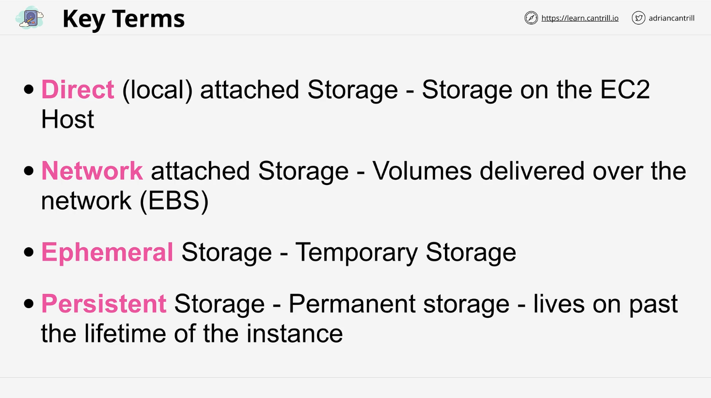
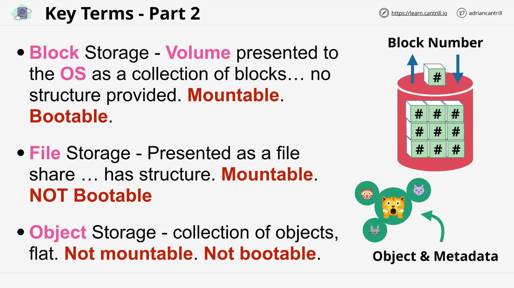
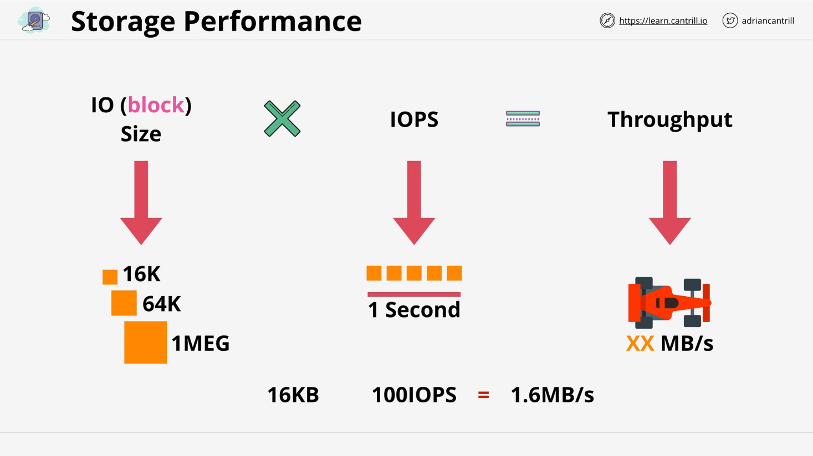

# AWS Certified Solutions Architect - Storage Concepts Summary

## Introduction

This lesson is a foundational refresher on storage concepts before diving into AWS-specific storage services. The AWS Certified Solutions Architect - Associate (SAA-C03) exam expects candidates to understand different types of storage and their appropriate use cases.

## Key Storage Terms

### Direct Attached Storage (DAS)

- Physical disks connected directly to a device (e.g., laptop, server).
- In AWS, **EC2 instance store** is a form of direct attached storage.
- **Pros:** Fast access to data.
- **Cons:** Data loss occurs if the disk, hardware, or EC2 host fails.

### Network Attached Storage (NAS)

- Volumes attached to a device **over the network**.
- Uses **iSCSI** or **Fibre Channel** in on-premises setups.
- In AWS, **Elastic Block Store (EBS)** is a NAS solution.
- **Pros:** Persistent storage that survives instance failures.

### Ephemeral Storage

- **Temporary** storage that does not persist beyond the lifecycle of the instance.
- Example: **EC2 instance store** (data lost if the instance is terminated).

### Persistent Storage

- Storage that exists independently of the instance lifecycle.
- Example: **EBS volumes**, which remain available even if an instance is terminated.
- **Important for the exam:** Understand which storage types are ephemeral vs. persistent.

## Three Main Categories of Storage in AWS

### 1. Block Storage

- Storage presented as **volumes** with **addressable blocks**.
- No built-in structure; OS formats it with a file system (e.g., **NTFS, EXT3**).
- Examples:
  - **EBS (Elastic Block Store)** - Provides network-attached block storage in AWS.
  - **Instance store** - Provides temporary block storage attached to EC2.
- **Use Cases:** Boot volumes, high-performance storage.

### 2. File Storage

- Provided via **file servers** and accessible as a structured file system.
- Users traverse folders and access files like a traditional file system.
- **Cannot be used to boot an OS.**
- Examples:
  - **Amazon EFS (Elastic File System)** - Network file storage.
- **Use Cases:** Shared access between multiple EC2 instances or services.

### 3. Object Storage

- **Flat storage** with no hierarchical structure.
- Data is stored as objects, each with metadata and a unique key.
- **Not mountable or bootable.**
- Example:
  - **Amazon S3 (Simple Storage Service)** - Highly scalable object storage.
- **Use Cases:** Large-scale data storage, backups, media files, and web assets.

## Storage Performance

### Key Performance Metrics

1. **IO or Block Size:** The size of individual read/write operations (e.g., 16 KB, 1 MB).
2. **IOPS (Input/Output Operations Per Second):** Measures read/write operations per second.
3. **Throughput:** The amount of data transferred per second (expressed in **MB/s**).

### Analogy: Race Car Performance

- **IOPS = Engine RPM** (speed of operations).
- **Block Size = Wheel Size** (amount of data in each operation).
- **Throughput = Final Speed** (total data transferred per second).

### Interdependencies in Storage Performance

- **Throughput = IOPS × Block Size.**
- Larger block sizes may **reduce** IOPS but **increase** throughput.
- Storage performance is affected by multiple factors:
  - Application behavior.
  - OS settings.
  - Network latency (for network-attached storage).
  - Disk technology (HDD vs. SSD).

### Example Calculation

- If a storage system supports **100 IOPS** at a **16 KB block size**, the maximum throughput is:
  - `100 IOPS × 16 KB = 1.6 MB/s throughput`
- If the block size increases to **1 MB**, potential throughput increases **if the system allows**.

## Exam Relevance

- Expect questions that test knowledge of **IOPS, throughput, and block size**.
- Need to recognize which AWS storage option is best for different **performance demands**.
- Example:
  - **High-performance application:** Choose **block storage (EBS)**.
  - **Shared file system across servers:** Choose **file storage (EFS)**.
  - **Scalable data storage for media/web apps:** Choose **object storage (S3)**.

## Conclusion

- This lesson covered **fundamental storage concepts** as preparation for AWS storage topics.
- Understanding these concepts is **critical** for making the right AWS storage choices.
- The upcoming lessons will introduce **specific AWS storage services** in detail.

**Next Steps:** Continue learning about AWS-specific storage solutions.
