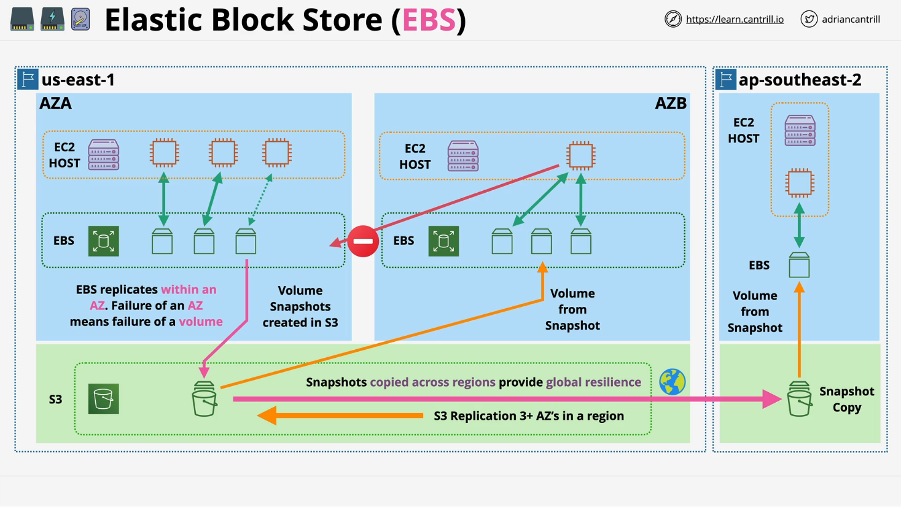

# AWS Certified Solutions Architect - Elastic Block Store (EBS) Summary

## Introduction

This lesson covers the basics of **Amazon Elastic Block Store (EBS)**, an essential AWS storage service used frequently in conjunction with **EC2 instances**. Understanding how EBS works, its limitations, and its architecture is critical for making informed decisions when deploying workloads on AWS.

## What is Amazon EBS?

EBS provides **block storage**, meaning storage is addressed using block IDs. It abstracts raw physical disks into **volumes**, which can be attached to EC2 instances. These volumes behave like traditional block devices, allowing operating systems to format them with file systems such as:

- **Linux:** EXT3, EXT4, XFS, etc.
- **Windows:** NTFS

## Key Characteristics of EBS

### 1. **Availability Zone (AZ) Scope**

- **EBS volumes are confined to a single availability zone** and cannot be directly attached across AZs.
- Each AZ has its own separate EBS infrastructure.
- EBS is **resilient within an AZ**, meaning it has built-in redundancy for device failures.
- However, **if an entire AZ fails, EBS volumes in that AZ will also fail**.

### 2. **Volume Attachment to EC2**

- **EBS volumes attach to EC2 instances over a storage network.**
- By default, an EBS volume is attached to a **single EC2 instance at a time**.
- **Multi-Attach:** Certain volume types support multi-attach for cluster use cases, but the application must handle data consistency.
- Volumes are **persistent** and remain intact even if the EC2 instance is stopped, restarted, or terminated (unless explicitly deleted).

### 3. **Data Backup with Snapshots**

- EBS allows **snapshots** to be created and stored in **Amazon S3**.
- Snapshots are **regionally resilient**, meaning they are stored across multiple AZs.
- **Snapshots enable cross-AZ and cross-region volume creation**:
  - A snapshot taken in **AZ A** can be used to create a volume in **AZ B**.
  - Snapshots can also be copied to another AWS region.

### 4. **EBS Storage Types**

EBS offers different types of storage, optimized for performance and cost:

- **SSD-based volumes:** High-performance storage.
- **HDD-based volumes:** Cost-effective, mechanical disk storage.
- Volumes vary in **size, performance characteristics, and pricing**.

### 5. **Billing Model**

- EBS pricing is based on **gigabytes per month (GB-month)**.
- Example:
  - 1 GB for **1 month** costs the same as **2 GB for half a month**.
  - Additional costs may apply for performance enhancements.

## EBS Architecture Overview

### **Regional and Availability Zone Structure**

- AWS regions (e.g., `us-east-1`, `ap-southeast-2`) contain multiple **availability zones** (AZs).
- **EBS volumes exist within a single AZ** and are separate from volumes in other AZs.

### **EBS Volume Attachments**

- **Within an AZ:**
  - An EC2 instance can have **one or more EBS volumes attached**.
  - A volume can be **detached from one instance** and **attached to another** in the same AZ.
- **Cross-AZ:**
  - **EBS volumes cannot be directly attached across AZs**.
  - Data must be moved using **snapshots** stored in S3.

### **Data Replication & Resilience**

- **EBS replicates data within the same AZ** across multiple physical devices for durability.
- If an entire AZ fails, EBS volumes in that AZ are **impacted**.
- To improve resilience, **snapshots should be taken and stored in S3** for cross-AZ recovery.
- **Snapshots can be copied to another region**, allowing volume creation in different regions.

## Exam Considerations

For the **AWS Certified Solutions Architect - Associate (SAA-C03)** exam, expect questions on:

- **EBS vs. other AWS storage options** (S3, EFS, Instance Store, etc.).
- **Performance considerations** (volume types, IOPS, throughput).
- **Resilience strategies** (snapshots, cross-AZ and cross-region replication).
- **Multi-attach scenarios** and their limitations.
- **Storage pricing** based on **GB-month billing**.

## Conclusion

- **EBS provides persistent block storage for EC2 instances.**
- **Volumes are AZ-specific** but can be backed up using **snapshots stored in S3**.
- **Multi-AZ storage is not possible**, but snapshots enable data migration.
- **Different storage types and pricing models exist**, based on performance needs.
- Understanding **EBS architecture and limitations** is critical for AWS solutions architects.

**Next Steps:** Continue to the next lessons for in-depth discussions on EBS features, performance tuning, and best practices.
