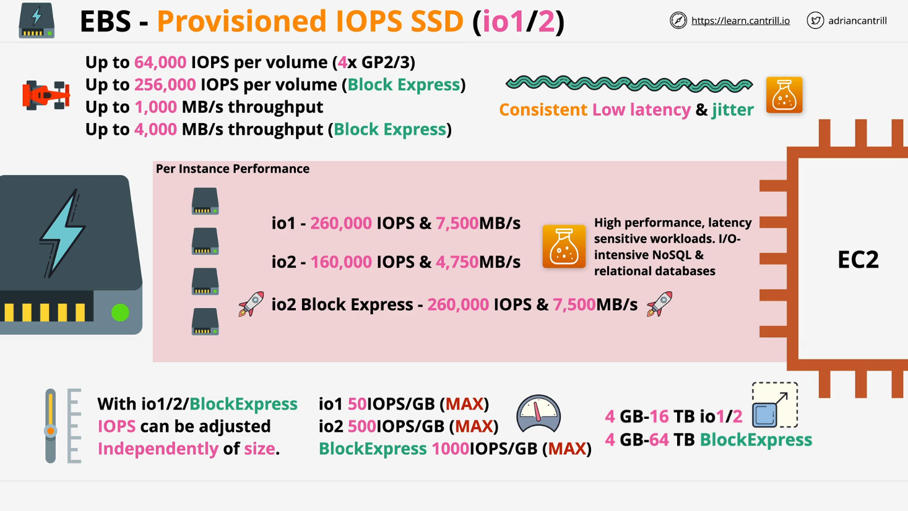

# AWS EBS: Provisioned IOPS SSD (IO1, IO2, and IO2 Block Express)

## Overview

This lesson covers **Provisioned IOPS SSD** volumes in AWS, specifically **IO1, IO2, and IO2 Block Express**. These volumes are designed for high-performance workloads requiring **low latency and consistent performance**.

### Key Characteristics:

- **IOPS Configurable Independently**: Unlike GP2/GP3, where IOPS is tied to volume size, IO1 and IO2 allow users to provision IOPS separately.
- **High Performance**: Supports extreme performance requirements.
- **Low Latency & High Consistency**: Ideal for critical applications.

## Types of Provisioned IOPS SSD

### 1. **IO1 and IO2**

- **Max IOPS per Volume**: 64,000 IOPS (4x higher than GP2/GP3).
- **Max Throughput per Volume**: 1,000 MB/s (same as GP3 but significantly more than GP2).
- **Volume Size Range**:
  - IO1 & IO2: **4 GB to 16 TB**
  - IO2 Block Express: **Up to 64 TB**

### 2. **IO2 Block Express** (Higher Performance)

- **Max IOPS per Volume**: **256,000 IOPS** (4x IO1/IO2).
- **Max Throughput per Volume**: **4,000 MB/s** (4x IO1/IO2).
- **Designed for ultra-high-performance workloads.**

## Performance and Scaling

### IOPS Allocation by Volume Type

| Volume Type           | IOPS per GB (Max) | Max IOPS per Volume |
| --------------------- | ----------------- | ------------------- |
| **IO1**               | 50 IOPS/GB        | 64,000 IOPS         |
| **IO2**               | 500 IOPS/GB       | 64,000 IOPS         |
| **IO2 Block Express** | 1,000 IOPS/GB     | 256,000 IOPS        |

- Unlike GP2/GP3, **you pay separately for provisioned IOPS and volume size**.

### Instance Performance Limits

Even with high-performance storage, **EBS-EC2 connection limits** must be considered.

#### **Max Performance per EC2 Instance**

| Volume Type           | Max IOPS per Instance | Max Throughput per Instance |
| --------------------- | --------------------- | --------------------------- |
| **IO1 & IO2**         | 160,000 IOPS          | 4,750 MB/s                  |
| **IO2 Block Express** | 260,000 IOPS          | 7,500 MB/s                  |

- **Per-instance limits** apply, meaning multiple volumes may be needed to reach these performance caps.
- **Instance Type & Size Impact Performance**: Only **latest-generation** and **large-size instances** support the highest performance levels.

## Use Cases

### When to Use Provisioned IOPS SSD?

- **Workloads Requiring Sub-Millisecond Latency**
- **Databases with High Throughput & Low Latency** (e.g., Relational Databases, NoSQL, OLTP).
- **High-Performance Computing (HPC) Applications**.
- **Enterprise Applications Needing Consistency**.
- **Smaller Volumes That Need High IOPS**.

### Comparison with General-Purpose SSDs

| Feature        | GP2           | GP3                     | IO1                  | IO2                        | IO2 Block Express     |
| -------------- | ------------- | ----------------------- | -------------------- | -------------------------- | --------------------- |
| Max IOPS       | 16,000        | 16,000                  | 64,000               | 64,000                     | 256,000               |
| IOPS Scaling   | Based on Size | Fixed Base (3,000)      | Provisioned          | Provisioned                | Provisioned           |
| Max Throughput | 250 MB/s      | 1,000 MB/s              | 1,000 MB/s           | 1,000 MB/s                 | 4,000 MB/s            |
| Best For       | General Usage | General Usage (Cheaper) | High-Performance DBs | Ultra-High Performance DBs | Enterprise-Scale Apps |

## Conclusion

- **IO1, IO2, and IO2 Block Express** provide high-performance, low-latency storage for mission-critical applications.
- **IO2 Block Express is the highest-performing option**, supporting up to **256,000 IOPS** and **4,000 MB/s throughput**.
- **Be aware of instance-level limits**, which cap the total performance that can be achieved by an EC2 instance.
- **If you need extreme performance for smaller volumes, IO1/IO2 are the only choices**.

This concludes the lesson on **Provisioned IOPS SSD**. In the next section, we will explore **Instance Store Volumes** and their unique characteristics.
