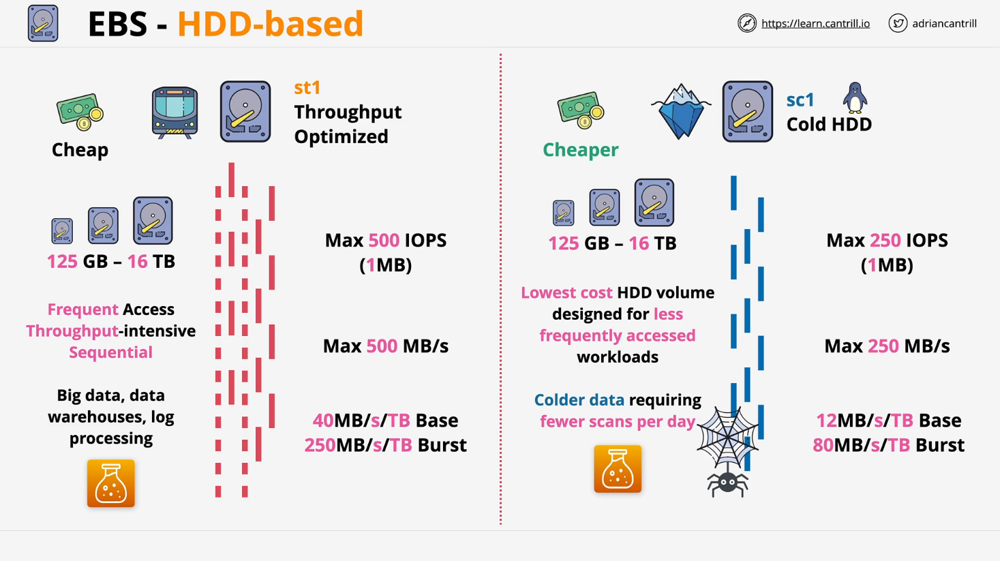

# HDD-Based EBS Volumes (ST1 & SC1)

## Introduction

This lesson covers the **HDD-based EBS volume types**, which use **mechanical components** (spinning platters and moving read/write heads). Due to their **slower performance**, these volumes are suited for **specific workloads** where cost efficiency is a priority.

## Types of HDD-Based EBS Volumes

There are **two main HDD-based volume types** in general usage:

1. **ST1 (Throughput Optimized HDD)** – Faster HDD storage designed for sequential access.
2. **SC1 (Cold HDD)** – The lowest-cost EBS storage, optimized for infrequent access.

> _Note: A legacy HDD volume type exists, but it is not widely used._

## Characteristics of HDD Storage

- **Lower performance compared to SSDs**
- **Lower cost**, making them suitable for storing large volumes of data
- **Best for workloads that prioritize throughput over IOPS**
- **Designed for sequential access** rather than random access

## ST1 (Throughput Optimized HDD)

### Overview

- Optimized for **sequential workloads** requiring frequent access.
- **More cost-effective** than SSDs for large datasets.
- Not ideal for **random access** due to HDD limitations.

### Performance Metrics

| Metric                   | Value           |
| ------------------------ | --------------- |
| **Volume Size Range**    | 125GB – 16TB    |
| **Max IOPS**             | 500             |
| **IO Block Size**        | 1MB             |
| **Max Throughput**       | 500MB/s         |
| **Baseline Performance** | 40MB/s per 1TB  |
| **Burst Throughput**     | 250MB/s per 1TB |

### Use Cases

- **Big Data workloads**
- **Data warehouses**
- **Log processing**
- **Applications requiring frequent but sequential access**

## SC1 (Cold HDD)

### Overview

- **Lowest-cost** EBS storage.
- Designed for **infrequently accessed workloads**.
- **Lower performance** compared to ST1, but also much cheaper.

### Performance Metrics

| Metric                   | Value          |
| ------------------------ | -------------- |
| **Volume Size Range**    | 125GB – 16TB   |
| **Max IOPS**             | 250            |
| **IO Block Size**        | 1MB            |
| **Max Throughput**       | 250MB/s        |
| **Baseline Performance** | 12MB/s per 1TB |
| **Burst Throughput**     | 80MB/s per 1TB |

### Use Cases

- **Cold data storage**
- **Archive storage**
- **Workloads with minimal daily access**
- **Scenarios requiring the cheapest possible EBS storage**

## Choosing Between ST1 and SC1

| Requirement                                     | Best Choice               |
| ----------------------------------------------- | ------------------------- |
| **Frequent sequential access, high throughput** | **ST1**                   |
| **Infrequent access, lowest cost**              | **SC1**                   |
| **High IOPS requirements**                      | **Use SSD-based storage** |

## Conclusion

- **HDD-based EBS volumes are lower-cost but lower-performance alternatives to SSDs**.
- **ST1** is best for **frequent, high-throughput workloads**.
- **SC1** is best for **cold storage with minimal access**.
- If **performance (IOPS) is a requirement**, **SSD-based storage is the better option**.

This concludes the lesson on HDD-based EBS volumes. In the next lesson, we will explore other storage options within AWS.
