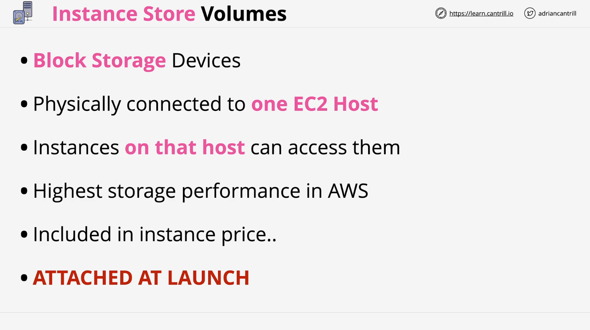
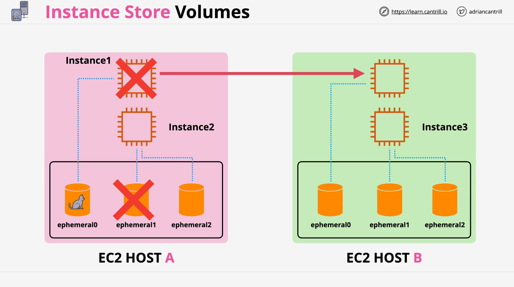
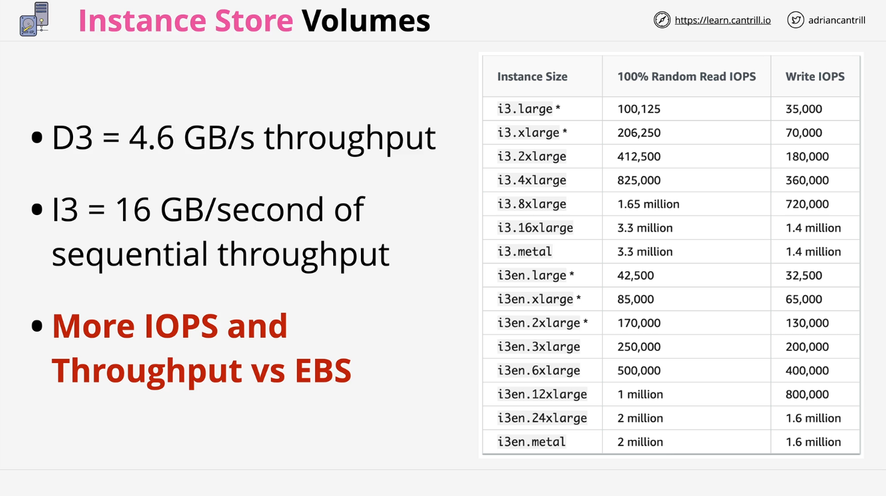

# Instance Store Volumes

## Introduction

Instance store volumes provide **temporary block-level storage** for EC2 instances. These volumes are **physically attached** to the host computer and are designed for **high-performance, ephemeral storage**.

## Key Characteristics of Instance Store Volumes

- **Physically attached to the EC2 host**
- **High-performance storage** (faster than EBS)
- **Included in the instance cost**
- **Temporary**: Data is lost if the instance stops, is restarted, resized, or moved to a new host
- **Cannot be added after instance launch**

## How Instance Store Volumes Work

- Each EC2 host has a set of instance store volumes.
- These volumes are isolated to the host and **cannot be shared** between hosts.
- Instance types determine the **number and size** of available instance store volumes.
- The virtual devices for instance store volumes follow the naming convention: `ephemeral[0-23]`.
  - Example: An instance with two instance store volumes will have `ephemeral0` and `ephemeral1`.

## Instance Store Volume Architecture

Each instance store volume is backed by **physical disks on the EC2 host**. If an instance moves to another host, it will receive a **new, blank instance store volume**.

### Example Architecture

| EC2 Host | Instance   | Instance Store Volumes |
| -------- | ---------- | ---------------------- |
| Host A   | Instance 1 | ephemeral0             |
| Host A   | Instance 2 | ephemeral1, ephemeral2 |
| Host B   | Instance 3 | ephemeral1, ephemeral2 |

- If **Instance 1** moves from **Host A to Host B**, its instance store volume (`ephemeral0`) is lost and replaced with a **new, blank** volume.
- If an **instance is stopped and restarted**, the storage is lost.
- If an **EC2 host undergoes maintenance**, instances are migrated and storage is wiped.
- If the **underlying hardware fails**, the data on the volume is lost.

## Use Cases for Instance Store Volumes

Instance store volumes are best used for **temporary storage** and **high-performance applications**:

- **Buffers & Caches**
- **Scratch data** (e.g., temporary computation data)
- **Load-balanced web servers** with replicated data
- **Big Data processing** (where data is not critical)

## Limitations of Instance Store Volumes

| Limitation               | Description                                                                   |
| ------------------------ | ----------------------------------------------------------------------------- |
| **Data Loss on Restart** | Data is lost when an instance stops, moves, or the host fails.                |
| **Cannot Attach Later**  | Instance store volumes must be added **at launch** and cannot be added after. |
| **Tied to Host**         | Volumes are physically attached and do not persist across instance migration. |

## Performance Benefits

- **Higher IOPS and throughput** than EBS
- **Best for high-performance, transient workloads**
- Examples of storage-optimized instance types:
  - **D3 instances**: Up to **4.6 GB/s throughput** (HDD-based)
  - **I3 instances**: Up to **16 GB/s throughput**, **2 million read IOPS** (NVMe SSDs)

| Instance Size   | 100% Random Read IOPS | Write IOPS  |
| --------------- | --------------------- | ----------- |
| i3.large \*     | 100,125               | 35,000      |
| i3.xlarge \*    | 206,250               | 70,000      |
| i3.2xlarge      | 412,500               | 180,000     |
| i3.4xlarge      | 825,000               | 360,000     |
| i3.8xlarge      | 1.65 million          | 720,000     |
| i3.16xlarge     | 3.3 million           | 1.4 million |
| i3.metal        | 3.3 million           | 1.4 million |
| i3en.large \*   | 42,500                | 32,500      |
| i3en.xlarge \*  | 85,000                | 65,000      |
| i3en.2xlarge \* | 170,000               | 130,000     |
| i3en.3xlarge    | 250,000               | 200,000     |
| i3en.6xlarge    | 500,000               | 400,000     |
| i3en.12xlarge   | 1 million             | 800,000     |
| i3en.24xlarge   | 2 million             | 1.6 million |
| i3en.metal      | 2 million             | 1.6 million |

## Exam Tips

- **Instance store volumes are ephemeral** – Data is lost when an instance moves.
- **Must be attached at launch** – Cannot be added later like EBS.
- **High-performance but temporary** – Do not store persistent data on them.
- **If the EC2 host fails, data is lost** – Always back up critical data.

## Conclusion

Instance store volumes offer **the highest performance storage in AWS**, but come with **significant limitations**. They should be used only for **temporary, non-critical data**. Understanding these trade-offs is crucial for both real-world applications and AWS certification exams.
