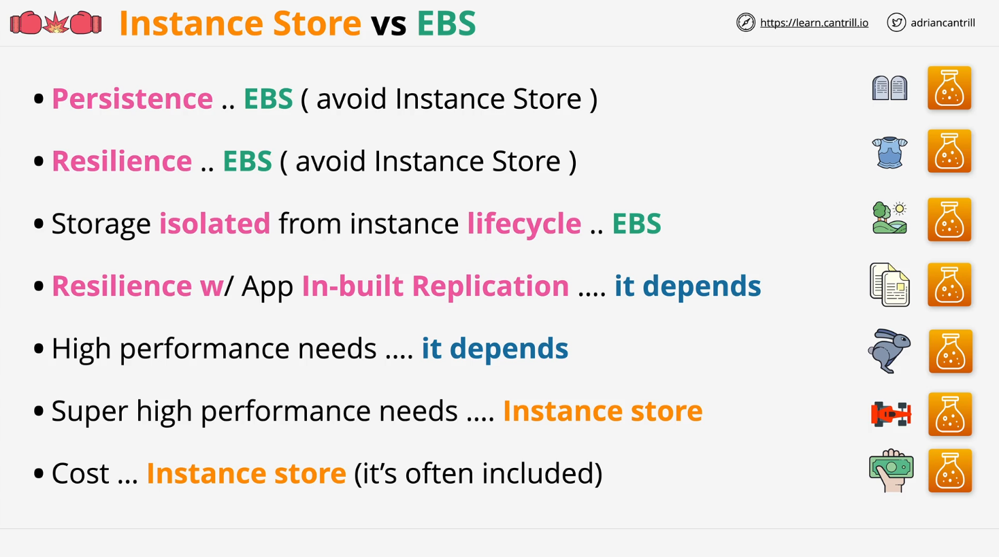
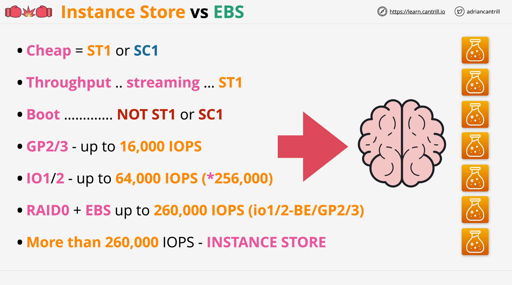

## AWS SA C03 - Choosing Between EBS and Instance Store Volumes

### Introduction

This lesson covers the scenarios in which you should use **EBS (Elastic Block Store)** over **Instance Store Volumes**, and vice versa. It also highlights cases where the choice depends on specific requirements. These insights are crucial for both real-world applications and AWS certification exams.

## When to Use EBS (Elastic Block Store)

EBS is the **default choice** when you need persistent storage.

### Key Characteristics of EBS

- **Persistent Storage:** Data is retained even if the instance is stopped or terminated.
- **Resiliency:** Hardware failures do not result in data loss within an **Availability Zone (AZ)**.
- **Snapshot Capability:** EBS volumes can be **backed up to S3** for added protection.
- **Instance Independence:** EBS volumes can be attached and detached from instances, allowing flexibility.

### When to Avoid Instance Store Volumes

- **Not Persistent:** Any instance failure, reboot, or host-level maintenance can result in data loss.
- **Not Resilient:** If the underlying hardware fails, the data is lost.

### Summary

If your application requires **resilient, persistent, and flexible storage**, **EBS is the clear choice**.

## When to Use Instance Store Volumes

Instance Store Volumes are **directly attached to EC2 instances** and provide high-speed local storage.

### Key Characteristics of Instance Store

- **Super High Performance:** Ideal for workloads requiring ultra-low latency and millions of IOPS.
- **No Extra Cost:** Included with certain EC2 instance types, making it cost-efficient.
- **Temporary Storage:** Good for caching, temporary logs, or high-speed batch processing.

### Scenarios Where It Makes Sense

1. **Your Application Has Built-in Replication:**
   - If your application can handle **distributed data replication**, you can use multiple instances with **Instance Store** to improve performance.
2. **Ultra-High Performance Needs:**
   - Instance Store Volumes outperform EBS when extreme performance is required.
3. **Cost Optimization:**
   - If you're using an EC2 instance that **includes Instance Store**, utilizing it can reduce storage costs.

### Trade-offs

- **Data is lost if the instance stops, fails, or is terminated.**
- **Cannot be detached and reattached like EBS.**

## Choosing Storage Based on Performance Requirements

| **Storage Type**      | **Max IOPS per Volume** | **Max IOPS per Instance**   | **Best Use Case**                |
| --------------------- | ----------------------- | --------------------------- | -------------------------------- |
| **GP2 / GP3**         | 16,000 IOPS             | N/A                         | General-purpose workloads        |
| **IO1 / IO2**         | 64,000 IOPS             | N/A                         | High-performance applications    |
| **IO2 Block Express** | 256,000 IOPS            | Requires large EC2 instance | Ultra-high performance workloads |
| **RAID 0 (EBS)**      | Up to 260,000 IOPS      | 260,000 IOPS (EC2 limit)    | Aggregating multiple EBS volumes |
| **Instance Store**    | Millions of IOPS        | Depends on instance type    | Extreme performance needs        |

- If **< 16,000 IOPS**, use **GP2/GP3**.
- If **16,000 - 64,000 IOPS**, use **IO1/IO2**.
- If **64,000 - 256,000 IOPS**, use **IO2 Block Express**.
- If **> 256,000 IOPS**, use **Instance Store** (if persistence isn't required).

## EBS Storage Class Recommendations

### Cost-Effective EBS Choices

- If cost is a concern, use **SC1 or ST1** instead of GP3/IO1.
- **SC1 and ST1 cannot be used as boot volumes**, so if the instance requires boot storage, avoid them.

### Performance-Optimized Storage

- **Streaming & Throughput workloads:** Use **ST1**.
- **Random I/O & Boot Volumes:** Use **GP3 or IO1/IO2**.

## RAID 0 with EBS

A common way to increase EBS performance is **RAID 0 striping**, which combines multiple EBS volumes to achieve higher IOPS.

### Key Considerations

- The **maximum IOPS per EC2 instance is 260,000**, so adding more volumes **won't increase performance beyond this limit**.
- To reach **maximum performance**, ensure the EC2 instance has enough bandwidth.

## Instance Store for Extreme Performance

If your workload needs **more than 260,000 IOPS**, and **data persistence is not a requirement**, use **Instance Store Volumes**.

- **Proper instance selection** is crucial to achieve millions of IOPS.
- Ideal for **temporary high-speed workloads**, such as **caching, big data processing, and AI/ML workloads**.

## Exam Tips

- **Persistent storage?** → Use **EBS**.
- **High performance (> 256,000 IOPS)?** → Use **Instance Store**.
- **Cost-sensitive storage?** → Use **SC1/ST1**.
- **Boot volumes?** → Use **GP3/IO1/IO2**, not SC1/ST1.
- **Performance questions?** → Memorize IOPS limits for each storage type.

## Conclusion

Understanding the trade-offs between **EBS and Instance Store Volumes** is key for both **AWS certification exams and real-world architecture decisions**. **EBS** is the default choice for persistence, while **Instance Store** excels in high-performance but **temporary** use cases.

This guide provides the critical knowledge needed to make informed decisions regarding AWS storage solutions. 🚀

### Additional Resources

- [AWS EBS Documentation](https://docs.aws.amazon.com/ebs/)
- [AWS Instance Store Documentation](https://docs.aws.amazon.com/AWSEC2/latest/UserGuide/InstanceStorage.html)
- [AWS RAID Configuration Guide](https://docs.aws.amazon.com/AWSEC2/latest/UserGuide/raid-config.html)
