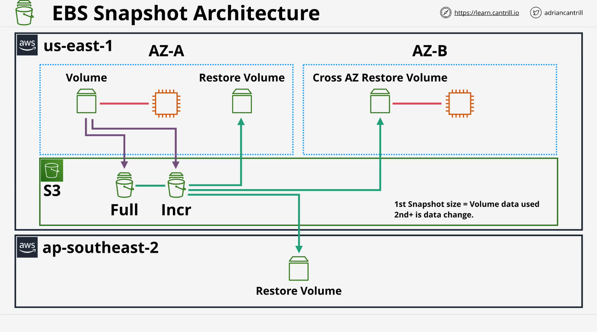
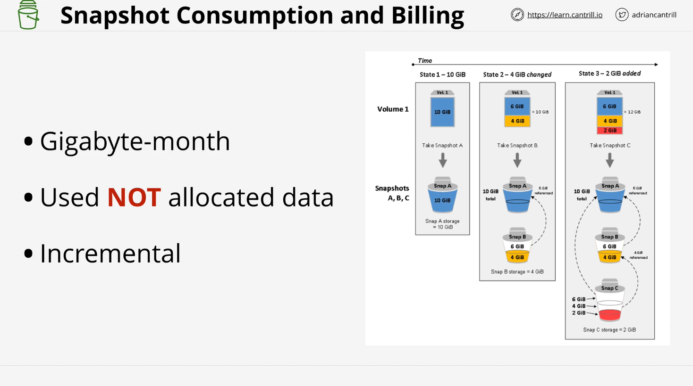

# **EBS Snapshots**

## **Introduction**

This lesson covers **Amazon Elastic Block Store (EBS) Snapshots**, their architecture, functionality, and use cases. It explains how snapshots provide **backup, resiliency, migration capabilities**, and performance considerations.

## **What are EBS Snapshots?**

- **EBS snapshots** are **backups** of EBS volumes stored in **Amazon S3**.
- They help protect data against **availability zone (AZ) failures**.
- Snapshots allow **migration of data** between AZs and even across AWS regions.
- They are **incremental**, meaning:
  - The first snapshot is a **full copy** of the used data.
  - Subsequent snapshots only store **changes** from the last snapshot.

## **Why Use EBS Snapshots?**

1. **Backup & Disaster Recovery**: Protects against AZ failures.
2. **Data Migration**:
   - Move volumes **within a region** (between AZs).
   - Copy snapshots across **regions** for **global DR (Disaster Recovery)**.
3. **Efficient Storage**: Since snapshots are **incremental**, storage costs are optimized.

## **How EBS Snapshots Work**

### **Snapshot Creation**

1. The **first snapshot** is a **full copy** of the used data.
2. Subsequent snapshots:
   - Only store **differences** (incremental changes).
   - Reference unchanged data from previous snapshots.

> **Example**: If a **40GB volume** has **10GB** of used data, the first snapshot is **10GB**, not 40GB.

### **Snapshot Architecture**



- Snapshots are stored in **S3**, making them **region-resilient**.
- Snapshots can be used to **create new EBS volumes** in:
  - The same AZ.
  - Another AZ within the same region.
  - Another AWS region (via **snapshot copy**).

## **Incremental Snapshots - How They Work**



Each snapshot references the previous one:

1. **Snapshot 1 (Full Copy)**: Stores **all used data** (e.g., 10GB).
2. **Snapshot 2 (Incremental)**: Only stores **changes** (e.g., 4GB).
3. **Snapshot 3 (Incremental)**: Stores **new changes** (e.g., 2GB).
4. If **an older snapshot is deleted**, AWS ensures later snapshots still function correctly.

> **EBS handles data integrity**, so deleting an old snapshot **won't break newer snapshots**.

## **Restoring EBS Volumes from Snapshots**

- **New EBS volumes** can be created **from snapshots**.
- Restored volumes **don't immediately have full performance** because data is fetched lazily from S3.

### **Optimizing Performance of Restored Volumes**

1. **Pre-read all blocks** using the `dd` command in Linux:
   ```sh
   sudo dd if=/dev/xvdf of=/dev/null bs=1M
   ```
   - This forces AWS to restore all blocks before production use.
2. **Use Fast Snapshot Restore (FSR)**:
   - Instantly restores snapshots in a specific AZ.
   - Costs extra and supports **up to 50 FSR-enabled snapshots per region**.

## **EBS Snapshot Encryption**

- Covered in a separate lesson.
- Encryption impacts snapshots, but AWS manages it transparently.

## **EBS Snapshot Pricing**

- **Billing is based on "GB-month"**:
  - Example: A **10GB snapshot stored for 1 month** = **10GB-month**.
  - Example: A **20GB snapshot stored for 15 days** = **10GB-month**.
- **Only stored (used) data is billed**, not the full EBS volume size.
- **Frequent snapshots** don't necessarily cost more since only **changed data is billed**.

## **Summary**

- **EBS snapshots** are an efficient way to backup and migrate data.
- **Incremental snapshots** optimize **storage costs** and **performance**.
- **Snapshots are region-resilient** and can be used for **cross-region disaster recovery**.
- **Performance considerations**:
  - Restored volumes are **lazy-loaded** from S3.
  - **Use `dd` or FSR** to speed up performance after restoration.
