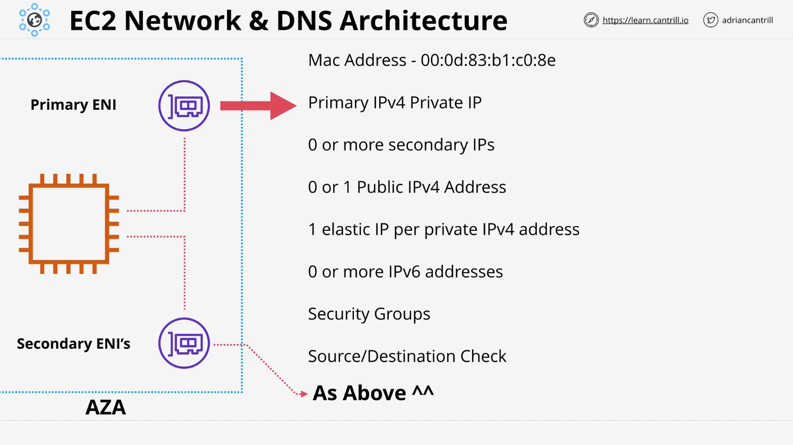
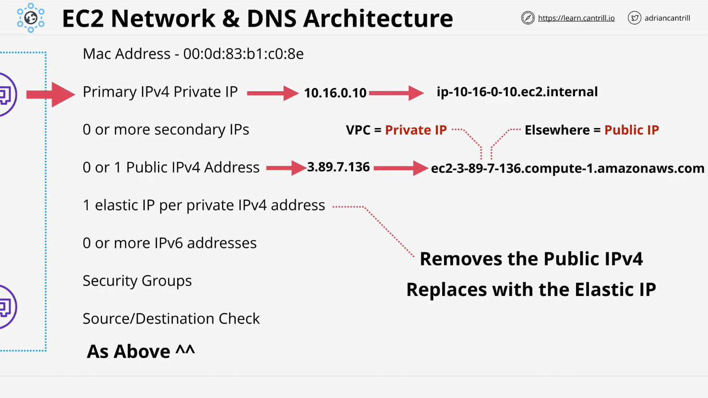
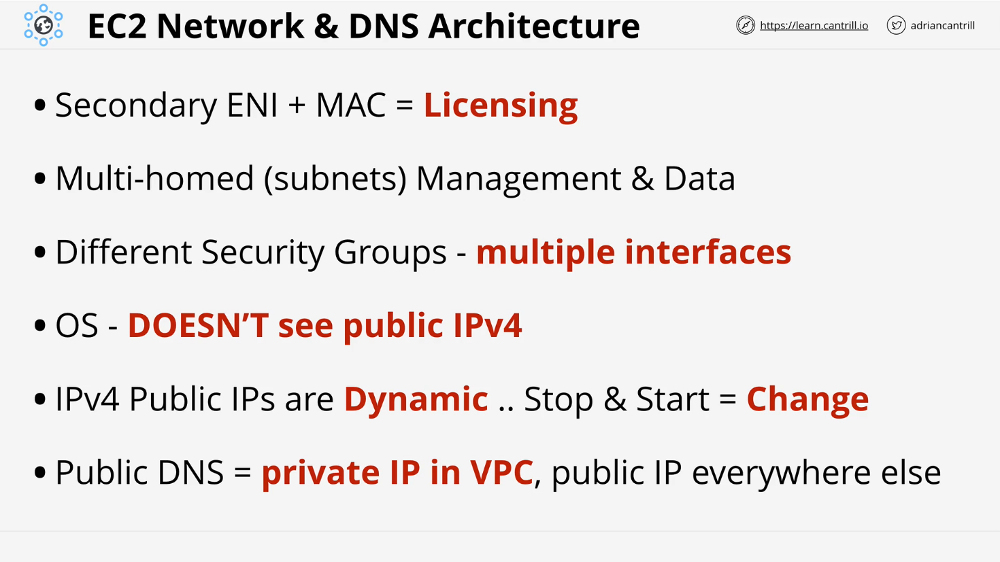

# EC2 Networking Theory

## Introduction

In this lesson, we cover key networking concepts related to EC2 instances, including network interfaces, IP addresses, and DNS. Understanding how these components work is crucial for effectively configuring and managing EC2 instances in AWS.

## **1. Elastic Network Interfaces (ENI)**

### **Primary vs. Secondary ENI**

- Every EC2 instance starts with **one primary network interface** (Primary ENI).
- Additional **secondary ENIs** can be attached but must be in the **same Availability Zone**.
- Security groups are applied **at the ENI level**, not at the instance level.

### **Attributes of ENIs**

Each ENI has the following attributes:

- **MAC Address**: Used for licensing and unique hardware identification.
- **Primary Private IPv4 Address**: Comes from the subnet's IP range.
- **Secondary Private IPv4 Addresses** (optional).
- **Public IPv4 Address** (optional, dynamic).
- **Elastic IP (EIP)** (optional, static public IP).
- **IPv6 Addresses** (optional, always public).
- **Security Groups**: Applied to ENI, affecting all associated IPs.
- **Source/Destination Check**: Controls whether traffic not originating from the ENI is allowed (needs to be disabled for NAT instances).

## **2. EC2 Instance IP Addressing**

### **Private and Public IP Addressing**

- **Primary Private IPv4 Address**: Static within the instance's lifetime.
- **Public IPv4 Address**:
  - Assigned dynamically if enabled.
  - **Changes on stop/start** but remains the same on restart.
- **Elastic IP Address (EIP)**:
  - Allocated to AWS accounts.
  - **Static public IP that persists across reboots**.
  - If assigned, it replaces any previously assigned public IP.
  - **Removing an EIP will assign a new public IP**, but not the old one.

## **3. EC2 Instance DNS Behavior**

### **Private and Public DNS Resolution**

- Private DNS (`ip-10-16-0-10.ec2.internal`):
  - Resolves to the **private IP** inside the VPC.
  - Used for internal communication within the VPC.
- Public DNS (`ec2-xx-xx-xx-xx.compute-1.amazonaws.com`):
  - Resolves **inside the VPC to the private IP**.
  - Resolves **outside the VPC to the public IP**.

This behavior ensures:

- **Internal traffic remains inside the VPC**.
- **External traffic can reach the instance via public IP**.

## **4. Elastic IPs (EIPs)**

### **How Elastic IPs Work**

- **EIPs are allocated to AWS accounts, not instances**.
- When an EIP is assigned to an instance:
  - **The default public IP is removed**.
  - The instance now has a **static public IP**.
- If the EIP is removed:
  - The instance receives a **new dynamic public IP**.

### **Key Exam Tip**

- **If an instance loses its EIP, it cannot regain its old dynamic public IP.**
- To maintain a **consistent public IP, always use an EIP**.

## **5. Security Groups & Multi-Interface Use Cases**

### **Security Group Behavior**

- **Security groups apply to ENIs, not instances**.
- If different security rules are required, use **multiple ENIs**.
- Example:
  - **One ENI for management traffic**.
  - **Another ENI for application traffic**.

### **Use Cases for Multiple ENIs**

- **Multi-homed Systems**: ENIs in different subnets for **segregated access**.
- **MAC Address-Based Licensing**: Secondary ENI's MAC address can be moved between instances, useful for software licensing.

## **6. NAT and Public IP Visibility**

### **How Public IPs Work in AWS**

- **OS never sees the public IP**:
  - Public IPs are managed by **AWS NAT (Internet Gateway)**.
  - OS only sees **private IPs**.
  - This differs from IPv6, where all addresses are **public**.

### **Exam Tip**

- **You never configure a public IP inside an EC2 instance**.
- The public IP is assigned at the AWS networking level, not at the OS level.

## **7. Key Exam Takeaways**

| Concept                 | Key Details                                                  |
| ----------------------- | ------------------------------------------------------------ |
| **Public IP**           | Changes on stop/start. Cannot be restored once lost.         |
| **Elastic IP**          | Persistent across instance reboots. Needs manual assignment. |
| **Security Groups**     | Applied to ENIs, not instances.                              |
| **Multiple ENIs**       | Used for multi-homed setups or security separation.          |
| **Public DNS Behavior** | Resolves to private IP inside VPC, public IP outside VPC.    |
| **OS and Public IPs**   | OS never directly sees or configures a public IPv4 address.  |

## **8. Conclusion**

This lesson covers the foundational networking concepts of EC2 instances, including ENIs, IP addresses, DNS resolution, security groups, and NAT behavior. These concepts are critical for designing scalable, secure, and efficient AWS architectures. The next lesson includes **hands-on practice with Elastic IPs and network configurations**.
