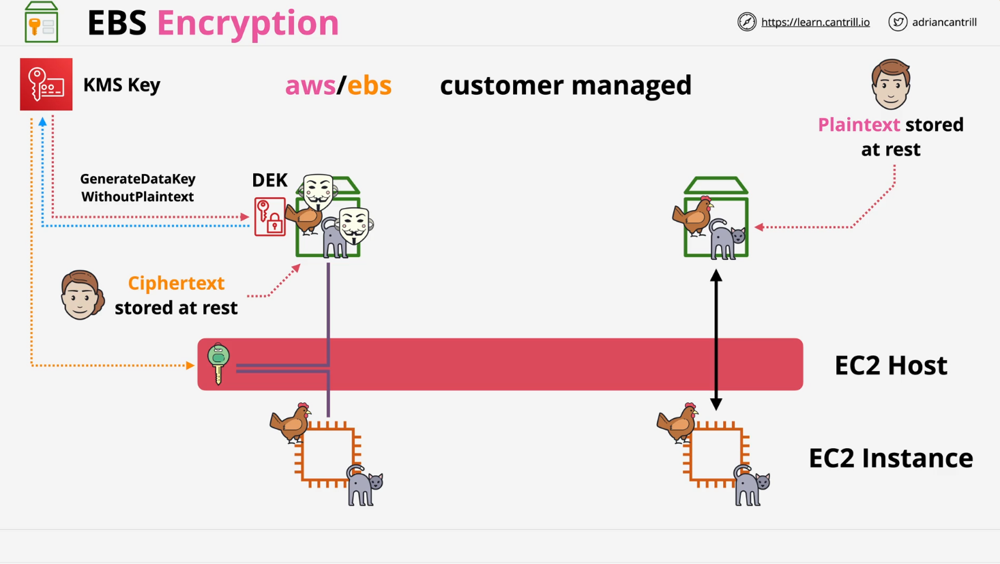
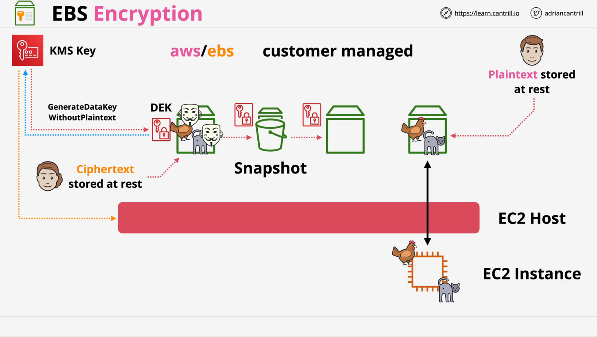

# AWS EBS Encryption

## Overview

This document provides a detailed summary of EBS encryption, covering its architecture, functionality, and key concepts relevant for real-world use and the AWS certification exam.

## Introduction to EBS Encryption

- EBS (Elastic Block Store) volumes are block storage devices presented over the network.
- These volumes are highly available within an availability zone (AZ) and are stored on one or more physical storage devices.
- By default, no encryption is applied, meaning data is stored in plaintext on the underlying hardware.
- This presents security risks, as unauthorized access to the physical storage could expose sensitive data.
- EBS encryption helps mitigate this risk by encrypting volumes and snapshots at rest.

## How EBS Encryption Works

- EBS encryption uses AWS Key Management Service (KMS) to manage encryption keys.
- It provides **at-rest encryption** for EBS volumes and snapshots.
- By default, AWS provides a managed KMS key (`AWS/EBS`), but users can create and manage their own customer-managed KMS keys.

### Architectural Flow

1. **Unencrypted EBS Volumes:**
   - An EC2 instance uses an EBS volume as its boot volume.
   - Without encryption, data is stored in plaintext on the volume.
2. **Encrypted EBS Volumes:**

   - When an encrypted EBS volume is created, KMS generates a **data encryption key (DEK)**.
   - The DEK itself is encrypted using the KMS key and stored with the volume.
   - The DEK can only be decrypted using KMS by an entity with proper permissions.

   

3. **Usage and Key Management:**
   - When an EC2 instance uses an encrypted volume, EBS requests KMS to decrypt the DEK.
   - The decrypted DEK is stored **only in memory** on the EC2 host.
   - The EC2 host uses the decrypted DEK to encrypt and decrypt data between the instance and the EBS volume.
   - The data stored on the EBS volume itself remains encrypted.
4. **Snapshots and Derived Volumes:**

   - If a snapshot is taken of an encrypted volume, the same DEK is used to encrypt the snapshot.
   - Any new volumes created from this snapshot will inherit the same DEK and remain encrypted.
   - However, when creating a completely new volume from scratch, a **new** DEK is generated.

   

## Key Exam Considerations

- AWS accounts can be configured to encrypt EBS volumes by default.
- Users can specify a default KMS key for encryption or select a key manually each time.
- **KMS keys do not directly encrypt/decrypt volumes**; instead, they generate a unique **per-volume** DEK.
- **Snapshots inherit encryption keys** from the original volume. Volumes created from these snapshots remain encrypted with the same key.
- Every **new** EBS volume (not derived from a snapshot) gets a **unique** DEK.
- Encryption is **irreversible**—once a volume or snapshot is encrypted, it cannot be converted back to an unencrypted state via AWS tools.
- To remove encryption, data must be copied manually to a new, unencrypted volume at the operating system level.
- The operating system itself is unaware of EBS encryption since encryption occurs between the EC2 instance and the EBS storage system.
- EBS uses AES-256 encryption for securing data at rest.

## Software Disk Encryption vs. EBS Encryption

- **EBS encryption happens at the storage layer** and is managed transparently by AWS.
- **Software disk encryption** (e.g., LUKS, BitLocker) occurs at the operating system level and requires manual key management.
- Both encryption methods can be used simultaneously, though it is not typically necessary.

## Performance and Cost

- EBS encryption is highly optimized and does **not impact performance**.
- There is **no additional cost** for enabling EBS encryption.

## Summary

- **EBS encryption is a default security best practice** and should be enabled whenever possible.
- **KMS manages encryption keys**, and **each volume has a unique DEK** (unless derived from an encrypted snapshot).
- **Encryption occurs transparently** at the storage layer, making it invisible to the operating system.
- **Encrypted volumes and snapshots retain their encryption**, and new volumes from snapshots inherit the same encryption key.

Understanding these concepts is crucial for AWS certifications and securing cloud environments.
