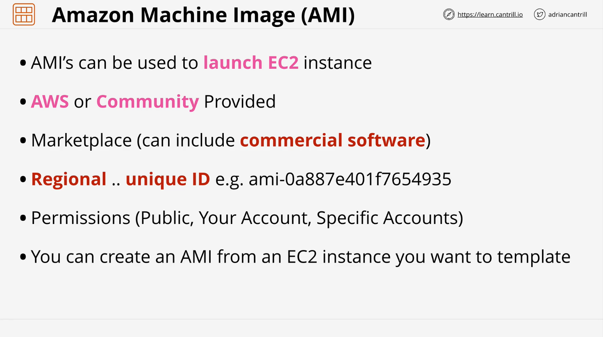
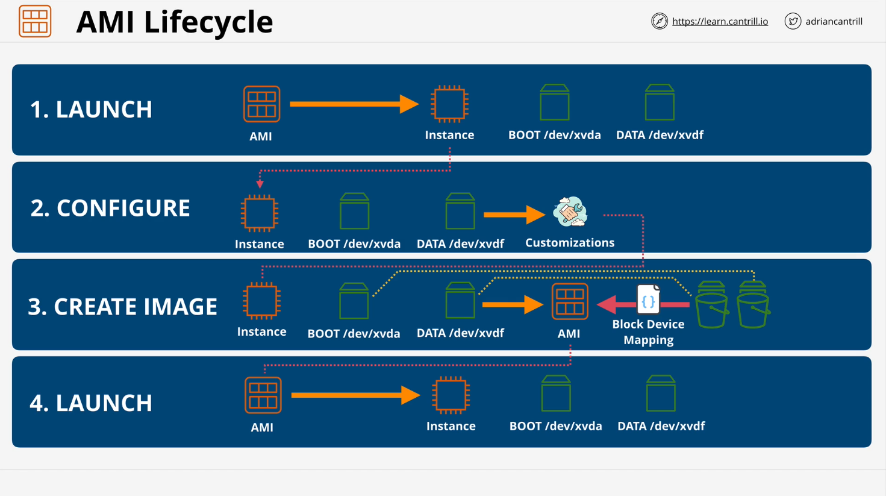
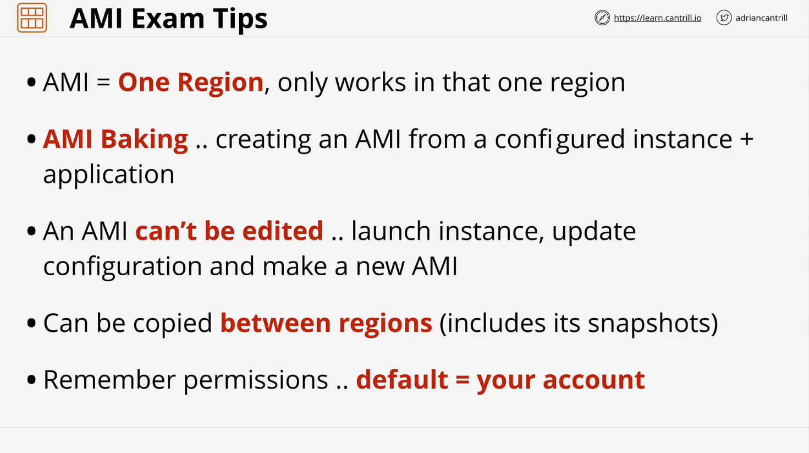

# AWS Solutions Architect (SAA-C03) - Amazon Machine Images (AMIs)

## Introduction



This lesson dives into the details of Amazon Machine Images (AMIs), their purpose, lifecycle, and best practices in AWS. AMIs serve as templates for launching EC2 instances, allowing users to create customized configurations for rapid deployment.

## What is an AMI?

- **Definition:** An Amazon Machine Image (AMI) is a pre-configured template used to launch EC2 instances.
- **Purpose:** AMIs enable the creation of multiple instances with the same configuration.
- **Usage:** Every time an EC2 instance is launched, an AMI is used as its base.

## Types of AMIs

1. **AWS-Provided AMIs:** Official images from AWS (e.g., Amazon Linux 2 AMI).
2. **Community AMIs:** Created by external vendors (e.g., Red Hat, Ubuntu, CentOS).
3. **Marketplace AMIs:** Commercial AMIs available for purchase, often including licensed software.

## AMI Properties

- **Regional:** AMIs are region-specific, with unique IDs in each region.
- **Permissions:**
  - **Private:** Only your AWS account can use it.
  - **Public:** Available for all AWS users.
  - **Shared:** Can be granted access to specific AWS accounts.

## AMI Lifecycle



1. **Launch:** Use an AMI to create an EC2 instance.
2. **Configure:** Modify the instance as per requirements (install software, configure settings).
3. **Create Image:** Convert the configured instance into a new AMI.
4. **Launch Again:** Deploy multiple instances using the custom AMI.

## EBS and AMIs

- EC2 instances have **EBS volumes** attached.
- AMIs store **snapshots** of these volumes.
- When an AMI is used to launch an instance, AWS:
  1. Creates new EBS volumes from the stored snapshots.
  2. Attaches them to the instance using the same **block device mapping**.

### Example: Block Device Mapping

Each AMI stores block device mappings linking snapshots to specific devices:

```json
{
  "DeviceName": "/dev/xvda",
  "Ebs": {
    "SnapshotId": "snap-1234567890abcdef0",
    "VolumeSize": 30,
    "VolumeType": "gp2"
  }
}
```

#### Explanation:

- `DeviceName`: The block device name inside the instance (`/dev/xvda`).
- `SnapshotId`: The EBS snapshot used to create the volume.
- `VolumeSize`: Size of the EBS volume in GB.
- `VolumeType`: Type of EBS volume (e.g., `gp2` for general-purpose SSD).

When an instance is launched from this AMI, AWS restores the EBS volume from the snapshot and attaches it as `/dev/xvda`.

## AMI Best Practices



- **Use AMI Baking:** Create pre-configured AMIs for rapid deployment.
- **Automate AMI Creation:** Use AWS Systems Manager or EC2 Image Builder.
- **Copy AMIs Across Regions:** Replicate AMIs to other AWS regions for redundancy.
- **Optimize Storage Costs:** AMIs reference snapshots, so delete unused AMIs to save costs.
- **Security Considerations:** Keep AMIs private unless necessary, and update software before creating AMIs.

## Exam Tips

- AMIs are **region-specific** but can be **copied to other regions**.
- AMIs cannot be modified directly; instead, launch an instance, make changes, and create a **new AMI**.
- An AMI consists of **snapshots** and **block device mappings**, not actual EBS volumes.
- **Public vs. Private AMIs:**
  - **Private:** Default setting, only your account can use it.
  - **Public:** Available to all AWS accounts.
  - **Shared:** Granted to specific AWS accounts.

## Conclusion

Understanding AMIs is crucial for AWS solutions architects. They enable standardized deployments, cost efficiency, and streamlined instance provisioning. The next lesson will include a hands-on demonstration of AMI creation and usage.
