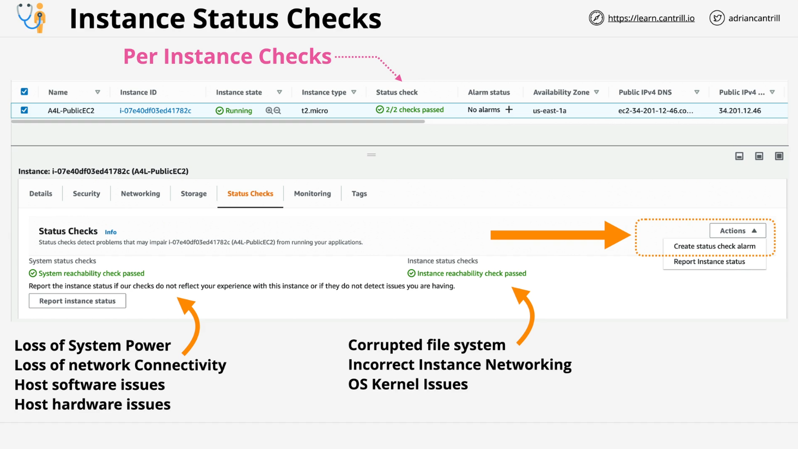

# EC2 Status Checks and Auto Recovery

### Overview

This lesson covers **EC2 Status Checks** and **Auto Recovery**, two key AWS EC2 features that help ensure high availability and system reliability.

- **EC2 Status Checks**: Two automated checks that assess the health of an EC2 instance.
- **Auto Recovery**: A mechanism to automatically recover a failing instance without requiring manual intervention.

## EC2 Status Checks

Every EC2 instance has two **high-level per-instance status checks**:

| Status Check        | Description                                                               | Failure Causes                                                                                      |
| ------------------- | ------------------------------------------------------------------------- | --------------------------------------------------------------------------------------------------- |
| **System Status**   | Checks for issues related to the AWS infrastructure hosting the instance. | - Loss of system power   - Loss of network connectivity   - EC2 host hardware/software issues |
| **Instance Status** | Checks for issues within the EC2 instance itself.                         | - Corrupt file system   - Misconfigured networking   - Kernel or OS issues                    |

### Expected Status

- **Initializing**: Status checks are still in progress.
- **1/2 Passed**: One check has failed and requires troubleshooting.
- **2/2 Passed**: Both checks have passed; the instance is healthy.

If an instance is **not** in a `2/2 Passed` state (except immediately after launching), action is required to resolve the issue.

## Resolving EC2 Instance Issues

### **Manual Resolution**

You can manually resolve issues by:

- **Stopping and restarting the instance**
- **Rebooting the instance**
- **Terminating and recreating the instance**

### **Automatic Recovery Using EC2 Auto Recovery**

AWS provides **auto recovery** for EC2 instances facing **system check failures**.

- The instance is moved to a new host machine.
- All networking and configuration settings remain unchanged.
- If applications/services are configured to start automatically, the instance should recover seamlessly.

## **Setting Up Auto Recovery with CloudWatch Alarms**

Auto Recovery can be configured using **CloudWatch Alarms**, which monitor the status checks and trigger an action if a failure is detected.

### **Steps to Enable Auto Recovery**

1. **Go to the EC2 Console**
2. **Select the Instance**
3. **Navigate to the "Status Checks" tab**
4. **Click on "Actions" > "Create Status Check Alarm"**
5. **Define the Alarm Conditions**
   - Alarm triggers if any status check fails for **5 consecutive minutes**.
6. **Choose the Auto Recovery Action**
   - **Recover the instance** (preferred)
   - Other options: Reboot, Stop, or Terminate the instance

### **Auto Recovery Actions**

If an instance fails a status check, AWS will attempt to:

- **Restart the instance** if a simple reboot can resolve the issue.
- **Migrate the instance** to a new EC2 host within the **same Availability Zone (AZ)**.

**Note**:

- Auto Recovery **does not protect against full AZ failures**.
- It relies on AWS having spare capacity to migrate the instance.
- Only **specific instance types** support auto recovery (e.g., A1, C5, M5, R5).
- Instances using **instance store volumes** are **not** eligible for auto recovery.

## **Limitations of Auto Recovery**

- It only helps with **isolated instance or EC2 host failures**.
- It **does not** protect against region-wide or large-scale failures.
- If there is no spare EC2 capacity, auto recovery might fail.
- It requires **modern instance types** and **EBS-backed storage**.

## **Next Steps**

- **Do not delete** the deployed CloudFormation stack, as it will be used in the next lesson (EC2 Termination Protection).
- Continue to the next lesson for further learning.

### **Resources**

- AWS CloudFormation Template for Deployment: [Launch Stack](https://console.aws.amazon.com/cloudformation/home?region=us-east-1#/stacks/create/review?templateURL=https://learn-cantrill-labs.s3.amazonaws.com/awscoursedemos/0022-aws-associate-ec2-statuschecksandterminateprotection/A4L_VPC_PUBLICINSTANCE.yaml&stackName=STATUSCHECKSANDPROTECT)
- AWS Documentation on EC2 Recovery: [EC2 Instance Recovery](https://docs.aws.amazon.com/AWSEC2/latest/UserGuide/ec2-instance-recover.html)
