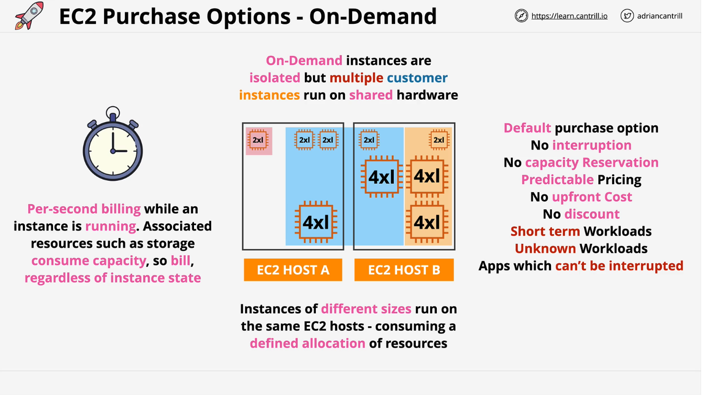
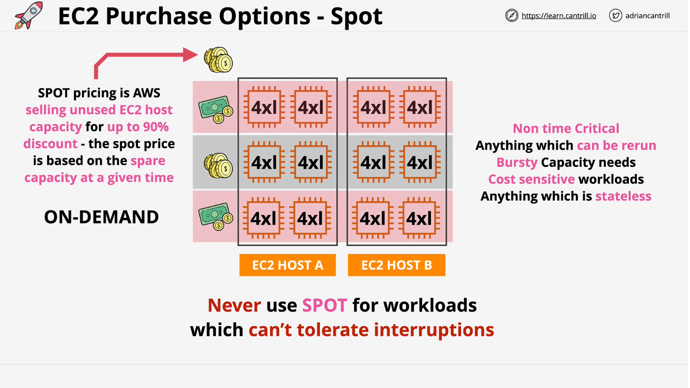

# AWS EC2 Purchase Options

## Introduction to EC2 Purchase Options

EC2 purchase options, also referred to as launch types, define how instances are acquired and billed. AWS officially uses the term **purchase options**, and understanding each is key to selecting the right one based on workload requirements.

This document covers the main EC2 purchase options, their pros and cons, and when to use them.

## On-Demand Instances

### **Overview**

- The **default** EC2 purchase option.
- Instances are launched and billed per second, only while running.
- No discounts, no long-term commitments.

### **How It Works**

1. EC2 hosts run multiple instances of different sizes.
2. AWS customers share these EC2 hosts, but with **isolation and security**.
3. AWS can efficiently allocate resources, leading to **reasonable pricing**.
4. Billing is per second, only while the instance is running.
5. **Associated services (e.g., storage, IP addresses) may incur costs even if the instance is stopped.**

### **Use Cases**

✅ **Best for:**

- Short-term or unpredictable workloads.
- Applications that **cannot tolerate interruptions**.
- Workloads where **predictable pricing** is required.

❌ **Not ideal for:**

- Long-running workloads that could benefit from **discounted pricing**.
- Mission-critical applications needing **guaranteed capacity** during AWS failures.

### **Key Considerations**

- **No capacity reservations** → Reserved instances take priority during AWS failures.
- **Predictable pricing** → Flat rate with no discounts.
- **Best suited for workloads requiring flexibility** without long-term commitments.

## Spot Instances

### **Overview**

- Spot instances offer **unused EC2 capacity at up to 90% discount** compared to On-Demand.
- **AWS dynamically adjusts Spot pricing** based on available capacity.
- Instances are **terminated if demand increases**, and the Spot price exceeds what you’re willing to pay.

### **How It Works**

1. **AWS has extra EC2 capacity** → Sold at a **discounted Spot price**.
2. Customers set a **maximum price they are willing to pay**.
3. As long as the **Spot price is lower than the max price**, the instances run.
4. **If the Spot price rises above the max price, AWS terminates the instances.**

#### **Example**

| Customer   | Max Price Willing to Pay | Initial Spot Price | Outcome When Price Increases                   |
| ---------- | ------------------------ | ------------------ | ---------------------------------------------- |
| Customer 1 | 4 Gold Coins             | 2 Gold Coins       | Instance continues running                     |
| Customer 2 | 2 Gold Coins             | 2 Gold Coins       | Instance is terminated if Spot price exceeds 2 |

### **Use Cases**

✅ **Best for:**

- Workloads that can tolerate interruptions.
- Highly parallel jobs (e.g., scientific research, big data processing).
- Stateless applications (e.g., media rendering, batch processing).
- Cost-sensitive workloads that don’t justify On-Demand pricing.

❌ **Not ideal for:**

- **Mission-critical applications** (e.g., databases, flight control systems).
- **Persistent services** (e.g., mail servers, traditional web hosting).
- Any workload that **requires guaranteed availability**.

### **Key Considerations**

- **Unreliable for long-term workloads** → AWS may terminate at any time.
- **Best suited for cost-sensitive, flexible, and batch processing tasks**.
- **Always have a fallback strategy** when using Spot instances.

## Summary & Key Takeaways

| Purchase Option | Cost                    | Reliability                         | Best Use Cases                                           |
| --------------- | ----------------------- | ----------------------------------- | -------------------------------------------------------- |
| **On-Demand**   | Standard (no discounts) | High                                | Short-term, unpredictable, mission-critical workloads    |
| **Spot**        | Up to **90% discount**  | **Low** (can be terminated anytime) | Fault-tolerant, batch processing, non-critical workloads |

- **Start with On-Demand** → Move to Spot if your workload can tolerate interruptions.
- **Use Spot for batch jobs, AI training, and high-performance computing**.
- **Never use Spot for business-critical applications** that need 24/7 uptime.
