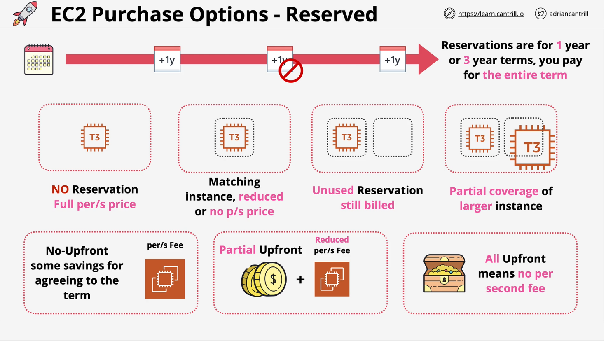
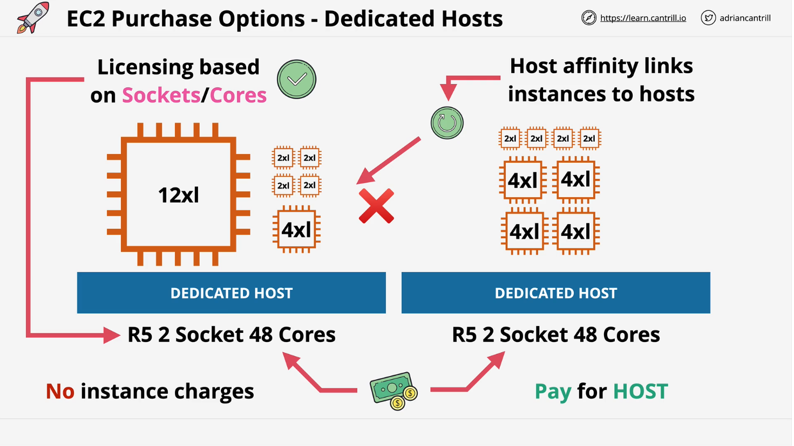
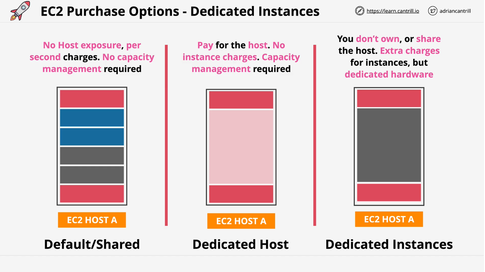

# **AWS EC2 Purchase Options - Part 2**

## **1. Introduction**

This document continues the discussion on **AWS EC2 Purchase Options**, focusing on **Reserved Instances, Dedicated Hosts, and Dedicated Instances**. These options provide cost savings and isolation advantages based on different use cases.

## **2. Reserved Instances (RI)**

### **Overview**

- **Ideal for predictable, long-term workloads**.
- Involves a **commitment** to AWS for a **1-year or 3-year period**.
- Offers **significant cost savings** compared to On-Demand instances.

### **How It Works**

1. You **reserve** an instance type for a fixed duration.
2. This commitment **reduces the per-second cost** or may even remove it entirely.
3. If the reserved instance is **unused**, you **still pay for it**.
4. Reservations can be:
   - **Zonal (Availability Zone Specific)** → Includes **capacity reservation**.
   - **Regional (Region-wide)** → More flexibility, but **no capacity reservation**.

### **Partial Reservation Effect**

- If you reserve a **T3.Large**, but launch a **T3.XLarge**, the reservation applies **partially**, reducing only a portion of the cost.

### **Payment Options**

| Payment Option      | Description                                        | Discount Level       |
| ------------------- | -------------------------------------------------- | -------------------- |
| **No Upfront**      | Pay per second at a reduced rate. No upfront cost. | **Lowest Discount**  |
| **Partial Upfront** | Pay part upfront, then a reduced per-second cost.  | **Medium Discount**  |
| **All Upfront**     | Pay the full amount upfront. No per-second cost.   | **Highest Discount** |

### **Best Use Cases**

✅ **Use Reserved Instances for:**

- **Consistently used workloads** (e.g., web servers, databases).
- **Long-term projects** where savings outweigh flexibility.
- **Stable infrastructure** that doesn’t frequently change.

❌ **Avoid Reserved Instances if:**

- Workload requirements may change.
- You need **full flexibility** over instance choices.
- Your workload is **short-term or bursty**.

## **3. Dedicated Hosts**

### **Overview**

- A **physical EC2 host dedicated to your account**.
- You **pay for the host itself**, not individual instances.
- Designed for workloads that require **full hardware control**.

### **How It Works**

1. AWS allocates an entire **EC2 host** exclusively to you.
2. You can **launch multiple EC2 instances** on this host, consuming its full capacity.
3. No per-second charges for instances **once the host is paid for**.

### **Key Features**

- **Fixed hardware resources** (CPU, memory, storage, network).
- **You manage capacity** → If full, no new instances can be launched.
- **Host Affinity** → Instances can stay on the same host after stop/start.

### **Primary Use Case: Software Licensing**

- Some software licenses are based on **physical sockets and cores**.
- Dedicated Hosts help comply with these **licensing constraints**.

### **Best Use Cases**

✅ **Use Dedicated Hosts for:**

- **BYOL (Bring Your Own License) software** that needs **core/socket-based licensing**.
- **Regulated industries** with strict compliance needs.
- Workloads that require full **isolation from other AWS customers**.

❌ **Avoid Dedicated Hosts if:**

- You don’t need full host control.
- Your workload doesn’t justify **higher costs**.
- You prefer **pay-as-you-go pricing**.

## **4. Dedicated Instances**

### **Overview**

- **Middle ground** between shared and dedicated hosts.
- Your instances run **exclusively on dedicated hardware**, but **you don’t pay for the host itself**.
- Ensures **no other AWS customers share your underlying hardware**.

### **How It Works**

1. AWS provisions EC2 instances on dedicated physical servers **only for your account**.
2. Unlike Dedicated Hosts, **you don’t manage capacity**.
3. You pay a **one-time hourly fee** per region + standard instance pricing.

### **Comparison: EC2 Hosting Models**

| Hosting Model           | Shared Hardware? | Pay for Host?      | Best For                     |
| ----------------------- | ---------------- | ------------------ | ---------------------------- |
| **On-Demand**           | Yes              | No                 | General workloads            |
| **Reserved**            | Yes              | No                 | Long-term workloads          |
| **Dedicated Hosts**     | No               | Yes                | Licensing, full control      |
| **Dedicated Instances** | No               | No (but extra fee) | Security-sensitive workloads |

### **Best Use Cases**

✅ **Use Dedicated Instances for:**

- **Security-sensitive workloads** that must be isolated.
- **Organizations with strict compliance requirements**.
- **Workloads requiring full control over instance placement**.

❌ **Avoid Dedicated Instances if:**

- Cost is a major concern (they **cost more** than On-Demand/Reserved options).
- You need **per-host licensing** (use Dedicated Hosts instead).

## **5. Summary & Key Takeaways**

| Purchase Option         | Cost Savings | Capacity Management | Best For                            |
| ----------------------- | ------------ | ------------------- | ----------------------------------- |
| **On-Demand**           | No discount  | AWS-managed         | Short-term, unpredictable workloads |
| **Spot**                | Up to 90%    | AWS-managed         | Interruptible workloads             |
| **Reserved**            | Up to 75%    | AWS-managed         | Long-term, steady workloads         |
| **Dedicated Hosts**     | Varies       | **User-managed**    | Licensing & compliance needs        |
| **Dedicated Instances** | Varies       | AWS-managed         | Security-sensitive workloads        |

- **On-Demand & Spot → Shared Infrastructure** (Most flexible, no long-term commitment).
- **Reserved Instances → Lower cost for predictable workloads**.
- **Dedicated Hosts & Dedicated Instances → Full hardware isolation** (Compliance, security, or licensing reasons).
- **Know your workload** before choosing a purchase option!

## **6. Exam Tips**

- **Know when to use Spot, On-Demand, and Reserved Instances.**
- **Understand licensing implications** for Dedicated Hosts.
- **Recognize cost trade-offs** between Dedicated Instances and Dedicated Hosts.
- **For cost savings, Reserved Instances and Spot are preferred**, but each has trade-offs.
