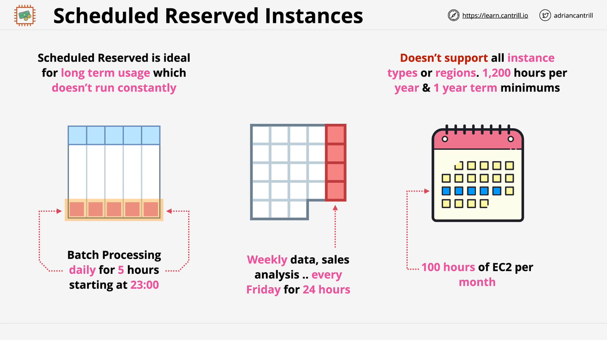
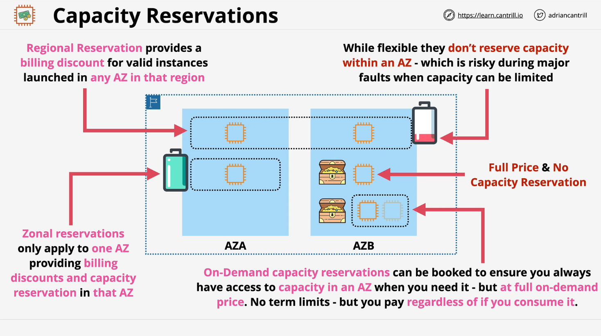
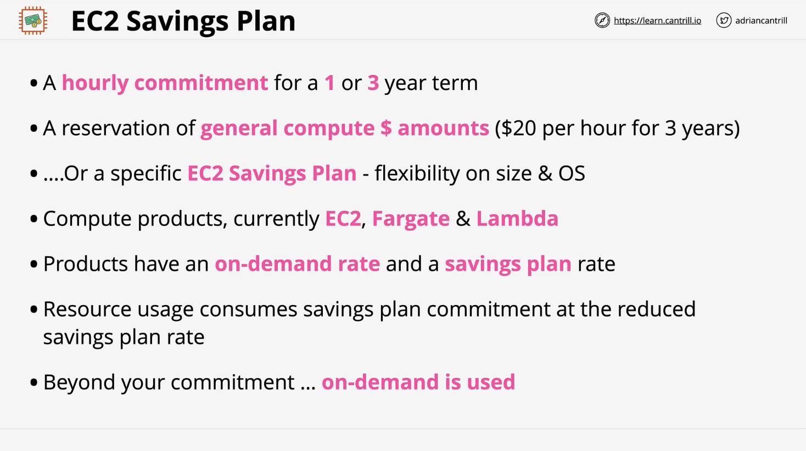

# EC2 Reservation Options

## Standard Reserved Instances (RI)

Standard Reserved Instances are used for long-term, consistent usage patterns and provide cost savings compared to on-demand pricing. They are ideal for workloads running **24/7/365** and require a commitment of **one or three years**.

### Key Points:

- Best suited for **predictable, long-term** workloads.
- Commitment period of **1 or 3 years**.
- Offers **significant cost savings** over on-demand instances.
- Cannot be modified frequently.

## Scheduled Reserved Instances

Scheduled Reserved Instances allow customers to reserve compute capacity for specific time periods.

### Use Cases:

- Workloads that run at **specific times** but not **continuously** (e.g., daily batch jobs, weekly reporting jobs).
- Examples:
  - **Daily batch processing:** Runs for **5 hours per day**.
  - **Weekly sales analysis:** Runs **every Friday for 24 hours**.
  - **Monthly large data processing:** Requires **100 hours of EC2 per month**.

### Limitations:

- Minimum purchase requirement of **1,200 hours per year**.
- Limited to specific **instance types and regions**.
- Requires a **minimum commitment of 1 year**.

## Capacity Reservations

Capacity reservations ensure that compute capacity is available when needed, without requiring a long-term pricing commitment.

### Priority Order of AWS EC2 Capacity Allocation:

1. **Reserved Instances** – AWS guarantees capacity for RI customers first.
2. **On-Demand Instances** – AWS provides capacity based on availability.
3. **Spot Instances** – AWS provides leftover capacity to spot instances.

### Key Features of Capacity Reservations:

- Useful for **mission-critical applications** that cannot tolerate interruptions.
- Separate from Reserved Instances – no pricing discount, only capacity guarantee.
- Can be used independently or combined with reserved instances.
- Flexibility in **regional vs. zonal reservations**.

### Regional vs. Zonal Reservations

| Type                               | Billing Discount | Capacity Reserved | Flexibility                               |
| ---------------------------------- | ---------------- | ----------------- | ----------------------------------------- |
| **Regional RI**                    | Yes              | No                | Can be used in **any AZ** within a region |
| **Zonal RI**                       | Yes              | Yes               | Tied to **one specific AZ**               |
| **On-Demand Capacity Reservation** | No               | Yes               | No long-term commitment                   |

### On-Demand Capacity Reservations

- Users **pay for reserved capacity**, whether used or not.
- No commitment of **1 or 3 years**.
- No pricing discounts – purely a capacity guarantee.
- Best suited for **short-term but guaranteed compute needs**.

## Savings Plans

Savings Plans provide cost reductions similar to Reserved Instances but with greater flexibility across AWS services.

### How Savings Plans Work:

- Users **commit to a minimum hourly spend** for 1 or 3 years.
- AWS provides a **discounted rate** for usage up to the committed spend.
- After exceeding the committed amount, normal **on-demand pricing** applies.

### Types of Savings Plans:

| Type                             | Applies To           | Maximum Savings |
| -------------------------------- | -------------------- | --------------- |
| **General Compute Savings Plan** | EC2, Fargate, Lambda | **Up to 66%**   |
| **EC2 Savings Plan**             | EC2 only             | **Up to 72%**   |

### Key Considerations:

- **General Compute Savings Plan** covers **EC2, Fargate, and Lambda**, allowing flexibility.
- **EC2 Savings Plan** is restricted to **EC2 only**, but offers higher savings.
- Organizations migrating from **EC2 to containerized or serverless architectures** may prefer **General Compute Savings Plans**.

### Exam Tip:

- **Understand the differences** between Reserved Instances, Capacity Reservations, and Savings Plans.
- Recognize **when to use** each cost-saving mechanism based on workload characteristics.

## Summary

| Feature                             | Best For                               | Commitment | Cost Savings | Capacity Guarantee |
| ----------------------------------- | -------------------------------------- | ---------- | ------------ | ------------------ |
| **Standard RI**                     | Long-term, predictable workloads       | 1-3 years  | High         | Yes                |
| **Scheduled RI**                    | Recurring but non-continuous workloads | 1 year     | Moderate     | Yes                |
| **Capacity Reservations**           | Mission-critical applications          | None       | None         | Yes                |
| **On-Demand Capacity Reservations** | Short-term guaranteed compute          | None       | None         | Yes                |
| **Savings Plans**                   | Flexible cost optimization             | 1-3 years  | High         | No                 |

By understanding these options, organizations can optimize their AWS EC2 usage for both **cost efficiency** and **availability assurance**.
