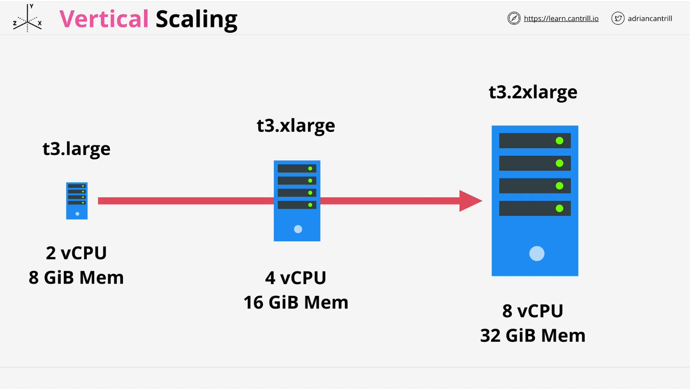
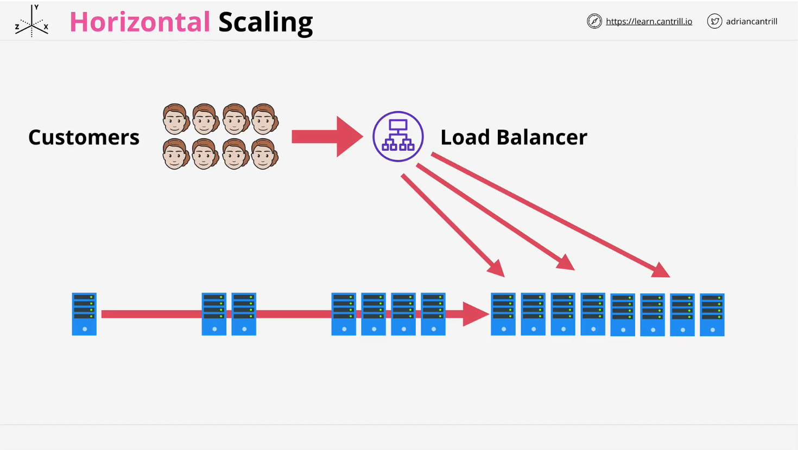
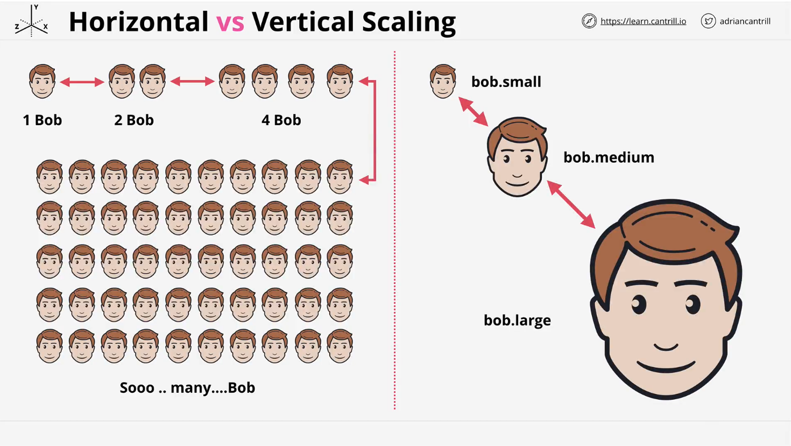

# AWS Scaling: Horizontal vs. Vertical Scaling

## Introduction

Scaling in AWS is essential for handling increasing or decreasing loads on a system. There are two primary types of scaling:

1. **Vertical Scaling** (Scaling Up/Down)
2. **Horizontal Scaling** (Scaling In/Out)

Each has its own advantages, disadvantages, and use cases. Understanding these methods is crucial for designing efficient, cost-effective, and highly available architectures.

## Vertical Scaling



### Definition

Vertical scaling involves increasing or decreasing the size of a single compute resource, such as an **EC2 instance**. This is achieved by upgrading the instance type to a larger or smaller configuration.

### Example

Suppose an application runs on a `t3.large` EC2 instance (2 vCPUs, 8 GiB memory). As the load increases, we can scale up by switching to:

- `t3.xlarge` (4 vCPUs, 16 GiB memory)
- `t3.2xlarge` (8 vCPUs, 32 GiB memory)

### Pros

✔ **Simple Implementation** - No code changes required. If an application runs on an instance, it will work on a larger instance.
✔ **Works for Monolithic Applications** - Suitable for apps that cannot be distributed across multiple instances.

### Cons

✖ **Downtime Required** - Resizing an EC2 instance requires a restart, leading to service disruption.
✖ **Scaling Limitations** - There is a maximum instance size in AWS, capping performance at a certain level.
✖ **Cost Inefficiency** - Larger instances have a higher price premium, and cost scaling is often non-linear.
✖ **Not Dynamic** - Scaling can only be done during planned maintenance windows, which is not ideal for handling unpredictable traffic spikes.

## Horizontal Scaling



### Definition

Horizontal scaling involves adding or removing instances to match the current load. Instead of upgrading a single instance, multiple smaller instances are used together.

### Example

If an application starts with a single instance, as traffic increases:

- One instance becomes **two**
- Two become **four**
- Four become **eight**, and so on...

A **Load Balancer** is required to distribute traffic evenly across instances.

### Key Concepts

- **Load Balancer**: Distributes incoming traffic to multiple instances, ensuring no single instance is overloaded.
- **Stateless Applications**: Each instance should be independent, meaning user session data must be stored externally (e.g., in a database or cache).
- **Session Handling**: Since user requests may hit different instances, sessions should be stored in a centralized location, such as:
  - **Amazon RDS** (Relational Database Service)
  - **Amazon DynamoDB** (NoSQL Database)
  - **ElastiCache** (Redis or Memcached)

### Pros

✔ **No Downtime** - Instances can be added or removed without affecting existing users.
✔ **Scalability** - No upper limit; instances can be continuously added as needed.
✔ **Cost-Effective** - Uses smaller, cheaper instances instead of large expensive ones.
✔ **Better Load Distribution** - Load is automatically spread across multiple instances.
✔ **Granular Scaling** - Scale in smaller increments (e.g., add one instance at a time instead of doubling capacity).

### Cons

✖ **Requires Application Changes** - Not all applications are designed to run on multiple instances.
✖ **Session Management Complexity** - Applications need external session storage to maintain user experience across multiple instances.
✖ **Requires Load Balancing** - Additional configurations are needed to distribute traffic effectively.

## Visualizing Scaling



### Horizontal Scaling (Adding More Instances)

```
Instance 1  → Instance 1, Instance 2  → Instance 1, Instance 2, Instance 3, Instance 4
```

Imagine cloning Bob:

- **1 Bob** → **2 Bobs** → **4 Bobs** → **Unlimited Bobs**
- More Bobs = More capacity!

### Vertical Scaling (Increasing Instance Size)

```
Small → Medium → Large → Extra Large
```

Imagine making Bob grow:

- **Small Bob** → **Medium Bob** → **Large Bob**
- There's a limit to how big Bob can get!

## Summary

| Feature                | Vertical Scaling             | Horizontal Scaling                         |
| ---------------------- | ---------------------------- | ------------------------------------------ |
| **Downtime**           | Yes (Restart Required)       | No (Instances Added Dynamically)           |
| **Session Management** | Simple (Stored Locally)      | Requires External Storage                  |
| **Scalability**        | Limited by Max Instance Size | Virtually Unlimited                        |
| **Cost**               | High for Large Instances     | Cheaper with Small Instances               |
| **Implementation**     | Simple (No Code Changes)     | Requires Load Balancer & External Sessions |

## Conclusion

- **Vertical Scaling** is quick and simple but has limitations in downtime, cost, and performance.
- **Horizontal Scaling** is more scalable and cost-efficient but requires application modifications and session handling.
- **For AWS SA-C03 Exam**: Remember **Horizontal Scaling = More Instances**, **Vertical Scaling = Bigger Instance**.

Understanding these concepts will help in designing **highly available**, **scalable**, and **cost-efficient** AWS architectures.

### Next Steps

- Explore **Elastic Load Balancing (ELB)** for distributing traffic.
- Learn about **Auto Scaling Groups (ASG)** for automatic horizontal scaling.
- Implement **stateless architectures** using DynamoDB or ElastiCache.
