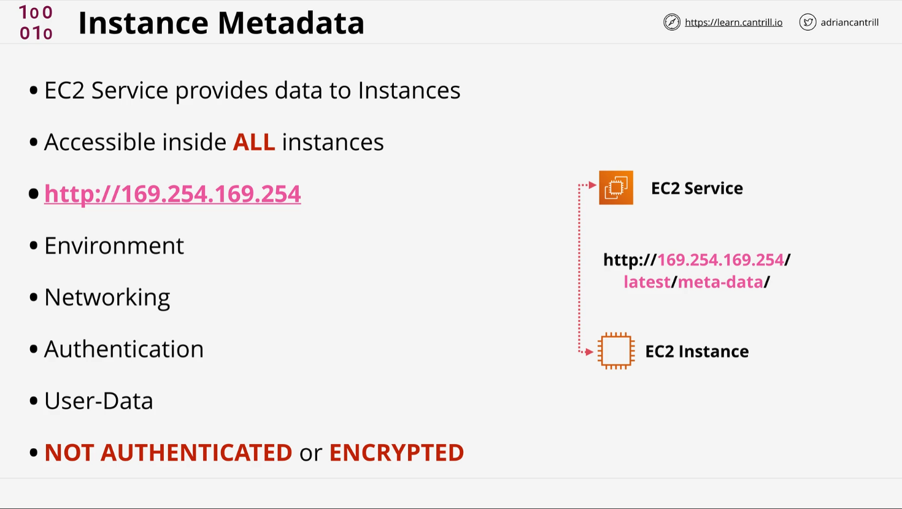

# AWS EC2 Instance Metadata - Learn Cantrill.io AWS SA C03

## Overview



EC2 Instance Metadata is a crucial feature that allows instances to access data about themselves. It is frequently used in AWS exams and real-world implementations for configuring and managing instances.

## Key Points

- Instance metadata provides information about the instance, such as networking, authentication, and security details.
- It is accessible inside all instances using the IP `169.254.169.254`.
- There is no authentication or encryption for metadata access.
- Metadata is used for instance roles, temporary credentials, SSH keys, and user data for automation.
- Public IPv4 addresses are not directly visible to the operating system; they are managed by the Internet Gateway.

## Instance Metadata Query Commands

To query instance metadata, use the following commands:

### Using `curl` to Fetch Metadata

```sh
curl http://169.254.169.254/latest/meta-data/public-ipv4
curl http://169.254.169.254/latest/meta-data/public-hostname
```

**Explanation:**

- `curl` retrieves metadata from `169.254.169.254`.
- `/latest/meta-data/public-ipv4` fetches the public IPv4 address.
- `/latest/meta-data/public-hostname` fetches the public hostname.

### Using `wget` to Download the EC2 Metadata Query Tool

```sh
wget http://s3.amazonaws.com/ec2metadata/ec2-metadata
chmod u+x ec2-metadata
```

**Explanation:**

- `wget` downloads the EC2 metadata query tool.
- `chmod u+x` makes the tool executable.

### Running the Metadata Tool

```sh
ec2-metadata --help
ec2-metadata -a  # Get AMI ID
ec2-metadata -z  # Get Availability Zone
ec2-metadata -s  # Get Security Groups
```

**Explanation:**

- `--help` displays available options.
- `-a` retrieves the AMI ID.
- `-z` retrieves the Availability Zone.
- `-s` retrieves Security Group details.

## Resources Used

### 1-Click Infrastructure Deployment

[AWS CloudFormation Stack Deployment](https://console.aws.amazon.com/cloudformation/home?region=us-east-1#/stacks/create/review?templateURL=https://learn-cantrill-labs.s3.amazonaws.com/awscoursedemos/0009-aws-associate-ec2-instance-metadata/A4L_VPC_PUBLICINSTANCE.yaml&stackName=METADATA)

### Lesson Commands & Documentation

- [Lesson Commands](https://learn-cantrill-labs.s3.amazonaws.com/awscoursedemos/0009-aws-associate-ec2-instance-metadata/lesson_commands.txt)
- [AWS EC2 Instance Metadata Guide](https://docs.aws.amazon.com/AWSEC2/latest/UserGuide/instancedata-data-retrieval.html)
- [AWS Instance Metadata Query Tool](https://aws.amazon.com/code/ec2-instance-metadata-query-tool/)

## Metadata Service Versions

- **Instance Metadata Service Version 1 (IMDSv1)**
- **Instance Metadata Service Version 2 (IMDSv2)**
- Default setting allows both versions
- Can be configured to require IMDSv2

## Access Considerations

### Command Format

- Different depending on metadata service version
- IMDSv2 can be required, which disables IMDSv1

### Metadata Retrieval

- Use `/latest/api/token` for IMDSv2
- Recommended to use `latest` in path to avoid code updates
- Supports IPv6 on Nitro-based instances

## Metadata Access Points

### IPv4 Endpoint

`http://169.254.169.254/latest/meta-data/`

### IPv6 Endpoint

`http://[fd00:ec2::254]/latest/meta-data/`

## Important Considerations

### Technical Limitations

- 1024 packets per second (PPS) limit
- User data limited to 16 KB before base64 encoding
- Metadata returned as plain text

### Container Environment Considerations

- Potential configuration needed for metadata access
- Recommended to increase hop limit to 2 in container environments

## User Data Handling

### Key User Data Characteristics

- Treated as opaque data
- Must be base64-encoded
- Not automatically run when instance restarts
- Not included when creating AMI

## Error Handling

### Possible HTTP Error Codes

- **400**: Missing/Invalid Parameters
- **401**: Unauthorized
- **403**: Forbidden
- **404**: Not Found
- **503**: Request Could Not Be Completed

## Best Practices

### Metadata Retrieval

- Cache security credentials
- Use exponential backoff for throttled queries
- Avoid concurrent metadata requests
- Enable error handling in scripts

## Additional Notes

### Windows-Specific Considerations

- Requires custom AMIs created with Windows Sysprep
- Specific configuration for user data script execution

## Query Options

### Checking Metadata Options

```bash
aws ec2 describe-instances \
    --instance-id i-1234567898abcdef0 \
    --query 'Reservations[].Instances[].MetadataOptions'
```

## Demonstration Steps

### Step 1: Deploy Infrastructure

- Use the **1-click deployment** link to create the necessary infrastructure in **Northern Virginia (us-east-1)**.
- Wait for the **CloudFormation stack** to reach the `CREATE_COMPLETE` state.

### Step 2: Access the EC2 Instance

- Navigate to the **EC2 console**.
- Select the **running instance**.
- Note the **Private IPv4, Public IPv4, and Public DNS**.
- Click **Connect** and use **EC2 Instance Connect**.

### Step 3: Retrieve Metadata

1. **Check Private IP Address**

   ```sh
   ifconfig
   ```

   - This command lists all network interfaces.
   - It displays the private IPv4 and IPv6 addresses.

2. **Query Public IPv4 Address Using Metadata**

   ```sh
   curl http://169.254.169.254/latest/meta-data/public-ipv4
   ```

   - The instance itself does not store the public IPv4 address.
   - The **Internet Gateway** maps the public IP dynamically.

3. **Query Public Hostname**

   ```sh
   curl http://169.254.169.254/latest/meta-data/public-hostname
   ```

   - Retrieves the **public DNS** of the instance.

4. **Use EC2 Metadata Query Tool**
   ```sh
   ec2-metadata -a  # Get AMI ID
   ec2-metadata -z  # Get Availability Zone
   ec2-metadata -s  # Get Security Groups
   ```
   - Provides instance metadata in a structured format.

## Security Considerations

- **Metadata service has no authentication** – any process on the instance can query it.
- **Firewall rules can restrict access** – blocking `169.254.169.254` improves security.
- **User data should not contain sensitive credentials** – it is accessible through metadata.

## Cleanup

- After the demo, delete the **CloudFormation stack** to remove resources.

## Conclusion

Understanding EC2 instance metadata is critical for AWS solutions. It is useful for retrieving instance details dynamically and plays a vital role in automation, configuration, and security. Being aware of how metadata is accessed, its security implications, and how to restrict it is important for both AWS exams and real-world applications.
