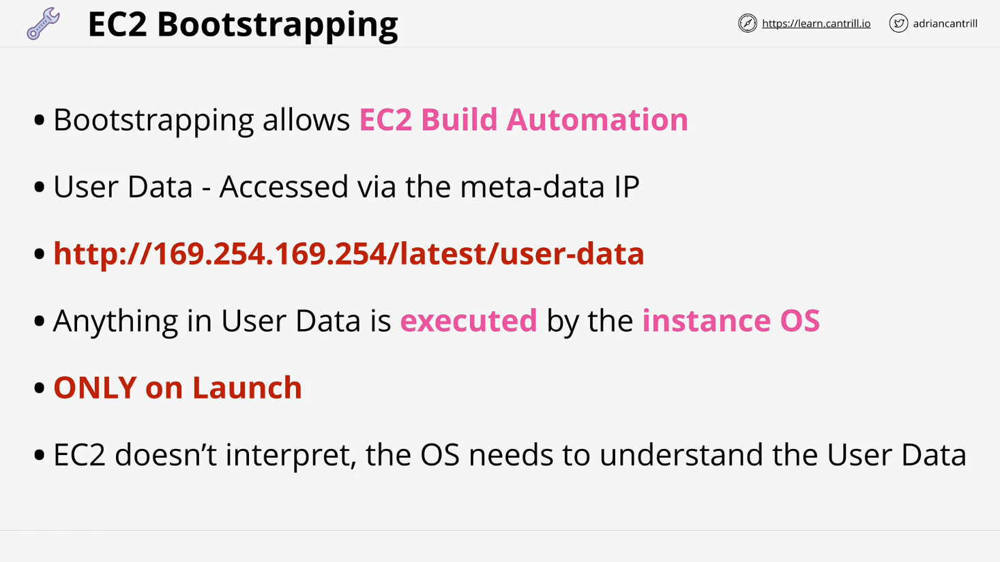
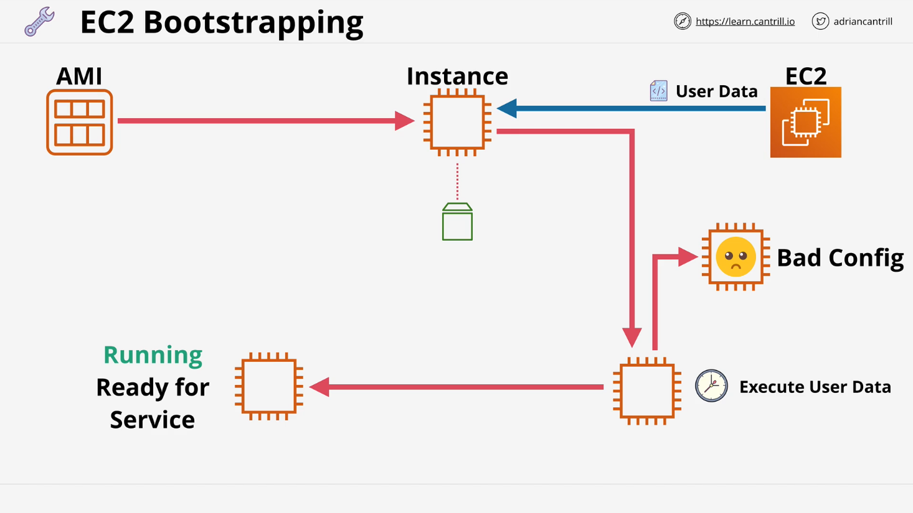
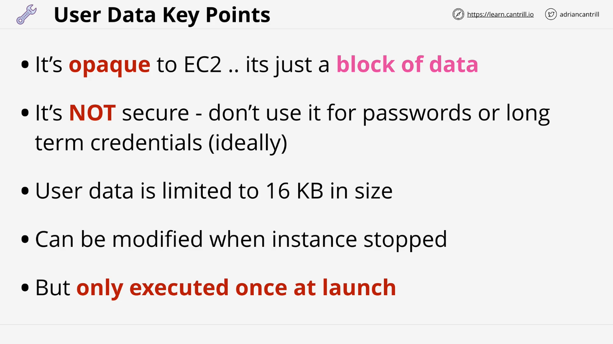
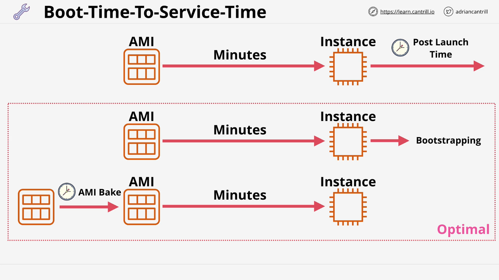

# EC2 Bootstrapping

## Introduction to EC2 Bootstrapping

EC2 bootstrapping is a powerful feature that allows automation during instance launch. It enables pre-configured software installations and configurations, helping solutions architects streamline infrastructure deployment.

## What is Bootstrapping?



Bootstrapping is a general automation process where a system performs self-configuration at launch. In AWS EC2, bootstrapping is implemented using **EC2 User Data**.

### Key Features:

- Enables build automation during instance launch.
- Configures instances beyond their default AMI state.
- Executes software installation and post-installation setup.
- Runs only **once** at instance launch.

## Understanding EC2 User Data

EC2 User Data is injected into an instance during its creation, similar to metadata. The instance retrieves and executes this data at launch.

### Accessing User Data:

User Data is accessed via the metadata IP:

```
http://169.254.169.254/latest/user-data
```

### Characteristics:

- Executed **only once** at launch.
- EC2 does not validate or interpret user data.
- User Data scripts run as **root**.
- If an error occurs, the instance still runs but may be misconfigured.
- Not secure; avoid passing long-term credentials.

## Bootstrapping Architecture



1. **AMI Launch:**

   - An instance is launched using an Amazon Machine Image (AMI).
   - An Elastic Block Store (EBS) volume is attached.

2. **User Data Injection:**

   - EC2 passes user data into the instance.
   - The instance retrieves and executes it during startup.

3. **Execution of User Data:**
   - The script is treated as a normal OS script.
   - It can install software, configure settings, and prepare the instance.
   - If successful, the instance is fully configured and ready.
   - If errors occur, the instance remains running but might be misconfigured.

## Security Considerations

- **User Data is Not Secure**: Anyone with OS access can view it.
- **Avoid Storing Credentials**: Instead, use AWS services like IAM roles or Secrets Manager.
- **EC2 Does Not Validate Data**: Incorrect scripts can lead to misconfigurations or security risks.

## Managing Boot Time to Service Time



"Boot Time to Service Time" refers to the duration from instance launch to readiness. Several factors influence this:

1. **AMI Choice:**

   - AWS-provided AMIs boot quickly.
   - Custom AMIs might take longer depending on pre-installed software.

2. **Post-Launch Configuration:**
   - Manual configuration increases time.
   - Automated processes like bootstrapping reduce it.

## AMI Baking vs. Bootstrapping

### **AMI Baking:**

- Pre-configures instances before launch.
- Faster boot times.
- Less flexibility in runtime configuration.

### **Bootstrapping:**

- Automates configurations at launch.
- More flexible but increases boot time.

### **Best Practice: Hybrid Approach**



- Use AMI baking for time-intensive installations.
- Use bootstrapping for final configurations.

## Next Steps: Demo Lesson

In the next lesson, a practical demo will illustrate the advantages of using EC2 User Data to automate configurations. The demo will:

- Install WordPress using User Data.
- Automate instance setup.
- Compare manual vs. automated processes.

This hands-on exercise will showcase how bootstrapping speeds up deployments and simplifies EC2 management.
