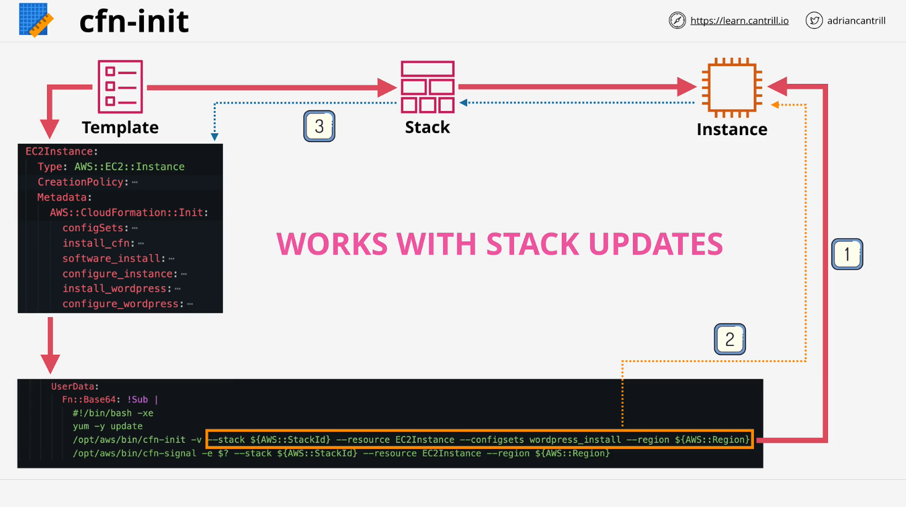

# CloudFormation Init (CFN Init)

## Introduction

This lesson covers **AWS CloudFormation Init (CFN Init)**, an advanced method for configuring EC2 instances beyond basic user data scripts. While this topic extends beyond the AWS Solutions Architect Associate exam, understanding CFN Init will help with automation-related questions.

## Overview of CFN Init


CloudFormation Init (`cfn-init`) is a helper script installed on Amazon Linux 2 and other supported OS environments. Unlike basic **user data**, which is procedural and runs once during instance startup, CFN Init supports both **procedural execution** and **desired state configuration**.

### Differences Between User Data and CFN Init

| Feature          | User Data                 | CFN Init                         |
| ---------------- | ------------------------- | -------------------------------- |
| Execution Style  | Procedural (line-by-line) | Procedural & Desired State       |
| Configuration    | Limited to shell scripts  | Full configuration management    |
| Package Handling | Manual installation       | Version-aware package management |
| State Awareness  | No awareness              | Ensures desired state is met     |

### Capabilities of CFN Init

- Ensures specific software packages are installed, upgraded, or removed.
- Manages OS users and groups.
- Downloads and extracts files (with authentication if needed).
- Creates and configures files with specific permissions and ownership.
- Runs commands and validates outcomes.
- Controls system services (e.g., ensuring a service starts at boot).

## CFN Init in a CloudFormation Template



CloudFormation Init is defined within the **metadata** section of an EC2 instance resource in a CloudFormation template:

```yaml
Resources:
  MyEC2Instance:
    Type: AWS::EC2::Instance
    Metadata:
      AWS::CloudFormation::Init:
        config:
          packages:
            yum:
              httpd: [] # Ensures Apache is installed
          files:
            /var/www/html/index.html:
              content: "Hello, World!"
              mode: "000644"
              owner: "root"
              group: "root"
          services:
            sysvinit:
              httpd:
                enabled: true
                ensureRunning: true
```

### Explanation of the Code

1. **`Metadata` Section**: Defines the `AWS::CloudFormation::Init` configuration.
2. **`packages`**:
   - Uses `yum` to install Apache (`httpd`).
3. **`files`**:
   - Creates an index.html file with specific permissions (`644`), owned by `root`.
4. **`services`**:
   - Ensures Apache (`httpd`) is enabled and running.

### Execution of CFN Init

CFN Init is executed via **User Data** using the following command:

```bash
#!/bin/bash
/usr/local/bin/cfn-init \
  --stack MyStack \
  --resource MyEC2Instance \
  --region us-east-1
```

### Explanation of the Command

- **`cfn-init`**: Runs CloudFormation Init.
- **`--stack`**: Specifies the CloudFormation stack name.
- **`--resource`**: Points to the EC2 instance resource.
- **`--region`**: Defines the AWS region.

CFN Init retrieves configuration from CloudFormation and applies the desired state.

## CFN Signal: Ensuring Bootstrapping Success

By default, CloudFormation does not verify if an EC2 instance is properly configured before marking it as "Create Complete." This is where **CFN Signal** comes in.

### CFN Signal Workflow

1. CloudFormation launches the EC2 instance.
2. The instance executes `cfn-init`.
3. If successful, it sends a success signal (`cfn-signal`) to CloudFormation.
4. If it fails or times out, CloudFormation marks it as a failure.

### Adding a Creation Policy


A **creation policy** ensures CloudFormation waits for a success signal before completing instance creation.

```yaml
Resources:
  MyEC2Instance:
    Type: AWS::EC2::Instance
    CreationPolicy:
      ResourceSignal:
        Count: 1
        Timeout: PT15M
    UserData:
      Fn::Base64: !Sub |
        #!/bin/bash
        /usr/local/bin/cfn-init --stack ${AWS::StackName} --resource MyEC2Instance --region ${AWS::Region}
        /usr/local/bin/cfn-signal -e $? --stack ${AWS::StackName} --resource MyEC2Instance --region ${AWS::Region}
```

### Explanation

1. **`CreationPolicy`**:
   - `ResourceSignal`: Ensures the instance sends a success signal before CloudFormation proceeds.
   - `Timeout`: If no signal is received within **15 minutes**, the stack creation fails.
2. **`cfn-init` Execution**:
   - Configures the instance as per CloudFormation metadata.
3. **`cfn-signal` Execution**:
   - Reports the success (`-e $?`) or failure to CloudFormation.

## CFN Init and Stack Updates

Unlike user data, which runs only once, CFN Init can detect and apply **stack updates**.

- If the metadata configuration changes, CFN Init can reapply the desired state.
- Useful for rolling out configuration updates without recreating instances.

## Key Takeaways

- **CFN Init**: Advanced instance configuration beyond basic user data.
- **CFN Signal**: Ensures CloudFormation waits for successful bootstrapping.
- **Creation Policies**: Prevent premature "Create Complete" status.
- **Stack Updates**: CFN Init can reapply changes dynamically.

These tools enhance automation and reliability in AWS deployments.
