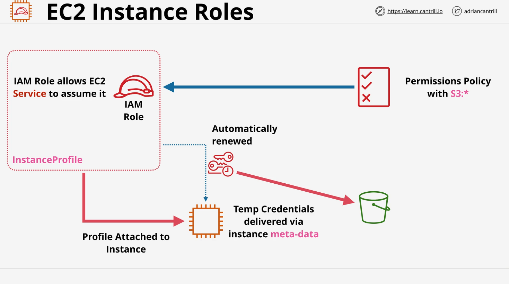
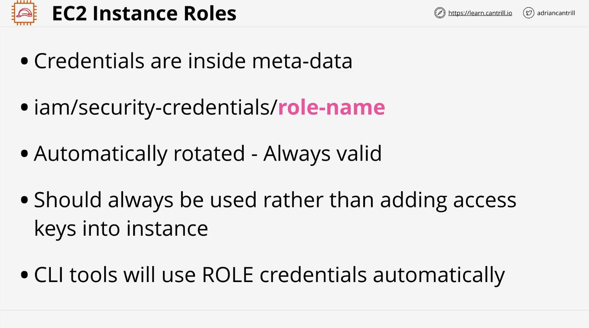

# AWS IAM Roles and EC2 Instance Roles

## Overview

This lesson covers the importance of AWS IAM roles, particularly in the context of EC2 instance roles. IAM roles provide a secure way for AWS services to assume permissions without the need for long-term credentials.

## Understanding IAM Roles

- IAM roles allow AWS services to assume permissions on behalf of the user.
- A role has an associated permissions policy that dictates what actions can be performed.
- When a role is assumed, AWS generates **temporary security credentials** that inherit the role's permissions.

## EC2 Instance Roles

- An **EC2 instance role** allows an EC2 instance to assume a role.
- Any application running on the EC2 instance gets the permissions associated with that role.

### How EC2 Instance Roles Work Architecturally



1. An **IAM role** is created with an attached permissions policy.
2. When assumed, it generates **temporary security credentials**.
3. The **EC2 service** is allowed to assume the role.
4. To deliver credentials into the EC2 instance, an **instance profile** is used.

## Instance Profiles

- An **instance profile** is a wrapper around an IAM role.
- When using the AWS console, an instance profile is automatically created with the same name as the role.
- When using AWS CLI or CloudFormation, the **IAM role and instance profile must be created separately**.
- When attaching a role to an EC2 instance, you're actually attaching an **instance profile**.

## Temporary Security Credentials

- When an EC2 instance role is assumed, **temporary security credentials** are generated.
- These credentials expire but are **automatically refreshed**.
- Credentials are delivered to the EC2 instance via **instance metadata**.

### Accessing Credentials from Instance Metadata

- The credentials are stored in instance metadata under the following path:
  ```bash
  curl http://169.254.169.254/latest/meta-data/iam/security-credentials/
  ```
- This response provides details about the temporary credentials, including:
  - Access key
  - Secret key
  - Session token
  - Expiry time
- Applications running inside the EC2 instance can access these credentials dynamically.

## Benefits of Using IAM Roles for EC2

1. **Security**: No need to store long-term credentials (access keys) inside the instance.
2. **Automatic Credential Rotation**: AWS handles the expiration and renewal of credentials.
3. **Seamless Integration**: AWS CLI and SDKs automatically use instance role credentials.
4. **Least Privilege Principle**: Permissions can be fine-tuned to only allow necessary actions.

## Best Practices



- **Always use IAM roles for EC2 instances instead of hardcoded credentials**.
- **Do not store access keys on the instance itself**.
- **Ensure applications check instance metadata periodically** to get fresh credentials.
- **Use IAM policies with least privilege** to grant only the necessary permissions.

## Summary

- **EC2 instance roles** provide temporary security credentials to applications running on EC2.
- **Instance profiles** are required to attach an IAM role to an EC2 instance.
- **Instance metadata** contains the credentials, which are automatically refreshed.
- **AWS CLI and SDKs** automatically use instance role credentials when available.
- **Using roles is the best practice** for granting AWS service permissions securely.

By following these principles, you can securely manage permissions for EC2 instances without the risks associated with long-term credentials.
