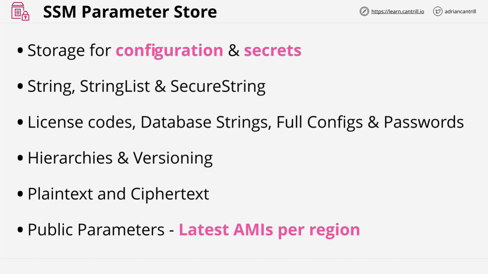
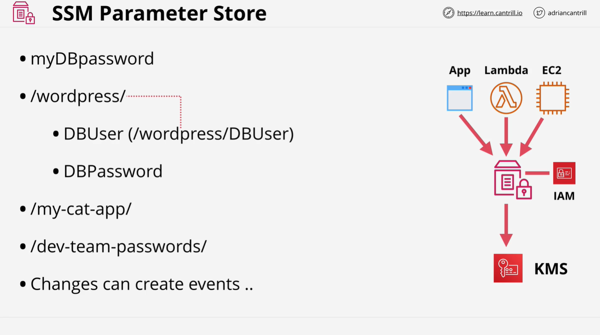

# AWS Systems Manager Parameter Store

## Overview

AWS Systems Manager Parameter Store is a service that allows secure storage and management of configuration data, such as strings, documents, and secrets. This service provides a resilient, scalable, and secure way to handle configurations.

## Why Use Parameter Store?



Passing sensitive information through user data in EC2 instances is considered bad practice because anyone with access to the instance can retrieve those secrets. Parameter Store helps improve security by securely storing configuration values and secrets.

## Parameter Store Features

### Types of Parameters

Parameter Store supports three types of parameters:

- **String**: Plain text values.
- **String List**: A list of string values.
- **Secure String**: Encrypted values using AWS Key Management Service (KMS).

These can be used to store data such as:

- License codes
- Database connection strings (hostnames, ports, etc.)
- Full configuration files
- Passwords and other sensitive information

### Parameter Versioning

Like S3 object versioning, Parameter Store allows versioning of parameters. This means you can track and revert changes when necessary.

### Plain Text vs. Encrypted Storage

- **Plain text parameters** are suitable for storing non-sensitive data such as database connection strings.
- **Encrypted parameters** use AWS KMS for encryption. This adds an extra layer of security and requires appropriate IAM permissions to decrypt values.

### Public Parameters

AWS provides publicly available parameters, such as AMI IDs for different operating systems. These can be accessed without needing to manually specify AMI IDs in CloudFormation templates.

## Architecture and Access Control



### Accessing Parameter Store

- Any AWS service or entity that needs access to Parameter Store must be connected to AWS public endpoints.
- Common consumers include:
  - Applications
  - EC2 instances
  - AWS Lambda functions

### IAM Integration

Since Parameter Store is an AWS service, access control is managed through IAM policies. Authentication and authorization are required for all accesses.

- Access credentials can be:
  - Long-term credentials (Access keys, IAM users)
  - IAM roles with short-term credentials
- If encrypted parameters are used, the requester must have proper KMS permissions.

## Hierarchical Parameter Organization

Parameters can be structured hierarchically, which is useful for organizing configurations across multiple applications or environments.

**Example Structure:**

```
/
├── wordpress/
│   ├── DB_USER
│   ├── DB_PASSWORD
├── my-cat-app/
│   ├── CONFIG_1
│   ├── CONFIG_2
```

- `/wordpress/DB_USER` and `/wordpress/DB_PASSWORD` can be accessed individually or retrieved together by referencing the `/wordpress/` hierarchy.
- Applications can have their own dedicated branches, and permissions can be set at the parameter or branch level.

## Event-Driven Architecture

Parameter Store changes can trigger AWS events, allowing automation of workflows. Examples include:

- Notifying other AWS services when a parameter is updated
- Initiating automated deployments or configuration changes

## Summary

- AWS Systems Manager Parameter Store is a secure, scalable, and structured way to manage configuration data.
- It supports plain text and encrypted parameters using KMS.
- Parameters can be versioned, organized hierarchically, and accessed programmatically.
- IAM permissions are required to access both plain text and encrypted parameters.
- Parameter updates can trigger AWS events, enabling automation.

## Next Steps

The next lesson will include a demo showcasing:

- How to interact with Parameter Store via the AWS Console.
- Using the AWS CLI to retrieve and manage parameters.
- Best practices for securing and organizing parameters.
