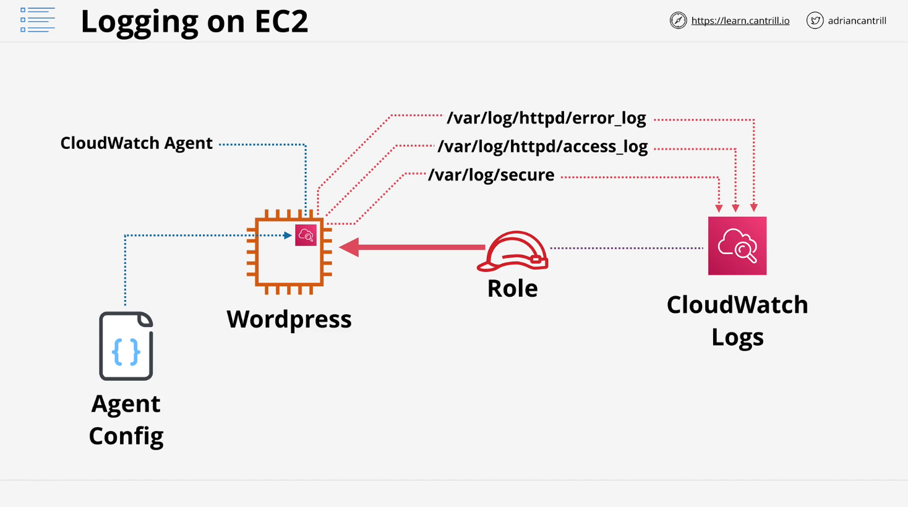

# AWS CloudWatch Agent and EC2 Monitoring

## Overview

In this lesson, we explore how to enable monitoring and logging inside an Amazon EC2 instance using the AWS CloudWatch Agent. By default, Amazon CloudWatch and CloudWatch Logs only monitor external EC2 instance metrics, but internal system performance and logs require additional configuration.

## CloudWatch and CloudWatch Logs Limitations

- CloudWatch monitors EC2 performance and reliability but only from an external perspective.
- CloudWatch Logs stores and visualizes logs but cannot natively capture logs from inside an EC2 instance.
- Internal OS-level metrics such as process monitoring and memory consumption are not visible by default.

## Solution: AWS CloudWatch Agent

### What is the CloudWatch Agent?

- A software agent that runs inside the EC2 instance.
- Captures OS-level performance metrics and logs.
- Sends collected data to CloudWatch and CloudWatch Logs for monitoring and visualization.

### Requirements for the CloudWatch Agent

To enable internal EC2 monitoring, we need:

1. **CloudWatch Agent Installation:** The agent must be installed inside the EC2 instance.
2. **Agent Configuration:** Defines what data to capture and send.
3. **IAM Role and Permissions:** Allows the agent to send data to AWS CloudWatch.

## Architectural Breakdown

1. **EC2 Instance**: By default, it cannot inject logs into CloudWatch Logs.
2. **CloudWatch Agent**: Installed on the instance to capture logs and metrics.
3. **Agent Configuration**: Defines which logs and metrics to collect.
4. **IAM Role**: Grants permission to interact with CloudWatch and CloudWatch Logs.
5. **Log Groups and Streams**:
   - Each log file maps to a **Log Group**.
   - Each EC2 instance creates a **Log Stream** within that log group.

## Steps to Set Up CloudWatch Agent

### 1. Installing the CloudWatch Agent

Manually:

- Log in to the EC2 instance.
- Install the agent.
- Configure the agent.
- Attach an IAM role with required permissions.

At Scale:

- Automate the process using AWS CloudFormation.

### 2. Configuring the CloudWatch Agent

- The agent requires a configuration file specifying which logs and metrics to capture.
- Configuration can be stored in **AWS Systems Manager Parameter Store**.

### 3. Storing Configuration in Parameter Store

- Allows centralized management of agent configuration.
- Enables reuse across multiple instances.

## Practical Demo Overview

In the next demo lesson, we will:

- Install and configure the CloudWatch Agent.
- Set up log collection for three different log files:
  1. `/var/log/secure` (Secure logins to EC2 instance)
  2. Apache `access.log` (Web server access logs)
  3. Apache `error.log` (Web server error logs)

Using these logs, we will gain practical experience in configuring the CloudWatch Agent and leveraging the Parameter Store for scalable configuration management.

## Next Steps

Proceed to the demo lesson where we install and configure the CloudWatch Agent and integrate it with AWS CloudWatch Logs and Parameter Store.
