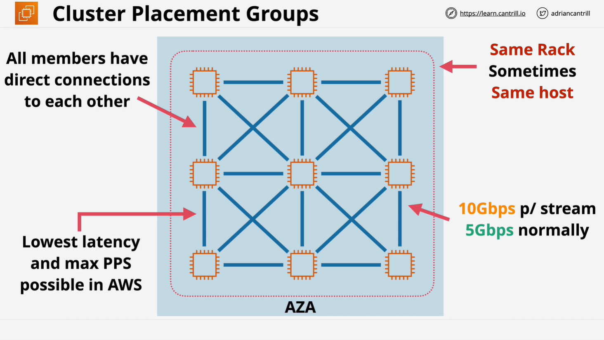
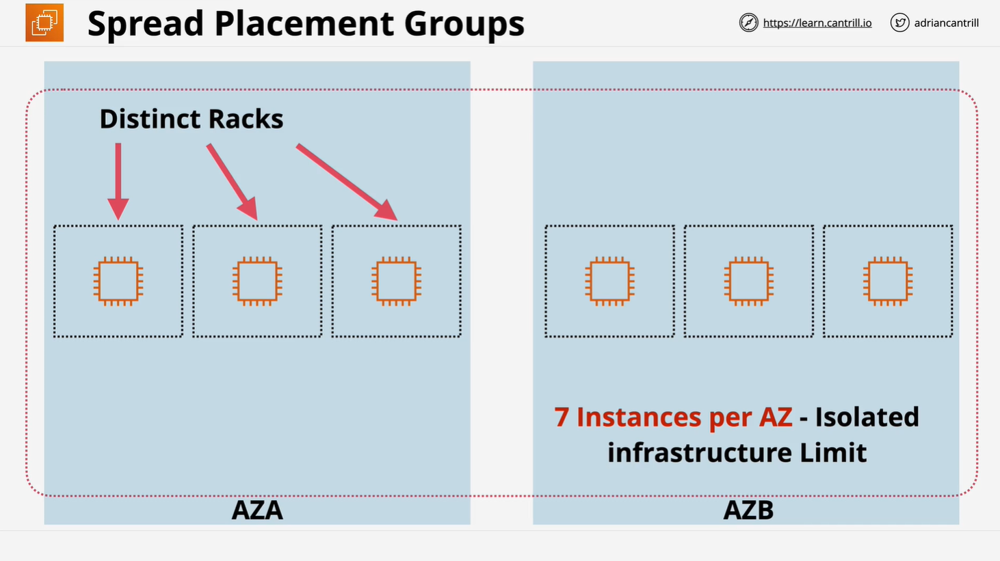
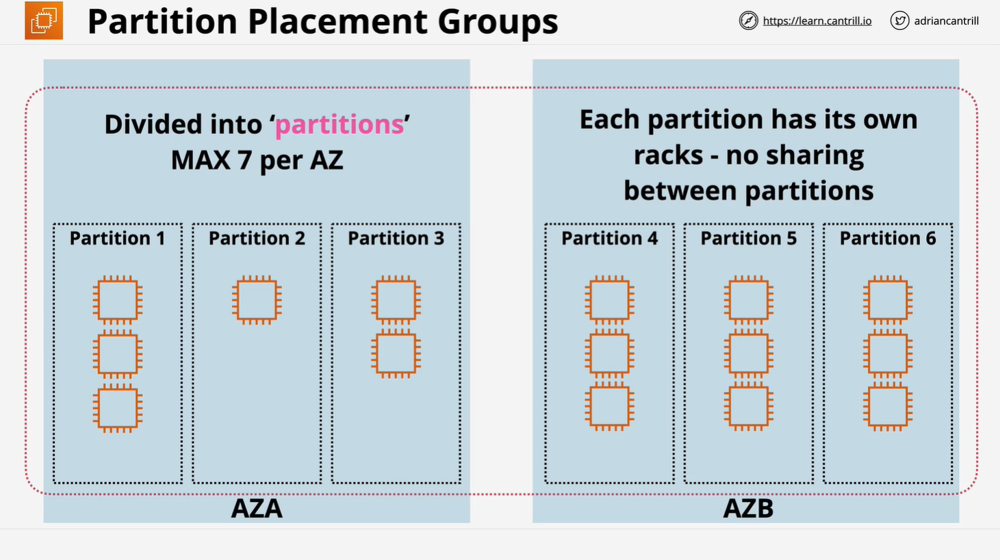

# AWS EC2 Placement Groups

## Overview

Amazon EC2 placement groups allow you to influence the physical placement of instances to optimize performance, resilience, or fault tolerance. Understanding their types and use cases is essential for AWS Solutions Architects.

## Types of Placement Groups

### 1. Cluster Placement Groups

Cluster placement groups are used to achieve the highest network performance by placing instances close together within a single Availability Zone.

#### Key Characteristics:

- **High network performance**: Up to **10 Gbps single-stream transfer rates** (vs. 5 Gbps normally).
- **Low latency** and **high packets per second**.
- **Best practice**: Launch all instances at the same time to ensure optimal placement.
- **Single Availability Zone restriction**.
- **Enhanced networking** is recommended.

#### Use Cases:

- High-performance computing (HPC).
- Scientific analysis.
- Applications requiring high node-to-node speeds and low latency.

#### Limitations:

- No resilience: If the underlying hardware fails, all instances in the group can fail.
- Cannot span multiple Availability Zones.
- Limited to certain instance types.

### 2. Spread Placement Groups

Spread placement groups are designed for applications requiring **maximum availability and resilience** by distributing instances across separate hardware racks.

#### Key Characteristics:

- **Instances are placed on separate racks**, each with its own network and power.
- Can **span multiple Availability Zones**.
- **Maximum of 7 instances per Availability Zone**.
- **Designed to minimize correlated failures**.

#### Use Cases:

- Highly available applications with a **small number of critical instances**.
- File servers and domain controllers.
- Applications requiring separate failure domains.

#### Limitations:

- Hard limit of **7 instances per Availability Zone**.
- Cannot use **Dedicated Hosts** or **Dedicated Instances**.

### 3. Partition Placement Groups

Partition placement groups provide logical partitions where groups of instances are separated across different underlying hardware, offering a balance between scale and resilience.

#### Key Characteristics:

- Can **span multiple Availability Zones**.
- Each partition is **isolated from others** (no shared infrastructure).
- Allows **more than 7 instances per Availability Zone**.
- Provides **visibility into partitions**, making it useful for topology-aware applications.

#### Use Cases:

- Large-scale distributed systems such as **HDFS, Cassandra, and Kafka**.
- Applications requiring **control over failure domains**.
- High-scale **parallel processing applications**.

#### Limitations:

- **Maximum of 7 partitions per Availability Zone**.
- Requires applications to be **topology-aware**.

## Comparison of Placement Groups

| Feature              | Cluster   | Spread | Partition |
| -------------------- | --------- | ------ | --------- |
| High Performance     | ✅        | ❌     | ✅        |
| Low Latency          | ✅        | ❌     | ✅        |
| High Availability    | ❌        | ✅     | ✅        |
| Multi-AZ Support     | ❌        | ✅     | ✅        |
| Instance Isolation   | ❌        | ✅     | ✅        |
| Max Instances Per AZ | Unlimited | 7      | Unlimited |

## Placement Group Considerations

- **Placement groups are optional**. If no placement group is specified, EC2 automatically distributes instances across different hardware.
- **Pricing**: There is no additional cost for using placement groups.
- **Rules and Limitations**:
  - An instance can belong to only **one placement group at a time**.
  - Cannot merge existing placement groups.
  - Spot Instances that stop or hibernate on interruption **cannot** be launched in a placement group.
  - **Dedicated Hosts** cannot be used in placement groups.
  - **On-Demand Capacity Reservations** and **zonal Reserved Instances** can be used with placement groups if instance attributes match.

## Conclusion

Understanding placement groups is crucial for optimizing AWS EC2 workloads. Selecting the appropriate type depends on your requirements:

- **Cluster**: Performance-focused applications.
- **Spread**: Highly available applications with a small number of critical instances.
- **Partition**: Large-scale distributed applications that require infrastructure awareness.

Ensuring the right placement strategy can significantly improve network performance, fault tolerance, and cost efficiency within AWS.
