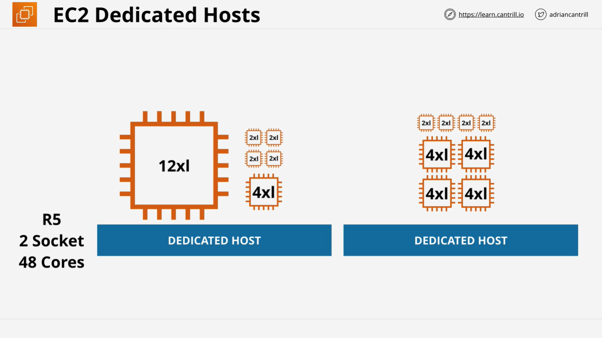

# EC2 Dedicated Hosts

## Overview

EC2 Dedicated Hosts in AWS provide a physical server fully allocated to a single AWS account, allowing users to run EC2 instances without sharing resources with other AWS customers. These hosts are beneficial for compliance requirements, software licensing models, and workload consistency.

## Key Features

- **Dedicated Physical Server:** A fully dedicated EC2 host for a single AWS account.
- **Billing:** Users pay for the host itself rather than for individual instances.
- **Instance Family Specific:** Dedicated hosts are tied to a particular instance family, such as A1, C5, or M5.
- **Flexible Payment Options:** Pay on-demand or reserve for 1 to 3 years with various upfront payment options.
- **Physical Hardware Considerations:** Hosts have a specific number of physical sockets and cores, impacting licensing and instance capacity.
- **No Additional Instance Charges:** Once a host is paid for, there are no extra EC2 instance charges for instances running on that host.

## Billing and Pricing Options

- **On-Demand:** Suitable for short-term or unpredictable usage.
- **Reserved:** Available for 1 or 3 years with options:
  - All upfront
  - Partial upfront
  - No upfront

## Instance Allocation

- A dedicated host supports a **specific instance family and size**.
- Example (A1 Dedicated Host with 16 cores):
  
  - 16 A1.medium instances
  - 8 A1.large instances
  - 4 A1.xlarge instances
  - 2 A1.2xlarge instances
  - 1 A1.4xlarge instance
- **Nitro-based Dedicated Hosts** (e.g., R5) provide more flexibility, allowing multiple instance sizes on the same host.
  
  - Example (R5 Dedicated Host with 48 cores):
    - 1 × 12xlarge + 1 × 4xlarge + 4 × 2xlarge (Total: 48 cores)
    - 4 × 4xlarge + 4 × 2xlarge (Total: 48 cores)

## Licensing Considerations

- Software that is licensed per **physical socket or core** benefits from Dedicated Hosts, as the entire host is owned by a single AWS account.
- Useful for enterprise software requiring per-socket/core licensing (e.g., Windows, Oracle, SQL Server).

## Limitations

- **AMI Restrictions:** Cannot use Red Hat Enterprise Linux (RHEL), SUSE Linux Enterprise Server (SLES), or Windows AMIs.
- **No RDS Support:** Amazon RDS instances cannot run on Dedicated Hosts.
- **No Placement Groups:** Dedicated Hosts do not support placement groups.

## Account Sharing with AWS RAM

- **Resource Access Manager (RAM)** allows sharing Dedicated Hosts across AWS accounts within an organization.
- Shared hosts:
  - The host owner can **see all instances** running on the host.
  - Other AWS accounts can only **see and manage their own instances**.

## When to Use EC2 Dedicated Hosts

- **Software licensing constraints:** When software vendors require per-socket or per-core licensing.
- **Compliance and regulatory requirements:** When workloads must run on dedicated physical servers.
- **Predictable, long-term workloads:** Reserved pricing can provide cost savings over time.
- **Workload consistency:** Ensures stable performance by avoiding resource sharing with other AWS customers.

## When NOT to Use EC2 Dedicated Hosts

- **For general EC2 instance needs:** Regular EC2 instances on shared hosts are more flexible and cost-effective.
- **For highly dynamic workloads:** Auto-scaling and on-demand instances provide better adaptability.
- **If not required for licensing or compliance:** Dedicated Hosts are more expensive than shared EC2 infrastructure.

## Conclusion

EC2 Dedicated Hosts are a niche AWS offering designed primarily for compliance and licensing requirements. While they offer advantages in control and predictability, their limitations make them suitable only for specific use cases. For most workloads, standard EC2 instances or other AWS compute options provide better flexibility and cost-effectiveness.

For further details, refer to AWS Documentation: [Amazon EC2 Dedicated Hosts pricing](https://aws.amazon.com/ec2/dedicated-hosts/pricing/).
