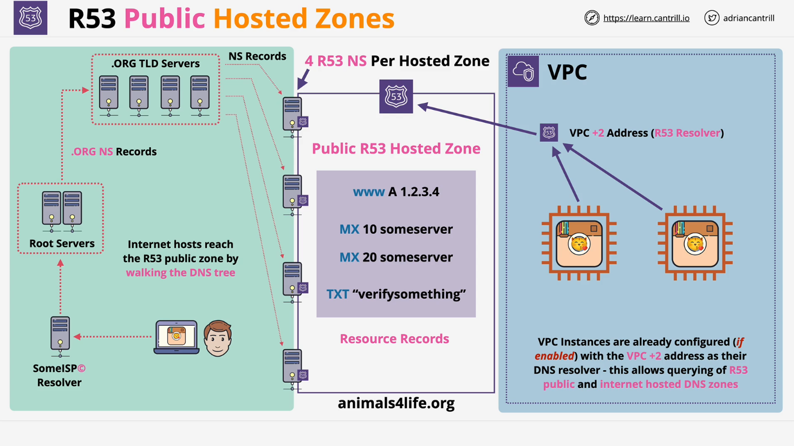

# AWS Route 53 Public Hosted Zones

## Introduction

This document provides an in-depth summary of AWS Route 53 Public Hosted Zones. AWS Route 53 is a scalable and highly available Domain Name System (DNS) web service. In this section, we will explore the concept of public hosted zones, their architecture, and how they integrate with the global DNS system.

## Hosted Zones Overview

- Route 53 supports **two types** of hosted zones: **Public** and **Private**.
- A **hosted zone** is essentially a DNS database for a specific domain, such as `animalsforlife.org`.
- Route 53 is a **globally resilient service**, meaning that its name servers are distributed worldwide, ensuring redundancy and availability.
- Hosted zones are **automatically created** when registering a domain via Route 53, but they can also be created separately if the domain is registered elsewhere.
- AWS charges a **monthly fee** for hosting a hosted zone along with a small fee per DNS query.

## Public Hosted Zones

A **public hosted zone** is a **DNS database** hosted by Route 53 on **public name servers**, making it accessible from the internet and within AWS VPCs.

### Key Features:

1. **DNS Delegation**:
   - A hosted zone is authoritative for its domain (e.g., `animalsforlife.org`).
   - When a domain is registered, **Name Server (NS) records** for that domain are updated to point to Route 53 name servers.
2. **Name Servers Allocation**:

   - When a **public hosted zone** is created, AWS Route 53 assigns **four public name servers**.
   - These name servers **host the zone file** and must be configured in the domain registrar’s settings.

3. **Resource Records**:
   - Inside the public hosted zone, various **DNS records** can be created, including:
     - **A Record** (IPv4 address)
     - **AAAA Record** (IPv6 address)
     - **MX Record** (Mail Exchange)
     - **TXT Record** (Text-based data)

## How Public Hosted Zones Work

### Within AWS VPCs

- AWS **Route 53 Resolver** allows instances inside a **VPC** to directly query the hosted zone.
- Instances using the **VPC DNS Resolver** can resolve public domain names without additional configuration.

### External Public DNS Resolution

The **DNS resolution process** follows these steps:

1. **User's DNS resolver (ISP)** queries the **root DNS servers**.
2. The **root DNS servers** refer the request to the **TLD (Top-Level Domain) servers** (e.g., `.org` servers for `animalsforlife.org`).
3. The **TLD servers** return the **authoritative Route 53 name servers** for the domain.
4. The **ISP resolver** queries one of the Route 53 **public name servers** to retrieve the requested DNS record.

This process, called **walking the tree**, ensures any public internet host can access records in a public hosted zone.

## Cost Considerations

- **Monthly charge** per hosted zone.
- **Minimal cost per DNS query**, but **high-traffic websites** should account for query volume.

## Conclusion

- **Public hosted zones** are a core part of AWS Route 53, enabling **DNS hosting** for domains accessible over the public internet.
- They provide **high availability**, **scalability**, and **integration with AWS services**.
- Understanding their architecture is crucial for **DNS management** and **networking within AWS**.
