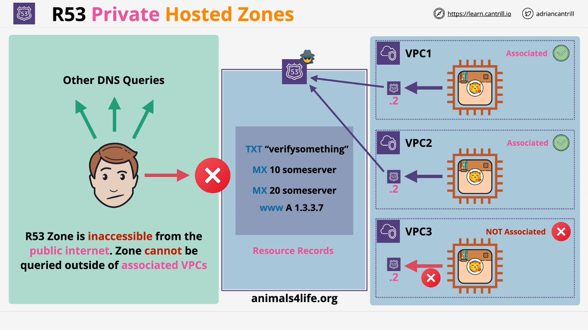

# AWS Route 53: Private Hosted Zones

## Introduction

This lesson covers **Private Hosted Zones** in AWS Route 53. Unlike **Public Hosted Zones**, private hosted zones are accessible only within **AWS VPCs (Virtual Private Clouds)** that they are explicitly associated with. This allows organizations to have internal DNS records that are not exposed to the public internet.

## What is a Private Hosted Zone?

A **Private Hosted Zone (PHZ)** in AWS Route 53 functions similarly to a **Public Hosted Zone**, except:

- It is **not accessible from the public internet**.
- It is **associated with one or more VPCs**, making it resolvable only within those VPCs.
- It supports standard **DNS records** (A, MX, TXT, etc.).
- It can be created and managed using the **AWS Console, CLI, or API**.
- Cross-account VPC associations can be made using **CLI or API** (not via the console).

## Use Cases of Private Hosted Zones

Private hosted zones are useful when:

- You need **internal DNS records** for AWS resources.
- You want to **restrict access** to certain services (e.g., internal APIs, databases).
- You need to support **split-horizon DNS** (same domain for internal and external users).

## Split-View DNS (Split-Horizon)

- **Split-View DNS** allows you to have **both public and private hosted zones for the same domain**.
- This means:
  - **Internal users** get a different DNS response than **external users**.
  - Common for corporate networks where internal systems need to access **private records**, while external users see a **public website**.

### Example Scenario:

- **animalsforlife.org**
  - Public hosted zone → Contains records for the public website.
  - Private hosted zone → Contains records for internal AWS services.

| DNS Query Source | Resolved Records            |
| ---------------- | --------------------------- |
| Public Internet  | Public hosted zone records  |
| AWS VPC (linked) | Private hosted zone records |

## Architecture of Private Hosted Zones



1. A **Private Hosted Zone** is created in Route 53.
2. It is associated with **one or more VPCs**.
3. **VPC instances** can resolve domain names inside the PHZ via the **Route 53 Resolver**.
4. If a **VPC is not associated**, it cannot resolve records from the PHZ.

### Visual Representation:

```
+-------------------+      +---------------------+
| Public Internet  | ---> | Route 53 Public Zone|  (Public DNS queries)
+-------------------+      +---------------------+
                                 |
                                 v
+-----------------------------+    +-----------------------------+
|   AWS VPC 1 (Linked)       |    |   AWS VPC 2 (Not Linked)   |
| - Route 53 Resolver        |    | - No access to PHZ         |
| - Resolves PHZ records     |    |                             |
+-----------------------------+    +-----------------------------+
```

### Key Points:

- Only VPCs **explicitly associated** with the private hosted zone can resolve records.
- Public internet users **cannot** query a private hosted zone.

## How Private Hosted Zones Work

1. A user within an **associated VPC** makes a DNS request.
2. The request is forwarded to the **Route 53 Resolver** (using the `.2` IP in the VPC CIDR range).
3. The **Private Hosted Zone** responds with the corresponding **private DNS record**.
4. If the VPC **is not associated**, the request **fails**.

## Example: Split-View DNS in Action


Consider a scenario where a company wants **internal users** to access an **internal version** of `accounting.animalsforlife.org`, but external users should not see it.

- **Public Hosted Zone**:

  - `animalsforlife.org` → Public website IP.
  - `www.animalsforlife.org` → Public website IP.

- **Private Hosted Zone (for VPCs)**:
  - `accounting.animalsforlife.org` → Internal AWS service IP (e.g., EC2 instance).
  - `internal-db.animalsforlife.org` → Private database IP.

| Query Source         | DNS Resolution                                    |
| -------------------- | ------------------------------------------------- |
| Public User          | `animalsforlife.org` (public website)             |
| AWS VPC (linked)     | `accounting.animalsforlife.org` (private service) |
| AWS VPC (not linked) | Cannot resolve                                    |

### **Why Use This?**

- Keeps **sensitive infrastructure private**.
- Ensures **external users see only public records**.
- Allows internal AWS applications to communicate securely.

## Summary

- **Private Hosted Zones** are accessible **only within associated VPCs**.
- **Split-View DNS** allows internal users to see different DNS records than external users.
- **VPCs must be explicitly associated** with a PHZ to resolve its records.
- **Public users cannot** query private hosted zones.
- **Common use case:** Keeping internal services (databases, APIs) private while exposing public websites.

This concludes the lesson on **AWS Route 53 Private Hosted Zones**.
