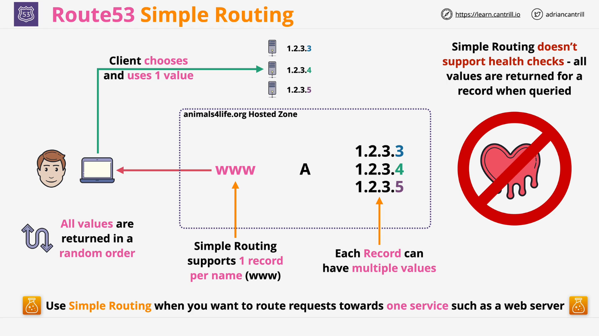

# **Simple Routing in AWS Route 53**

## **Introduction**

This lesson introduces **Simple Routing**, which is the **default and most basic routing policy** in AWS **Route 53**. Simple Routing is used when **only one record per domain name** is required, and all values are returned in response to a DNS query.

## **Understanding Simple Routing**



### **How Simple Routing Works**

- Simple Routing operates within a **hosted zone** (e.g., `animalsfulive.org`).
- You can create a single **DNS record** per name, such as:
  ```plaintext
  www.animalsfulive.org  A  1.2.3.4
  ```
- If multiple IP addresses exist for a record, **all values are returned randomly** in a single query.
- The **client selects one of the values** and connects to it.

### **Example of a Simple Routing Record**

```plaintext
www.animalsfulive.org  A  1.2.3.4, 5.6.7.8
```

- The DNS response contains both `1.2.3.4` and `5.6.7.8`.
- The client (e.g., a web browser) **chooses one** and connects.

### **Limitations of Simple Routing**

1. **No Health Checks**

   - There is **no verification** that the IP addresses returned are working.
   - If one of the servers is **down**, clients may still receive that IP.
   - Other Route 53 routing policies provide health checks, but **Simple Routing does not**.

2. **No Routing Intelligence**
   - Simple Routing does not support **traffic distribution** or **failover**.
   - It is not suitable for **load balancing** across multiple locations.

## **When to Use Simple Routing**

Use **Simple Routing** when:

- You only need to route to **one service** (e.g., a single web server).
- You **don't need** health checks or intelligent traffic routing.
- The setup should be **quick and easy** with minimal complexity.

## **Conclusion**

- **Simple Routing is the most basic routing policy in Route 53**.
- It does **not** support health checks or advanced traffic management.
- Suitable for **simple use cases** where only one service needs to be reached.
- Other **advanced routing policies** (covered in later lessons) provide **health checks and traffic management**.

This concludes the lesson on **Simple Routing in AWS Route 53**.
