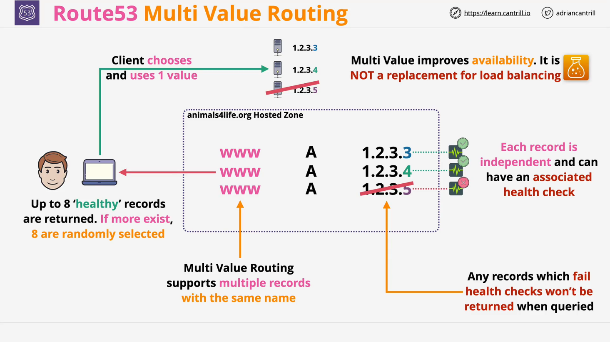

# AWS Route 53 Multi-Value Routing

## Overview

This lesson covers **Multi-Value Routing**, an advanced routing policy in AWS Route 53 that merges benefits from both **Simple Routing** and **Failover Routing**. It is designed to improve **availability** by distributing traffic across multiple resources while ensuring that only healthy endpoints are returned to clients.

## What is Multi-Value Routing?

Multi-Value Routing allows you to create **multiple DNS records with the same name**, each pointing to different IP addresses. The key characteristics of Multi-Value Routing include:

- **Supports Multiple Records**: You can create multiple records (e.g., multiple A records for `www.example.com`).
- **Uses Health Checks**: Each record can be associated with a **health check**.
- **Returns Multiple Values**: When queried, Route 53 returns up to **eight healthy records**.
- **Random Selection**: If more than eight records exist, Route 53 selects **eight at random**.
- **Improves Availability**: Clients can connect to any of the healthy IP addresses.

## How Multi-Value Routing Works

1. **DNS Records Creation**

   - You create multiple A records (IPv4) or AAAA records (IPv6) with the same hostname (`www.example.com`).
   - Each record points to a different IP address.

2. **Health Check Association**

   - Each record can have an **associated health check** to monitor resource availability.
   - If a record fails the health check, it **won't be returned** to clients.

3. **Query Resolution Process**
   - When a DNS query is made, Route 53 selects up to **eight healthy records** and returns them.
   - If there are more than **eight records**, Route 53 **randomly selects eight**.
   - The client then picks one IP from the list and connects to it.

## Multi-Value Routing vs. Other Routing Policies

| Routing Policy          | Health Checks | Use Case                                                             |
| ----------------------- | ------------- | -------------------------------------------------------------------- |
| **Simple Routing**      | ❌ No         | Single static resource (e.g., a web server).                         |
| **Failover Routing**    | ✅ Yes        | Active-standby setup (e.g., primary web server with an S3 failover). |
| **Multi-Value Routing** | ✅ Yes        | Multiple resources that can serve requests, selected randomly.       |

### Key Differences:

- **Simple Routing**: No health checks; directs all traffic to a single endpoint.
- **Failover Routing**: Routes traffic to a primary endpoint but switches to a backup if the primary fails.
- **Multi-Value Routing**: Distributes traffic among multiple healthy endpoints.

## When to Use Multi-Value Routing

- You have **multiple identical resources** (e.g., multiple web servers) and want to distribute traffic across them.
- You need a **basic DNS-level load balancing solution**.
- You want to improve **availability** by removing unhealthy endpoints dynamically.

> ⚠️ **Note:** Multi-Value Routing **is not** a replacement for a **Load Balancer** (e.g., AWS ALB or NLB). It only determines which IPs are returned to clients but does not manage the actual network connection.

## Summary

- Multi-Value Routing is **a blend of Simple and Failover Routing**.
- It allows **multiple records** with the same name, each linked to a different IP.
- It **uses health checks** to ensure only functional endpoints are returned.
- Route 53 selects **up to eight random healthy records**.
- It enhances **availability** but is **not a true load balancing solution**.

## Next Steps

- Set up Multi-Value Routing in **AWS Route 53**.
- Experiment with **different routing policies** to understand their behavior.
- Continue to the next lesson for more advanced AWS networking concepts.
