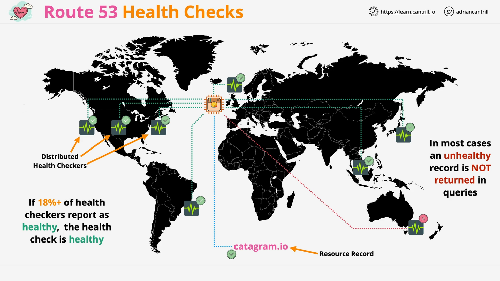

# **AWS Route 53 Health Checks**

## **Introduction**

Health checks in **AWS Route 53** are an essential feature that enables **high availability and fault tolerance** by monitoring the health of resources and influencing DNS query responses. Understanding how health checks work is crucial for **architects, developers, and engineers** to design resilient architectures.

## **Overview of Route 53 Health Checks**

- **Health checks are independent of DNS records** in Route 53.
- They are created separately and **associated with DNS records**.
- Health checks help determine **whether an endpoint is operational**.
- AWS operates **a global fleet of health checkers** that periodically test endpoints.
- Health checks can be used for **AWS and non-AWS resources** as long as they are publicly accessible.

### **How Health Checks Work**

1. Route 53 periodically sends **requests to an endpoint**.
2. If the endpoint responds correctly, it is marked as **healthy**.
3. If it fails multiple checks, it is marked as **unhealthy**.
4. Health check results influence **DNS responses** (e.g., removing unhealthy endpoints from DNS resolution).

## **Types of Health Checks**

There are three types of health checks in Route 53:

### **1. Endpoint Health Checks**

- **Directly monitor an IP address or domain name**.
- **TCP Check**:
  - Route 53 attempts to **establish a TCP connection** to the endpoint.
  - Must succeed **within 10 seconds**, or it is marked as **unhealthy**.
- **HTTP/HTTPS Check**:
  - Establishes a **TCP connection** within **4 seconds**.
  - Expects an HTTP response **(status 200 or 300)** within **2 seconds**.
  - Can verify the **content of the response body** for a specific string.

### **2. CloudWatch Alarm Health Checks**

- Health check status is based on **CloudWatch Alarms**.
- Can monitor **custom metrics, application logs, or in-depth system health**.
- Ideal for **internal resources** that aren’t directly accessible over the internet.

### **3. Calculated Health Checks**

- A **meta-check** that evaluates the status of **multiple health checks**.
- Useful for determining **overall application health** based on several components.

## **Health Check Configuration in AWS Console**

To create a health check in the **AWS Management Console**, follow these steps:

1. **Navigate to Route 53** → Select **Health Checks** from the left menu.
2. Click **Create Health Check**.
3. **Specify a name** (e.g., `TestHealthCheck`).
4. **Select Health Check Type**:
   - Endpoint (IP address or domain).
   - Calculated (based on other checks).
   - CloudWatch Alarm.
5. **Configure Endpoint Settings**:
   - Choose **TCP or HTTP(S)**.
   - Specify **IP address, port, and request path**.
   - Optionally, configure **response string matching** for application validation.
6. **Set Request Frequency**:
   - Every **30 seconds** (default).
   - Every **10 seconds** (higher cost).
7. **Define Failure Threshold**:
   - Number of **consecutive failed checks** before marking unhealthy.
   - Helps prevent false positives due to temporary failures.
8. **Enable Notifications (Optional)**:
   - Integrate with **SNS Topics** to trigger alerts.
   - Allows automation of incident response.

## **Advanced Health Check Options**

- **Latency Graph**: Measures **response time** over time.
- **Invert Status**: Marks unhealthy as healthy (rarely used).
- **Disable Health Check**: Temporarily bypasses health status for maintenance.
- **Customize Health Checker Regions**: Choose specific AWS regions for monitoring.

## **Health Check Behavior in Route 53**

1. **Health Checkers Send Requests**:
   - Distributed across AWS regions for **global reach**.
   - Each checker **independently verifies** endpoint health.
2. **Threshold for Failure**:
   - At least **18% of health checkers must fail** before marking as unhealthy.
3. **Impact on DNS Routing**:
   - **Unhealthy records are removed from DNS responses**.
   - Ensures clients are directed to **healthy resources** only.
4. **Used in Routing Policies**:
   - **Failover Routing**: Switch traffic to backup endpoints.
   - **Latency Routing**: Choose the fastest healthy endpoint.
   - **Weighted Routing**: Distribute traffic among available healthy resources.

## **Architectural Example**

### **Scenario**

- A web application `category.io` is hosted in **the UK**.
- Route 53 is configured with **a DNS record pointing to the application**.
- A **health check is associated** with this DNS record.
- If the application becomes **unhealthy**, Route 53:
  - **Stops resolving the record** to users.
  - **Redirects traffic** to a backup server if configured.

## **Conclusion**

- Route 53 Health Checks **increase application resilience** by **detecting failures**.
- They work by **periodically checking endpoints** and marking them as **healthy or unhealthy**.
- Can be used with **different routing policies** to ensure **high availability**.
- Understanding health checks is **critical for AWS architects, developers, and operations teams**.

By leveraging **Route 53 Health Checks**, organizations can **improve uptime, automate failover, and optimize traffic routing**.
