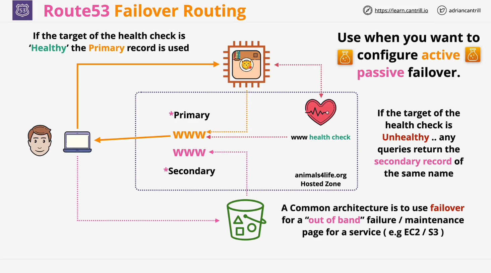

# **AWS Route 53: Failover Routing Policy**

## **Introduction**

Failover routing in **AWS Route 53** is a DNS routing strategy that enables **high availability** by directing traffic to a primary resource and failing over to a secondary resource if the primary becomes unavailable. This type of routing is crucial for applications that require an **active-passive failover architecture**.

## **How Failover Routing Works**

### **1. Hosted Zone and DNS Records**

- A **hosted zone** contains DNS records, including an **A record (or CNAME)** for a domain such as `www.example.com`.
- In failover routing, multiple records with the **same name** are created:
  - **Primary Record** (active resource)
  - **Secondary Record** (failover resource)

### **2. Primary and Secondary Resource Setup**

- The **primary record** points to the main application, such as an **EC2 instance**.
- The **secondary record** points to a backup resource, such as an **S3 static website**.

### **3. Health Check Mechanism**

- A **Route 53 health check** is associated with the **primary record**.
- The health check continuously **monitors the primary resource** by sending **HTTP, HTTPS, or TCP requests**.
- If the health check **fails** (e.g., the EC2 instance becomes unresponsive):
  - **Traffic is rerouted** to the secondary record (e.g., an S3 bucket hosting a maintenance page).
- If the health check **passes**, traffic remains directed to the primary resource.

## **Use Case for Failover Routing**

Failover routing is ideal for **active-passive failover** scenarios where:

- The **primary resource** should handle all traffic **when healthy**.
- The **secondary resource** serves as a **backup** in case of failure.
- Examples include:
  - **Web applications with a backup static site**.
  - **Database failover to a read replica**.
  - **Disaster recovery solutions**.

## **Example Architecture**

### **Scenario**

- **Primary resource**: An EC2 instance running a web application.
- **Secondary resource**: An S3 bucket configured as a static website.
- **Health check**: Monitors the EC2 instance's health.

### **Behavior**

| Condition                       | DNS Response                                             |
| ------------------------------- | -------------------------------------------------------- |
| EC2 instance is healthy         | Route 53 resolves `www.example.com` to the EC2 instance. |
| EC2 instance fails health check | Route 53 resolves `www.example.com` to the S3 bucket.    |

## **Conclusion**

- **Failover routing** in Route 53 ensures **high availability** and **disaster recovery**.
- It is an essential strategy for **business continuity**.
- **Health checks** play a critical role in determining **failover conditions**.

Understanding failover routing helps **AWS architects and engineers** design **resilient and fault-tolerant applications**.
